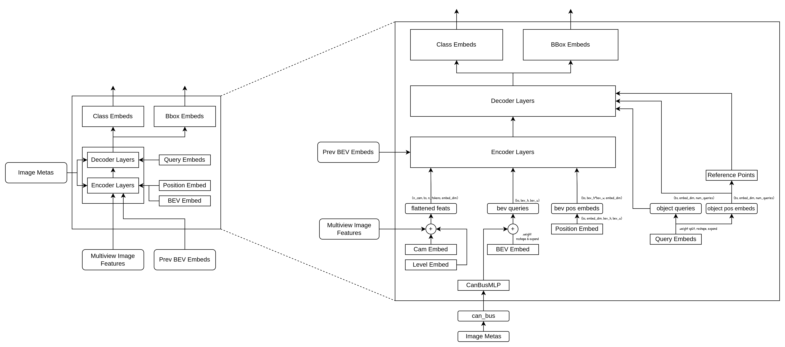
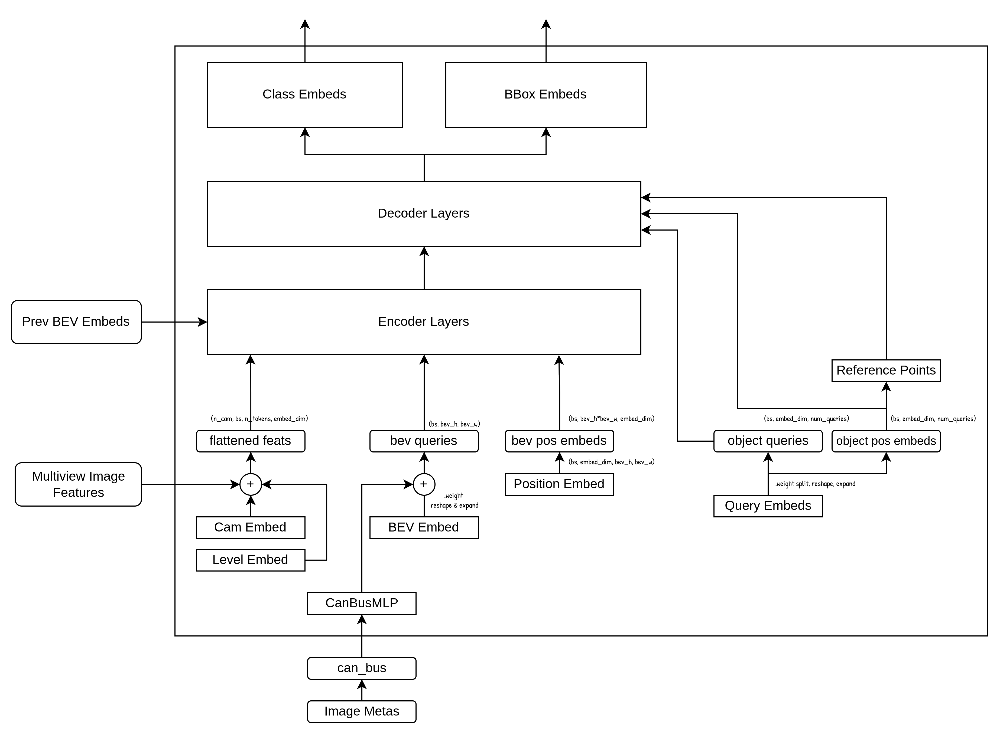

# 从零开始学 BEVFormer (4) -  EncoderLayer的整体结构



上一节我们重点学习了Encoder的输入部分，这一节我们将详细分析Encoder的部分，以及这些输入是如何经过Encoder进行相关计算的。Encoder部分可以说是BEVFromer的核心部分，它最重要的作用就是学习BEV特征表达，利用了（1）前序帧的BEV特征（2）环视图像的图像特征；为此BEVFormer设计了TSA和SCA两种注意力，通过可变形注意力计算和3D投影等方式，完成了时间和空间上的信息融合。



上图是BEVFormer的Transformer的整体结构，上一节中我们知道，输入给Transformer Encoder的主要是：

- BEV Queries 和 bev pos embeds：这是我们要学习优化的目标，BEV Query中的每个元素，表示3D空间中某一个位置的特征。
- Flattened Features： 多视角、多尺度图像特征，被展开成了一个Token序列，每个元素表示一个特征点的图像特征
- Prev BEV： 历史帧的BEV 特征，是之前一帧计算时Encoder的输出

## Encoder的结构：


Encoder的结构主要包含了：

- **多个EncoderLayer层**：这个EncoderLayer层里包含了具体的注意力计算和FFN等层
- Encoder的结构主要是堆叠多个EncoderLayer层
- **参考点的生成**：参考点是针对于采样点的“基准位置”，也就是说，我们的目标是生成多个采样点位置，用于采样特征，这些采样点又是基于一系列的参考点，以这些参考点为中心再其周围通过偏移量计算出的一系列的采样点。
    - 2D参考点： 主要是用于TSA，因为这一步是前序帧和当前帧的**BEV特征级别的注意力**计算，BEV特征是被“压扁”到2D的特征，所以只需要2D位置。本质上是用BEV特征图上的各个特征点，在特征图中的坐标位置（类似于数组的下标位置）作为参考点。
    - 3D参考点：主要用于SCA，这个3D参考点是基于BEV特征图的大小，再加上高度上的采样得到的3D位置。这个位置将会被用来与相机内外参计算投影，得到每个视角下的图像像素坐标系下的位置。这样，就将BEV空间上的点，对应到个各个视角下图像像素的位置，有了这个位置，就可以分别在各视角下以对应的位置找到图像特征，进而利用注意力机制融合这些特征，完成从不同视角图像特征到BEV特征的转换。
    - 3D参考点投影：这一步就是将3D参考点投影到各个视角，找到各个视角下对应的像素位置。

## EncoderLayer的结构：


从上图可以看到，EncoderLayer的结构类似于标准Transformer的“Decoder”结构（标准的Encoder通常只有Self-Attn），只不过将标准的Self-Attn和Cross-Attn变成了：

- Temporal Self Attention
- Spatial Cross Attention

输入的部分：

- **TSA**：
    - BEV query
    - BEV Pos Embeds
    - Prev BEV
    - **2D参考点**
- **SCA**：
    - TSA的输出
    - BEV Pos Embeds
    - Flatten Feat**s**
    - **3D参考点投影后的Cam参考点**

TSA和SCA的结构我们在接下来的章节中会详细分析。本节我们先看参考点的相关细节。

## 2D参考点：

假设我们有一个BEV特征图：


这个特征图的大小（h x w）是：6x8；其中每个位置（图中每个格子）表示一个元素的特征（是一个embed_dIm维度的特征向量）。

在BEV空间中，每个格子又代表在真实世界中的某个区域，假设BEV覆盖的是6m x 8m的面积，那么，每个特征就代表： 真实世界中1m x 1m的区域内的特征表达。 注意，这里是说，我们定义了一个BEV特征，给了一定的尺寸，然后让他对应到真实世界的一定范围，这些范围都是可以指定的。也就是说BEV特征的大小，以及BEV特征每个格子代表的真实区域的大小，都是可以灵活设置的。

那么，我们想找到真实世界中的坐标位置，那么就可以用1m x 1m的中心点位置作为这个区域（这个BEV特征在空间中的位置），也就是 （0.5, 0.5），单位是m（这里假设左上角是(0, 0)点)。


在实际代码实现的时候，这里的2D参考点最终的目的是在特征图上进行特征采样，所以坐标位置会进行归一化（从实际的m归一化到0到1），使用的是相对坐标。

## 3D参考点：


3D参考点和2D参考点类似，同样是在BEV特征大小上均匀采样整个网格中的位置，不同的地方是引入了高度，并且在高度上也进行均匀采样（图中蓝色的点）。得到的3D位置，再经过归一化处理，得到的3D位置，就是3D参考点。

## 3D参考点投影：


我们的目标是求3D参考点位置对应的特征，这个特征又来自于各个相机返回的图片特征，如何将他们对应起来？ 这里就用到了3D点到2D点的投影。如上图所示，各个相机因为安装位置的不同，返回的图像视野、范围和角度都不相同，在给定相机内外参的情况下，我们可以根据相机坐标系的投影公式，计算出3D空间中的一点，对应2D图像上的像素坐标。通过这种方式，我们就可以得到同一个3D点，在各个视角下的像素位置，有了这些像素位置，因为图像特征与图像本身的空间信息是可以对应的（通常图像特征都是图像的x倍下采样），就可以得到特征图上的某个坐标。进而通过可变形注意力机制，就能够得到我们最终需要的3D坐标点的2D投影特征。

接下来我们来看具体的计算过程，首先我们来看一下坐标系转换的过程。


上图是Nuscene数据集的一个sensor和坐标系的参考图。可以看到

1. **Sensor**：每个传感器都会有自己的坐标系
2. **自车坐标系（ego vehile）**:是以主车后轴中心为原点，车头前方向为x轴正向，主车向左是y轴正向。
3. **全局坐标系**：是地图坐标系，地图左上角为原点的坐标系，向右是x轴正向，向下是y轴正向。

**数据集的坐标系：**

- Nuscenes数据集本身标注的是bbox是在全局坐标系下，但是通过设置sensor_type,在使用get_sample_data获得数据的时候，会将bbox从global坐标系转到对应的sensor坐标系；
    - 参考链接：
        
        [https://github.com/nutonomy/nuscenes-devkit/issues/687](https://github.com/nutonomy/nuscenes-devkit/issues/687)
        
- 在源代码实现的时候，使用过了MMDetection3d库处理并生成数据集，其中，bboxes作为gt，是按照lidar坐标系来进行读取的：https://github.com/open-mmlab/mmdetection3d/blob/v0.17.0/tools/data_converter/nuscenes_converter.py#L167
    
    ```
             lidar_path, boxes, _ = nusc.get_sample_data(lidar_token)
    ```
    

也就是说：

1. **Nuscenes数据集本身标注的bbox是全局坐标系**
2. **读取数据的是时候，将bbox转为了lidar坐标系**

BEVformer在实现的时候，我们定义的BEV空间中的3D参考点，理论上是以IMU坐标系表示，实现的时候，使用的是Lidar坐标系。这时候，3D参考点的原点就应该是lidar中心，主车向前是y轴正方向，主车向右为x轴正向，由地面向上方向为z轴正向。因此，对于3D点到图像的投影，就是将lidar坐标系下的点，投影到各个camera上的变换。


### Lidar坐标系：

Lidar坐标系，用于定位3D点云点位置，其定义如下：

- 原点：**(0,0,0)**为原点，位置是Lidar传感器中心
- 坐标轴：x轴主车向右，y轴主车向前，z轴地面向上
- 坐标表示：一个点的坐标表示为**(x,y,z)**

### 相机坐标系：

相机坐标系，用于描述物体在相机视野中的3D位置，其定义如下：

- 原点：**(0,0,0)**为原点，位置是相机的光心
- 坐标轴：x轴是相机的右侧，y轴相机的下方，z轴相机的前方（通常是光轴方向）
- 坐标表示：一个点的坐标表示为**(x,y,z)**，单位是m或者mm

### 像素坐标系：

像素坐标系，用于定位图像上的像素点的位置，其定义如下：

- 原点：左上角**(0,0)**为原点
- 坐标轴：x轴水平向右，y轴垂直向下
- 坐标表示：一个像素的坐标表示为**(x,y)**,其中x表示水平方向的像素索引，y表示竖直方向的像素索引。x和y通常是整数（离散表示）。

**接下来是坐标系的转换过程：**

我们先来看一下整体的转换步骤：

1. **Lidar坐标系 → 相机坐标系**
2. **相机坐标系 → 像素坐标系**
    1. **细化：相机坐标系→ 归一化图像平面→ 像素坐标系**

这里又涉及到投影矩阵的概念：

https://github.com/nutonomy/nuscenes-devkit/blob/master/docs/schema_nuscenes.md#calibrated_sensor

Nuscenes官方链接中有说明，对于每个Sensor（例如相机和Lidar），都会有对应的外参（Extrinsic parameters）来表示该传感器在世界坐标系中的位置和方向，Nuscenes的sensor外参是相对于自车坐标系的（ego）。

所以对于Lidar，我们能够拿到：

- Lidar2ego：lidar的外参，用于将lidar坐标系投影到ego坐标系

对于Camera：

- Camera2ego：相机的外参，用于将相机坐标系投影到ego坐标系
- Camera intrinsic：相机内参，用于将相机坐标系投影到像素坐标系

这些**外参主要包含2部分：**

- 平移（Translation）：（x,y,z）表示，单位为m，其实就是坐标系的原点位置
- 旋转（Rotation）：是以4元数（w, x, y, z）来表示。

有了以上这些信息，我们就可以计算完整的投影过程。

**3D点的定义：**

定义空间中的3D点，用齐次坐标表示：

- 一个3D点的笛卡尔坐标表示为：$P_w = [X_w, Y_w, Z_w]^\mathrm{T}$
- 这个点的齐次坐标表示为：$P^{(h)}_w = [X_w, Y_w, Z_w, 1]^\mathrm{T}$
    - 引入1的目的是方便线性变换（包括把平移从加也变成线性变换）

**Lidar坐标系 → 相机坐标系**

从Lidar坐标系转换到相机坐标系，可以使用矩阵乘法和加法来计算：

1. $P_{camera} = R \cdot P_{lidar} + T$
2. $R$是$3\times3$的旋转矩阵：表示相机朝向
3. $T$是$3\times1$的平移矩阵：表示相机在Lidar坐标系中的位置

如果利用齐次坐标表示，可以将平移向量与旋转矩阵结合，并使用矩阵乘法（而不是加），实现坐标系的投影变换（旋转和平移）：

1. $P^{(h)}_{camera} = \begin{bmatrix} R & T \\ 0 & 1\end{bmatrix} \cdot P^{(h)}_{lidar}$ ，其中（h）表示齐次坐标

要得到这个齐次表示的投影矩阵（简称为lidar2cam），需要从数据集中读取相应的参数进行合并：

1. lidar2ego：用于计算Lidar坐标系下的3D点到ego坐标系的投影
2. camera2ego：用与计算ego到camera的投影

在转换数据集的时候，已经做了获得sensor2lidar的投影矩阵的步骤（注意：这里是四元数的计算，不是使用齐次坐标计算）：

[https://github.com/open-mmlab/mmdetection3d/blob/v0.17.0/tools/data_converter/nuscenes_converter.py#L273](https://github.com/open-mmlab/mmdetection3d/blob/v0.17.0/tools/data_converter/nuscenes_converter.py#L273)

这一步有一个**sweep→ego→global→ego'→lidar** 的转换链，其中ego是只sweep的时间戳下的主车位姿，ego’是只当前时间（例如目标检测时间，或者理解为经过各种操作和转换之后已经过了一段时间，当前的位姿），这么做事为了保证多传感器在全局坐标系下能够时空对齐。

这里得到的是 sensor2lidar的rotation和translation，要得到lidar2cam，只需要对其取逆（代码里就是调用np.linalg.inv）就可以了。

**相机坐标系 → 像素坐标系**

有了相机坐标系的位置，将其转换到像素坐标系通常分为两步：

1. 相机坐标系到归一化图像平面
2. 从归一化平面利用相机内参投影到像素坐标系

或者：

1. 齐次坐标表示下，先利用相机内参，将齐次坐标转为像素坐标系下的齐次坐标
2. 通过齐次坐标归一化，得到像素坐标

归一化图像平面是一个以相机焦点为中心的二维平面，其坐标定义如下，用笛卡尔坐标表示为：（也就是除以深度Z，就将三维点投影到了一个二维平面上）

$$
P_n=[x, y, Z_c]^T = [\dfrac{X_c}{Z_c},\dfrac{Y_c}{Z_c} ]^\mathrm{T}
$$

相机内参，通常用$K$来表示，是一个$3\times3$的矩阵，描述了从相机坐标系到像素坐标系的转换关系，主要由焦距，主点位置和像素比例组成

- 内参形式：
    
    $$
    K = \begin{bmatrix} f_x & 0 & c_x \\ 0 & f_y & c_y \\ 0 & 0 & 1\end{bmatrix}
    $$
    
- $f_x$$f_y$：焦距，分别对应x方向和y方向的像素尺度
- $c_x，c_y$：主点坐标，通常为图像中心，光轴与图像平面的交点
- 0，0，1：方便齐次坐标表示

从归一化图像平面到像素坐标平面：

这一步的变换就是通过相机内参完成：

$$
\begin{bmatrix} u\\v\end{bmatrix}=K\cdot\begin{bmatrix} u_n\\v_n\end{bmatrix}
$$

如果使用齐次坐标，首先进行矩阵投影：

$\begin{bmatrix} u\\v\\1\end{bmatrix}=\begin{bmatrix} f_x & 0 & c_x & 0\\ 0 & f_y & c_y & 0 \\ 0 & 0 & 1 & 0\end{bmatrix} \cdot \begin{bmatrix} {X_c}\\Y_c\\ Z_c \\ 1\end{bmatrix}$

然后将齐次坐标转换到像素坐标（除以$Z_c$）：

$\begin{bmatrix} u'\\v'\\w\end{bmatrix}=\begin{bmatrix} f_xX_c+sY_c+c_xZ_c \\ f_yY_c+c_yZ_c \\ Z_c\end{bmatrix}$

$u=\dfrac{u'}{w}=\dfrac{f_xX_c+sY_c+c_xZ_c}{Z_c}$

$v=\dfrac{v'}{w}=\dfrac{f_yY_c+c_yZ_c}{Z_c}$

 

**BEV空间的3D参考点投影到图像特征过程：**

1. 根据sensor2lidar的投影矩阵，和相机内参，计算出lidar2img的投影矩阵，用齐次坐标表示
2. 将参考点表示为齐次坐标
3. 对齐Tensor维度
4. 矩阵乘法完成投影：refernce_points_cam = lidar2img * reference_points
5. 齐次坐标转为笛卡尔坐标
