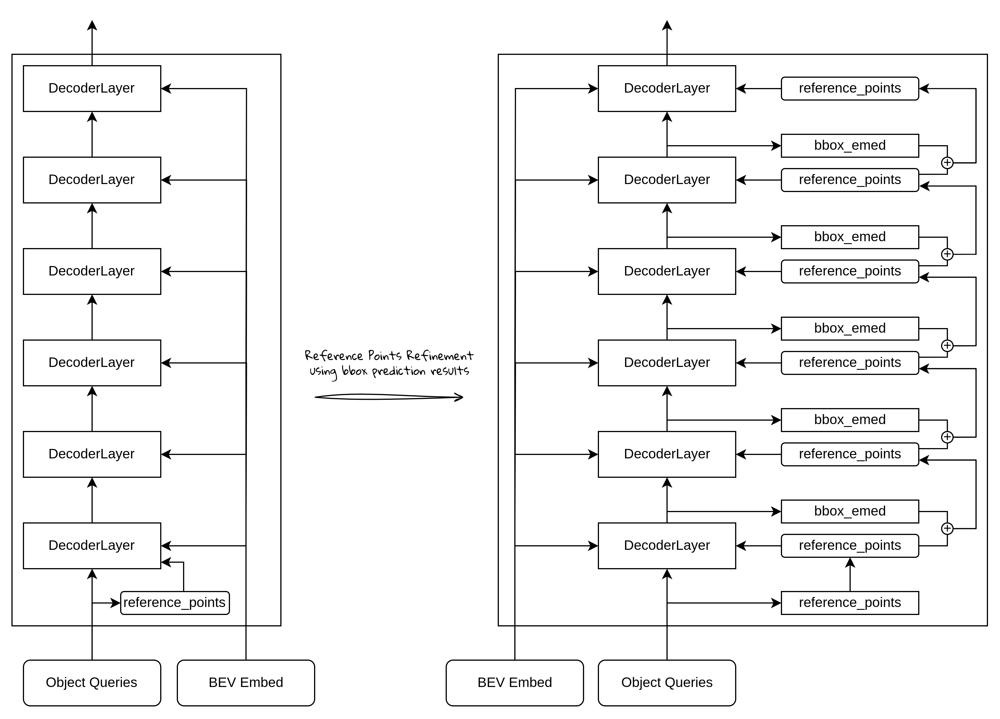

# 从零开始学 BEVFormer (7) - Decoder - 目标查询的自注意力

## BEVFormer的Decoder整体结构：

如上图所示：

- 输入：Object Query，预先定义的object的查询特征的初始表示，Decoder的整个计算过程可以理解为利用注意力机制来优化更新这个object query，使得输出的object query学习到足够的目标物体的语义和位置信息。每个object query也可以理解为一个潜在的目标，数量是预先设定的一个比实际GT数量大的数。
- 输入：BEV Embed，由encoder计算得到的输出，也是BEV特征图。
- 输出：经过各层计算后得到的Object Query更新后的特征表示，也就是说，输入的object是特征的初始表示，此时特征还不具有障碍物的信息，经过Decoder的计算之后，它不再只是一个查询特征向量，而是包含了关于检测到物体的信息（例如类别和位置信息）。这个输出仍然对应每个 object query，但它已经编码了关于目标物体的识别信息。所以，在输出之后，再接上det head，就可以计算出物体的位置和类别信息。
- DecoderLayer：Decoder是由多个DecoderLayer堆叠而成，每个DecoderLayer都会根据BEV特征（bev embed），和上一层的Decoder输出，进行注意力计算（自注意力和交叉注意力），并得到输出特征，输出特征是和object query一一对应，也保持shape不变。

参考点更新：

- bbox_embed：是decoder之后接的det head的一部分，主要用于回归目标物体的中心点位置和长宽高等空间信息，这里学习的是目标物体基于参考点的偏移量，也就是说，要得到最终的中心点位置，需要将bbox_embed的输出，加上对应该object query的参考点位置。
- reference_points：object query的3D参考点，有object query的pos embed部分经过可学习的线性层计算得到。这些参考点，是用来在bev embed特征图上进行特征采样时使用的
- 参考点位置更新：通过bbox_embed（这里是基于参考点的偏移量）计算得到的偏移量，在训练时候，每一层decoder都将参考点位置进行“微调”（加上这个偏移量）。这样做的好处是：
    - 动态调整参考点位置，并且是根据预测的位置进行调整，让参考点更接近真实目标的位置。
    - Decoder是每一层都进行refinement，这样逐层的方式可以使得预测框的学习更加稳定
    - Decoder计算注意力的时候会根据参考点位置进行BEV的特征采样，使用参考点更新策略，可以使得特征采样的位置更接近目标位置，使得采样到的特征更准确，这样注意力计算也会更好的学习到重点区域的信息。

## BEVFormer的Decoder自注意力结构：

BEVFormer Decoder的DecoderLayer结构主要包含：

- 自注意力模块：计算obejct query之间的注意力，这部分使用的是标准的self-attention计算
- 交叉注意力模块：计算object query作为查询，bev embed特征作为value的交叉注意力，这部分采用的是Deformable attention的方式来完成计算。
- FFN，LayerNorm，Residual：与标准的Transformer结构基本一致。

自注意力，使用的是标准self-attention计算：

这部分不涉及到2D、3D、BEV特征等概念，主要是obejct query之间的注意力计算，object query的shape通常是: `[BS, num_queries, embed_dim]`  ，注意力计算也就是标准的self-attention：

