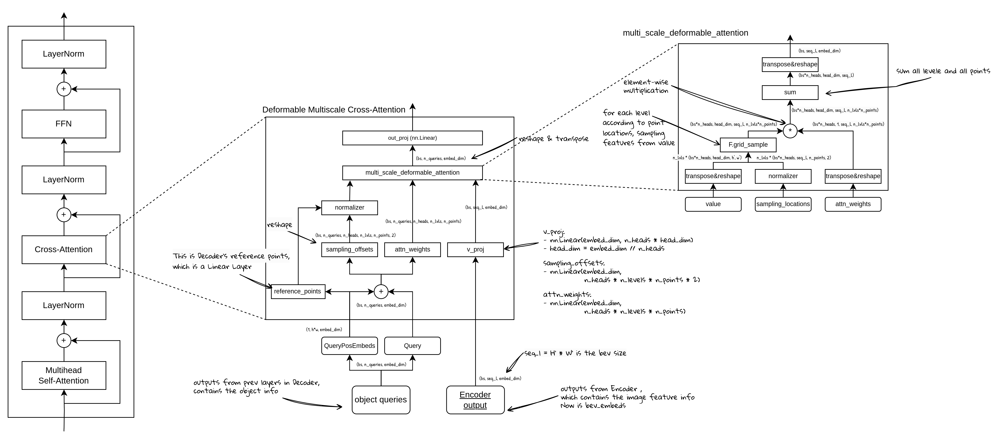

# 从零开始学 BEVFormer (8) - Decoder - Deformable Attention：目标查询与BEV查询的交叉注意力

## BEVFormer的Decoder交叉注意力结构：

DecoderLayer的交叉注意力是计算object query和bev embed之间的注意力关系。具体来说，对于每一个object query，会有一个对应的可学习的3D参考点。根据参考点的位置，在其附近再进行一次偏移量采样，可以得到多个采样点位置。 有了这些采样点位置，就可以在BEV特征图上进行特征采样，然后再通过Deformable attention的计算方式计算交叉注意力，最终得到该模块的输出。

### Cross Attention的结构：

- **输入：**
    - object queries：这里是经过self-attention计算之后的object query，也可以叫做object embedding
    - Encoder outputs：其实就是bev embeds，或者bev特征，这是bev query经过encoder计算之后得到的特征，尺寸通常是[bs, seq_l, embed_dim]，这里的seq_l是bev_h * bev_w。
    - reference points：这个是使用object queries的pos embed，通过Decoder里定义的一个linear层计算得到的3D参考点。这个3D参考点与object queries一一对应。
- **计算过程：**
    - object queries = object queries + object query pos embed
    - 经过一个linear层，计算得到attn_weights，作为注意力权重
    - 经过另一个linear层，计算得到sampling_offsets，作为采样点的偏移（基于参考点位置的偏移量）
    - 参考点和sampling_offsets经过reshape，normalize等操作，得到sampling_locations
    - bev embeds经过一个linear层，得到value
    - sampling_locations, attn_weights, value进行特征采样，这里的采样是多尺度的特征采样，得到的特征再与attn_weights相乘，最后再与value相乘得到输出。
    - 最后再经过一个linear层，得到cross attention的输出。
- **输出：**
    - 经过cross attention的object queries（object embeds），shape和输入一样保持不变

### Deformable Attention的注意力计算过程：

这一步的计算原理并不复杂，主要是在实现的时候有很多维度上的变换（在实践章节会详细讲解）。核心其实是使用grid_sample方法，在给定的特征图（这里是value）上，根据采样点位置进行特征采样。采样得到的特征，与attn_weights相乘（类似于标准attention的softmax(q*k’) * v，只是这里的v变成了采样部分特征点，并且不使用k，而是使用可学习的attn_weights直接与采样特征相乘，attn_weights是通过q经过linear层计算得到的。
