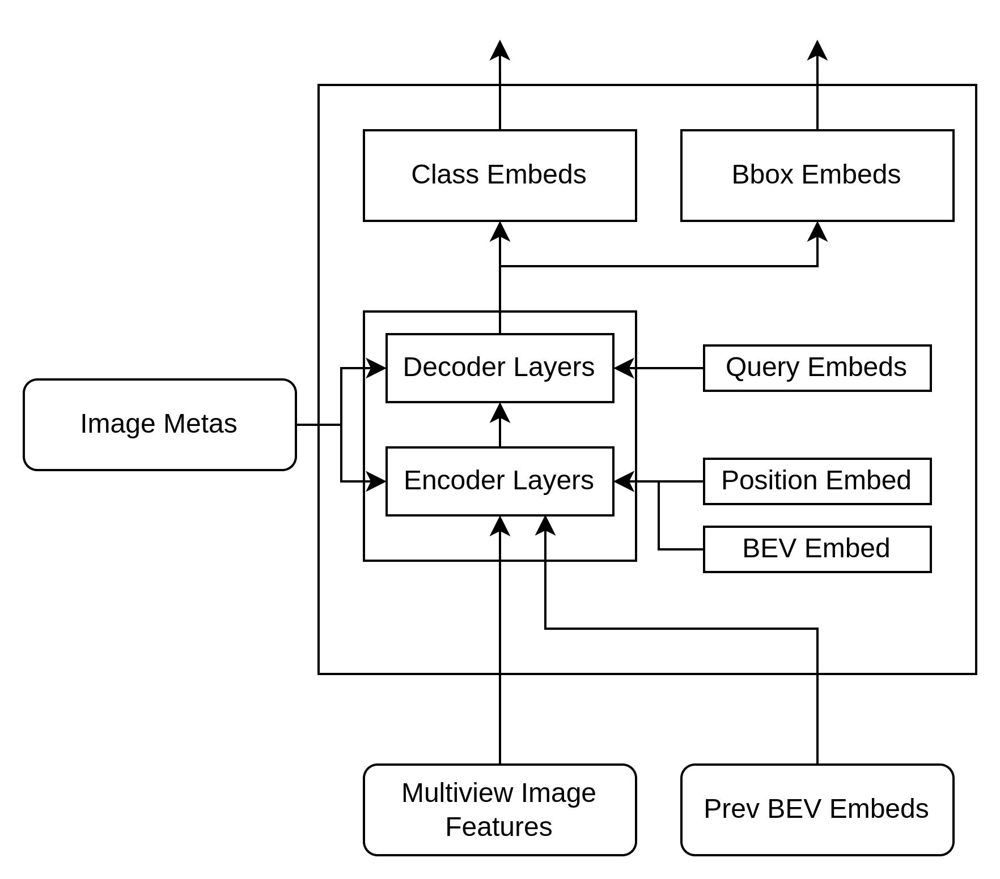

# 从零开始实现 BEVFormer (3) - BEVFormerTransformer类



### 这个类主要的成员变量包括：

1. Encoder：单独定义
2. Decoder：单独定义
3. level_embed：线性层，用来补偿不同的level
4. cams_embed：线性层，用来补偿不同的cam
5. can_bus_mlp：mlp层，用来编码can_bus的信息
6. 参考点计算：线性层，从query到参考点的映射

### 推理的过程：

在Transformer这一层的推理划分为这么几个步骤：

1. 准备Encoder的输入
2. Encoder推理
3. 准备Decoder的输入
4. Decoder推理
5. 返回结果


## 1. 准备Encoder的输入

1. bev_query和位置信息bev_pos:
    1. bev_query是embedding计算得到的
    2. bev_pos，是二维的可学习的位置编码，通过单独的position_encoding方法定义
2. 计算前一帧的bev到当前帧的bev的变换
    
    TSA的目标是学习到前序帧的信息，也就是通过前序帧的BEV特征（bev_embeds）与当前帧结合，按照注意力机制的方式更新。具体来说，我们的输入是：
    
    - 当前帧的bev_query，shape是[bs, bev_h*bev_w, embed_dim]
    - 之前帧的bev_embeds, shape是[bs, bev_h*bev_w, embed_dim]
    
    ### **当有前一帧时：**
    
    - `x_q = [prev_bev, bev_query + pos_embed]`
    - `value = [prev_bev, bev_query]`
    
    ### **当没有前一帧时（比如开始时间的第一帧）：**
    
    - `x_q = [bev_query, bev_query + pos_embed]`
    - `value = [bev_query, bev_query]`
    
    这里需要解释一下，x_q中，只有后半部分才加上位置信息：
    
    - `prev_bev` 是从前一帧直接传递过来的全局 BEV 表征。
    - 它已经是空间位置对齐的特征，包含了完整的空间上下文信息，**无需再额外添加位置编码**。
    - 如果对 `prev_bev` 再加位置编码，反而可能破坏它原本的空间结构信息
    - `bev_query` 是基于当前帧传感器信息生成的查询特征，位置编码的加入是为了提升其在时间序列中的空间定位能力。
    - `pos_embed` 提供额外的几何信息，使得当前帧的查询能够更有效地与历史特征进行匹配
    
    需要注意，我们在有了x_q 和 value之后，接下来的步骤是什么？ 
    
    接下来，我们要基于参考点和偏移量，计算采样点进而在bev特征的对应位置上进行特征采样。
    
    ### 那这些参考点是如何计算的？
    
    参考点是在bev 空间上含有具体位置信息的均匀采样点，但是，对于prev_bev和bev_query，参考点是一样的吗？ 对于他们自身来说，各自的参考点是没问题的，都是基于主车位置（bev特征的中心点），前后左右bev_h, bev_w大小的范围。但是，**对于前帧和当前帧，主车的位置是发生了变化，**也就是说，对于当前帧的主车来说，上一帧的bev的位置对于当前的BEV是有偏移的，偏移量就是主车移动的偏移量。例如，如果主车从前帧到当前帧，向右上移动了一个位置，那么上一帧的bev上的(1,1)位置，对于当前帧来说，其实是（2，0）位置了。所以，当我们取参考点的时候，之前帧的参考点坐标是需要加上这个偏移量，才是实际的位置。
    
    首先我们来看2D参考点的计算：
    
    就是从[0.5, bev_h-0.5]这个范围内，均匀采样bev_h个点作为y坐标，
    
    就是从[0.5, bev_w-0.5]这个范围内，均匀采样bev_w个点作为x坐标
    
    这w*h个点就是我们的参考点位置。
    
    1. 计算前后帧的bev的旋转平移向量shift
    
     如何计算前一帧对于当前帧的位置偏移呢？
    
    首先我们有一些已知量，这些是从车辆IMU中可以读取到的：（delta_x, delta_y），`delta_x` 和 `delta_y` 分别表示自车在 **x 和 y 方向上的位移差**，通常是指自车在两个时间帧之间（当前帧和历史帧）的位置变化。单位一般为 **米**。是从img_meta中读取的，(delta_x, delta_y)是一个向量，可以计算出主车从上一位置到当前位置的角度和距离。可以理解成是整个bev特征图（按中心点）从某个位置移动到了另一个位置。
    
    
    
    Nuscenes数据集中， ego coords, 自车的坐标轴就是:
    
    - x轴：沿主车车头方向朝前
    - y轴：沿主车车头方向朝左
    - 原点：主车后轴中心（通常是IMU的中心）
    
    global coords：
    
    - x轴：沿地图方向朝右，
    - y轴：沿地图方向向下
    - 原点：地图左上角
    
    
    
    ego_angle，就是运动角度，从img_meta中读取。`ego_angle` 通常以弧度或角度表示，是一个标量，表示自车的朝向相对于某个参考坐标系的偏转角
    
    
    
    所以我们计算当前bev下，之前bev的shift，就
    
    canbus返回的是18维度的：
    
    [https://github.com/fundamentalvision/BEVFormer/blob/66b65f3a1f58caf0507cb2a971b9c0e7f842376c/projects/mmdet3d_plugin/datasets/nuscenes_dataset.py#L158](https://github.com/fundamentalvision/BEVFormer/blob/66b65f3a1f58caf0507cb2a971b9c0e7f842376c/projects/mmdet3d_plugin/datasets/nuscenes_dataset.py#L158)
    
    Translation： x,y,z
    
    Rotation： w, x, y, z
    
3. can_bus编码和level编码
    1. can_bus是一个mlp层，将can_bus的18维度的信息编码成embed_dim维度然后加入到feat中。
    2. level是一个线性层，就是额外增加一个可学习的编码，增加level信息。
4. 展开图像特征，图像特征加上level编码和cam编码：
    1. 注意：我们这里实现的是pytorch版本的Deformable Attention，所以变量spatial_shapes,和level_start_index在实际计算中是没有用到的，当使用CUDA版本的实现时，需要用这两个变量作为输入。
    2. 这一步主要是将多层特征展开拉平，然后按照camera的顺序分别排列在一起。具体来说：
        1. 当前的图像特征是一个list，list中的每个元素表示一个camera view的多层图像特征（多层来自FPN的输出）
        2. 我们的目标是将特征列表变成一个tensor: [num_cam, seq_l, bs, embed_dim], 其中，seq_l 是每层特征展开后的长度的总和，可以写成：
            1. seq_l = seq_l_feat1 + seq_l_feat2 + seq_l_feat4 + seq_l_feat4 = h1*w1 + h2*w2 + h3*w3  + h4*w4；  其中h_i,w_i表示每层特征图的大小 
        3. 每层和每个cam会加上一个额外的编码，在分层处理的时候按维度相加即可。
    
    ```python
            feat_flatten = []
            spatial_shapes = []
            for level, feat in enumerate(multi_level_feats):
                bs, num_cam, c, h, w = feat.shape
                spatial_shape = (h, w)
                feat = feat.flatten(3)  # [bs, num_cam, c, h*w]
                feat = feat.transpose([1, 0, 3, 2])  # [num_cam, bs, h*w, c]
                feat = feat + self.cams_embeds[:, None, None, :]
                feat = feat + self.level_embeds[None, None, level:level+1, :]
    
                spatial_shapes.append(spatial_shape)
                feat_flatten.append(feat)
    
            feat_flatten = paddle.concat(feat_flatten, 2)  # [num_cam, bs, sum(h*w), embed_dim]
            feat_flatten = feat_flatten.transpose([0, 2, 1, 3])  # [num_cam, sum(h*w), bs, embed_dim]
            spatial_shapes = paddle.to_tensor(spatial_shapes)
            level_start_index = paddle.concat([paddle.zeros(1, dtype='int64'), spatial_shapes.prod(1).cumsum(0)[:-1]])
    ```
    

## 2. Encoder推理

这一步就是调用Encoder的forward方法，注意参数的填写：

```python
bev_embed, encoder_intermediate = self.encoder(bev_query=bev_queries,
                                               value=feat_flatten,
                                               bev_h=bev_h,
                                               bev_w=bev_w,
                                               bev_pos=bev_pos,
                                               spatial_shapes=spatial_shapes,
                                               level_start_index=level_start_index,
                                               prev_bev=prev_bev,
                                               img_metas=img_metas,
                                               shift=shift)
```

需要注意的点：

1. encoder的输入是bev_queries，会用在TSA和SCA中
2. encoder中计算注意力的value是图像特征，feat_flatten，主要会用在SCA中
3. bev_pos是bev_query的位置编码
4. prev_bev是前一帧的BEV，会用在TSA中

## 3. 准备Decoder的输入

1. 得到object_query和object_query_pos。这里就是将embedding的权重拆分成两部分。这里的object_query_embeds = self.query_embeddings.weight。而self.query_embeddings = nn.Embedding(num_queries, embed_dim)
    1. 为什么是直接使用embedding的权重就可以作为query？
    
    首先我们来看一下这一步的实际意义是什么，这一步是说，我们定义了num_query个查询，每个查询有个编号，比如从0到899。每个查询，经过query_embeddings，都会得到一个embed_dim维度*2的特征。而在nn.Embedding计算的时候，其实就是把一个One-hot的vector，乘以本层的权重w，得到的其实就是w的某一行。所以当我们需要拿0到899所有query的特征的时候，直接拿权重w，对应的每一行就是我们要的结果，因此为了省略，直接拿w和我们生成（0，899）个index，再过一遍embedding层的forward，效果是一样的。例如：
    
    ```python
    >>> l = paddle.nn.Embedding(4, 16)
    >>> l.weight
    Parameter containing:
    Tensor(shape=[4, 16], dtype=float32, place=Place(gpu:0), stop_gradient=False,
           [[-0.42400789, -0.16835111, -0.18443665, -0.46273285, -0.31738895,
             -0.18782417, -0.27129447,  0.06062754,  0.31361949, -0.16856498,
              0.30354533,  0.17078768, -0.05223346,  0.34842244, -0.39092016,
             -0.15598777],
            [ 0.49990246, -0.30553773, -0.28784928,  0.37769380, -0.22225364,
              0.14069790, -0.25493911, -0.15964910, -0.32160524, -0.53748524,
              0.06079450,  0.24854460, -0.22602859, -0.25298676,  0.24601513,
              0.37058988],
            [ 0.14584133,  0.39202473,  0.51722008, -0.02393341,  0.38006169,
             -0.42005193,  0.50736982,  0.25188190,  0.14430901, -0.10152952,
             -0.01304743,  0.39764297,  0.48923466, -0.47561589, -0.22418877,
              0.17042477],
            [-0.36457464, -0.33194637,  0.36396924, -0.49369973, -0.46327212,
             -0.51061457,  0.20546453, -0.39061910, -0.15447615, -0.34875691,
              0.53302431, -0.27667105, -0.34903672, -0.44926789, -0.19105272,
              0.49206612]])
    >>> l(paddle.to_tensor([0,1,2,3],dtype='int64'))
    Tensor(shape=[4, 16], dtype=float32, place=Place(gpu:0), stop_gradient=False,
           [[-0.42400789, -0.16835111, -0.18443665, -0.46273285, -0.31738895,
             -0.18782417, -0.27129447,  0.06062754,  0.31361949, -0.16856498,
              0.30354533,  0.17078768, -0.05223346,  0.34842244, -0.39092016,
             -0.15598777],
            [ 0.49990246, -0.30553773, -0.28784928,  0.37769380, -0.22225364,
              0.14069790, -0.25493911, -0.15964910, -0.32160524, -0.53748524,
              0.06079450,  0.24854460, -0.22602859, -0.25298676,  0.24601513,
              0.37058988],
            [ 0.14584133,  0.39202473,  0.51722008, -0.02393341,  0.38006169,
             -0.42005193,  0.50736982,  0.25188190,  0.14430901, -0.10152952,
             -0.01304743,  0.39764297,  0.48923466, -0.47561589, -0.22418877,
              0.17042477],
            [-0.36457464, -0.33194637,  0.36396924, -0.49369973, -0.46327212,
             -0.51061457,  0.20546453, -0.39061910, -0.15447615, -0.34875691,
              0.53302431, -0.27667105, -0.34903672, -0.44926789, -0.19105272,
              0.49206612]])
    >>> l(paddle.to_tensor([1],dtype='int64'))
    Tensor(shape=[1, 16], dtype=float32, place=Place(gpu:0), stop_gradient=False,
           [[ 0.49990246, -0.30553773, -0.28784928,  0.37769380, -0.22225364,
              0.14069790, -0.25493911, -0.15964910, -0.32160524, -0.53748524,
              0.06079450,  0.24854460, -0.22602859, -0.25298676,  0.24601513,
              0.37058988]])
    
    ```
    

1. 计算初始参考点:
    1. 对于Decoder来说，参考点就是对于每个query，给一个初始的BEV空间中的位置，这里是通过线性变换得到的，所以只需要调用对应的线性层即可：
        
        ```python
        reference_points = self.reference_points(object_query_pos).sigmoid()
        ```
        
        sigmoid是将每个坐标归一化到(0，1)
        

## 4. Decoder推理

这一步就是调用Encoder的forward方法，注意参数的填写：

```python
decoder_output = self.decoder(input_embeds=object_query,
                              value=bev_embed,
                              attn_mask=None,
                              pos_embeds=object_query_pos,
                              ref_pts=reference_points,
                              img_metas=img_metas,
                              bbox_embed=bbox_embed,
                              spatial_shapes=paddle.to_tensor([[bev_h, bev_w]], dtype='int64'),
                              level_start_index=paddle.zeros([1], dtype='int64'))
```

需要注意的点：

1. decoder的输入query是object_query，pos_embeds也是object_query_pos
2. decoder的输入value是bev_embed,也就是经过encoder的bev特征输出，这里decoder就是做obejct_query作为查询在bev_embed上通过注意力机制找到有用的信息，最终用来更新object_query。
3. 这里的reference_points，是decoder的reference_points, 通过线性变换生成的，每个query对应一个参考点。

### 完整代码：

```python
class BEVFormerTransformer(nn.Layer):
    """BEVFormer transformer for object detection"""
    def __init__(self,
                 pc_range,
                 num_points_in_pillar,
                 num_feature_levels,
                 num_cams,
                 num_encoder_layers,
                 num_decoder_layers,
                 embed_dim,
                 num_heads,
                 self_attn_dropout,
                 cross_attn_dropout,
                 ffn_dim,
                 ffn_dropout,
                 num_points=8,
                 num_bev_queue=2):
        super().__init__()
        self.embed_dim = embed_dim
        self.num_feature_levels = num_feature_levels
        self.num_cams = num_cams
        self.level_embeds = paddle.create_parameter(
            shape=[num_feature_levels, embed_dim], dtype='float32')
        self.cams_embeds = paddle.create_parameter(
            shape=[num_cams, embed_dim], dtype='float32')
        self.reference_points = paddle.nn.Linear(embed_dim, 3)
        self.can_bus_mlp = nn.Sequential(
                nn.Linear(18, embed_dim // 2),
                nn.ReLU(),
                nn.Linear(embed_dim // 2, embed_dim),
                nn.ReLU(),
                nn.LayerNorm(embed_dim))

        self.encoder = BEVFormerEncoder(embed_dim=embed_dim,
                                        ffn_dim=ffn_dim,
                                        num_heads=num_heads,
                                        num_layers=num_encoder_layers,
                                        num_levels=num_feature_levels,
                                        num_points=num_points,
                                        num_points_in_pillar=num_points_in_pillar,
                                        num_bev_queue=num_bev_queue,
                                        self_attn_dropout=self_attn_dropout,
                                        cross_attn_dropout=cross_attn_dropout,
                                        ffn_dropout=ffn_dropout,
                                        num_cams=num_cams,
                                        pc_range=pc_range)

        self.decoder = BEVFormerDecoder(embed_dim=embed_dim,
                                        num_heads=num_heads,
                                        num_layers=num_decoder_layers,
                                        num_levels=1,  # BEV query only has 1 level
                                        num_points=4,  # cross attn on BEV query samples 4 points
                                        ffn_dim=ffn_dim,
                                        self_attn_dropout=self_attn_dropout,
                                        cross_attn_dropout=cross_attn_dropout,
                                        ffn_dropout=ffn_dropout)

    def forward(self,
                multi_level_feats,
                object_query_embeds,
                bev_queries,
                bev_h,
                bev_w,
                grid_length,
                bev_pos,
                bbox_embed,
                img_metas,
                prev_bev=None):
        """
        Args:
            multi_level_feats: list/tuple of Tensor, shape [bs, num_cams, embed_dim, h, w]
            query_embeds: object query embeds for decoder, [num_queries, embed_dim*2]
            bev_queries: [bev_h * bev_w, embed_dim]
            bev_pos: position embeddings for bev, with shape [bs, embed_dim, bev_h, bev_w]
        """
        bs = multi_level_feats[0].shape[0]
        bev_queries = bev_queries.unsqueeze(0)  # [bev_h*bev_w, c] -> [1, bev_h*bev_w, c]
        bev_queries = bev_queries.expand([bs, bev_h*bev_w, -1])  # [bs, bev_h*bev_w, c]
        bev_pos = bev_pos.flatten(2)  # [bs, c, bev_h, bev_w] -> [bs, c, bev_h*bev*w]
        bev_pos = bev_pos.transpose([0, 2, 1])  # [bs, bev_h*bev*w, c]

        # obtain rotation angle and shift with ego motion
        delta_x = np.array([img_meta['can_bus'][0] for img_meta in img_metas])
        delta_y = np.array([img_meta['can_bus'][1] for img_meta in img_metas])
        ego_angle = np.array([img_meta['can_bus'][-2] / np.pi * 180 for img_meta in img_metas])
        grid_len_x, grid_len_y = grid_length[0], grid_length[1]
        translation_len = np.sqrt(delta_x ** 2 + delta_y**2)
        translation_angle = np.arctan2(delta_y, delta_x) / np.pi * 180
        bev_angle = ego_angle - translation_angle

        shift_y = translation_len * np.cos(bev_angle / 180 * np.pi) / grid_len_y / bev_h
        shift_x = translation_len * np.sin(bev_angle / 180 * np.pi) / grid_len_x / bev_w
        shift = paddle.to_tensor([shift_x, shift_y])
        shift = shift.transpose([1, 0])

        if prev_bev is not None:
            for i in range(bs):
                rotation_angle = img_metas[i]['can_bus'][-1]
                # prev_bev: [bs, c, bev_h*bev_w]
                tmp_prev_bev = prev_bev[i]  # [c, bev_h*bev_w]
                tmp_prev_bev = tmp_prev_bev.reshape([-1, bev_h, bev_w])
                tmp_prev_bev = VF.rotate(tmp_prev_bev, rotation_angle, center=self.rotate_center)
                tmp_prev_bev = tmp_prev_bev.reshape([-1, bev_h*bev_w])
                tmp_prev_bev = tmp_prev_bev.unsqueeze(0)  # [c, bev_h*bev_h] -> [1, c, bev_h*bev_w]
                prev_bev[i] = tmp_prev_bev[0, :]

        # add can bus signals
        can_bus = paddle.to_tensor([img_meta['can_bus'] for img_meta in img_metas])
        can_bus = self.can_bus_mlp(can_bus)
        can_bus = can_bus[:, None, :]
        bev_queries = bev_queries + can_bus  # [bs, h*w, c]

        feat_flatten = []
        spatial_shapes = []
        for level, feat in enumerate(multi_level_feats):
            bs, num_cam, c, h, w = feat.shape
            spatial_shape = (h, w)
            feat = feat.flatten(3)  # [bs, num_cam, c, h*w]
            feat = feat.transpose([1, 0, 3, 2])  # [num_cam, bs, h*w, c]
            feat = feat + self.cams_embeds[:, None, None, :]
            feat = feat + self.level_embeds[None, None, level:level+1, :]

            spatial_shapes.append(spatial_shape)
            feat_flatten.append(feat)

        feat_flatten = paddle.concat(feat_flatten, 2)  # [num_cam, bs, sum(h*w), embed_dim]
        feat_flatten = feat_flatten.transpose([0, 2, 1, 3])  # [num_cam, sum(h*w), bs, embed_dim]
        spatial_shapes = paddle.to_tensor(spatial_shapes)
        level_start_index = paddle.concat([paddle.zeros(1, dtype='int64'), spatial_shapes.prod(1).cumsum(0)[:-1]])

        bev_embed, encoder_intermediate = self.encoder(bev_query=bev_queries,
                                                       value=feat_flatten,
                                                       bev_h=bev_h,
                                                       bev_w=bev_w,
                                                       bev_pos=bev_pos,
                                                       spatial_shapes=spatial_shapes,
                                                       level_start_index=level_start_index,
                                                       prev_bev=prev_bev,
                                                       img_metas=img_metas,
                                                       shift=shift)
        bs = multi_level_feats[0].shape[0]
        object_query_pos, object_query = paddle.split(object_query_embeds, 2, axis=1)
        object_query_pos = object_query_pos.unsqueeze(0).expand([bs, -1, -1])
        object_query = object_query.unsqueeze(0).expand([bs, -1, -1])
        reference_points = self.reference_points(object_query_pos).sigmoid()

        decoder_output = self.decoder(input_embeds=object_query,
                                      value=bev_embed,
                                      attn_mask=None,
                                      pos_embeds=object_query_pos,
                                      ref_pts=reference_points,
                                      img_metas=img_metas,
                                      bbox_embed=bbox_embed,
                                      spatial_shapes=paddle.to_tensor([[bev_h, bev_w]], dtype='int64'),
                                      level_start_index=paddle.zeros([1], dtype='int64'))
        output = (bev_embed, ) + decoder_output
        # output: bev_embed, decoder_states, init_ref_pts, intermediate_ref_pts, all_self_attn, all_cross_attn
        return output
```
