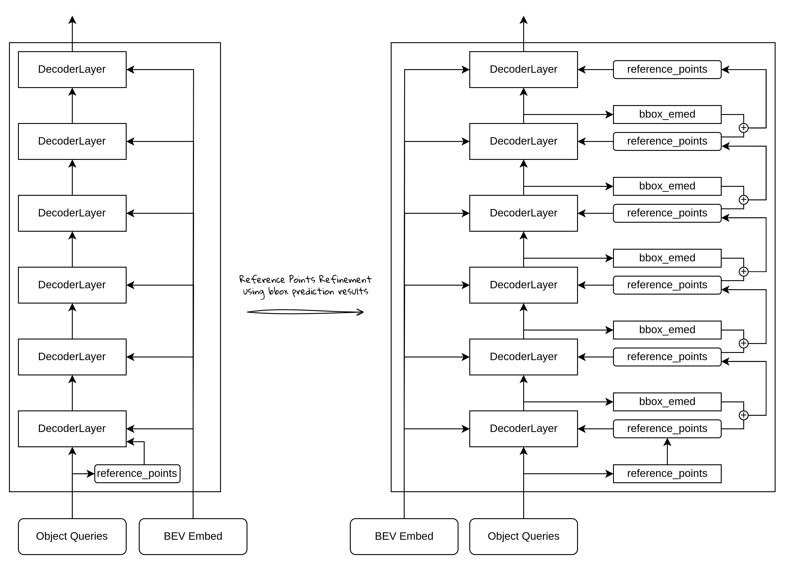

# 从零开始实现BEVFormer (7) - Decoder类



## Decoder的整体结构

如上图所示，BEVFormer的Decoder，主要的作用是：

- 输入Object Query，通过DecoderLayer里的注意力机制，不断更新优化，使得最终的输出包含有丰富的障碍物信息。其中，每个Object Query表示一个潜在的目标障碍物。
- 输入的Reference Points是根据输入object query pos embedding经过Linear层动态生成的参考点，用于在BEV特征图上进行采样。
- 输入BEV特征，是经过Encoder计算得到的特征图，通过交叉注意力，object query将BEV特征中有用的信息融合进来，从而达到优化object query的作用。

上图右边是BEVFormer在实现的时候采用的参考点更新策略：

- 对于Decoder的每层计算，都会动态更新参考点的位置，这个更新是通过bbox预测头预测的障碍物中心点的偏移量，加上当前的参考点位置得到的。

### 代码实现：

```python
class BEVFormerDecoder(nn.Layer):
    """BEVformer decoder"""
    def __init__(self,
                 embed_dim,
                 num_heads,
                 num_layers,
                 num_levels,
                 num_points,
                 ffn_dim,
                 self_attn_dropout,
                 cross_attn_dropout,
                 ffn_dropout):
        super().__init__()
        # Decoder包含多个DecoderLayer层
        self.layers = nn.LayerList([
            BEVFormerDecoderLayer(
                embed_dim=embed_dim,
                ffn_dim=ffn_dim,
                num_heads=num_heads,
                num_points=num_points,
                num_levels=num_levels,
                self_attn_dropout=self_attn_dropout,
                cross_attn_dropout=cross_attn_dropout,
                ffn_dropout=ffn_dropout) for idx in range(num_layers)])
    def forward(self,
                input_embeds,
                attn_mask,
                value,
                pos_embeds,
                ref_pts,
                spatial_shapes,
                level_start_index,
                img_metas,
                bbox_embed):
        init_ref_pts = ref_pts
        x = input_embeds
				# 用于存放各层的结果
        decoder_states = []  # 各层的输出
        all_self_attn = []  # 自注意力打分
        all_cross_attn = [] # 交叉注意力打分
        intermediate_ref_pts = []  # 各层调整后的参考点

        for layer_idx, layer in enumerate(self.layers):
            # [bs, num_queries, 3] -> [bs, num_queries, 1, 2]
            # 只取前2维，不考虑高度
            ref_pts_input = ref_pts[..., :2].unsqueeze(2)
            decoder_states.append(x)
            out = layer(x=x,
                        attn_mask=attn_mask,
                        value=value,
                        pos_embeds=pos_embeds,
                        ref_pts=ref_pts_input,
                        spatial_shapes=spatial_shapes,
                        level_start_index=level_start_index)
            x = out[0]
            # refine ref_pts using bbox_embed
            if bbox_embed is not None:
                # 获得当前层的预测结果（偏移量）
                # bbox_embed: cx, cy, w, l, cz, h, rot_sine, rot_cos, vx, vy
                tmp = bbox_embed[layer_idx](x)
                new_ref_pts = paddle.zeros_like(ref_pts)
                ref_pts = inverse_sigmoid(ref_pts)
                new_ref_pts[..., :2] = tmp[..., :2] + ref_pts[..., :2]
                new_ref_pts[..., 2:3] = tmp[..., 4:5] + ref_pts[..., 2:3]
                new_ref_pts = new_ref_pts.sigmoid()
                ref_pts = new_ref_pts.detach()

            # save results
            intermediate_ref_pts.append(ref_pts)
            all_self_attn.append(out[1])
            all_cross_attn.append(out[2])

        decoder_states.append(x)
        # 从list转为Tensor
        decoder_states = paddle.stack(decoder_states, 0)
        intermediate_ref_pts = paddle.stack(intermediate_ref_pts, 1)

        return decoder_states, init_ref_pts, intermediate_ref_pts, all_self_attn, all_cross_attn

```

## DecoderLayer的整体结构：


可以看到，Decoder的各层是比较标准的Transformer Decoder结构：

- MultiheadSelfAttention：标准的多头注意力，计算的是object queries之间的自注意力
- Cross-Attention：是2D的Deformable Attention，计算的是object query作为query，bev特征作为value的可变形交叉注意力
- FFN：标准的FFN网咯结构

### 代码实现：

```python
class BEVFormerDecoderLayer(nn.Layer):
    """decoder layer for bevformer"""
    def  __init__(self, # W: Too many arguments (9/5)
                  embed_dim,
                  ffn_dim,
                  num_heads,
                  num_points,
                  num_levels,
                  self_attn_dropout,
                  cross_attn_dropout,
                  ffn_dropout):
        super().__init__()
        # self attn
        self.self_attn = MultiheadAttention(embed_dim=embed_dim,
                                            num_heads=num_heads,
                                            dropout_rate=self_attn_dropout)
        self.self_attn_norm = nn.LayerNorm(embed_dim)
        # cross attn
        # 这里的num_points和encoder不一样，是4
        # num_levels目前只考虑单层的BEV特征，所以设置为1
        self.cross_attn = BEVFormerDeformableAttention(embed_dim=embed_dim,
                                                       num_heads=num_heads,
                                                       num_points=num_points,  # 4
                                                       num_levels=num_levels)  # 1
        self.cross_attn_norm = nn.LayerNorm(embed_dim)
        # ffn
        self.fc1 = nn.Linear(embed_dim, ffn_dim)
        self.fc2 = nn.Linear(ffn_dim, embed_dim)
        self.act = nn.ReLU()
        self.act_dropout = nn.Dropout(ffn_dropout)
        self.fc_dropout = nn.Dropout(ffn_dropout)
        self.ffn_norm = nn.LayerNorm(embed_dim)
    def forward(self,
                x,
                attn_mask,
                value,
                pos_embeds,
                ref_pts,
                spatial_shapes,
                level_start_index):
        # self-attn: MultiHeadAttention
        # 这里的x就是object query， pos_embeds就是query_pos位置编码
        x, self_attn_w = self.self_attn(x=x,
                                        pos_embeds=pos_embeds,
                                        attn_mask=None)
        x = self.self_attn_norm(x)
        # cross-attn: BEVFormerDeformableAttention
        # x是object query，pos_embeds是query_pos
        # value是bev_embed,来自encoder的输出bev特征
        # spatial shape: 就是 [bev_h, bev_w]
        # level_start_index: [[0]]
        x, cross_attn_w = self.cross_attn(x=x,
                                          value=value,
                                          attn_mask=attn_mask,
                                          pos_embeds=pos_embeds,
                                          ref_pts=ref_pts,
                                          spatial_shapes=spatial_shapes,
                                          level_start_index=level_start_index)
        x = self.cross_attn_norm(x)
        # ffn
        h = x
        x = self.fc1(x)
        x = self.act(x)
        x = self.act_dropout(x)
        x = self.fc2(x)
        x = self.fc_dropout(x)
        x = h + x
        x = self.ffn_norm(x)

        outputs = (x, self_attn_w, cross_attn_w)
        return outputs
```
