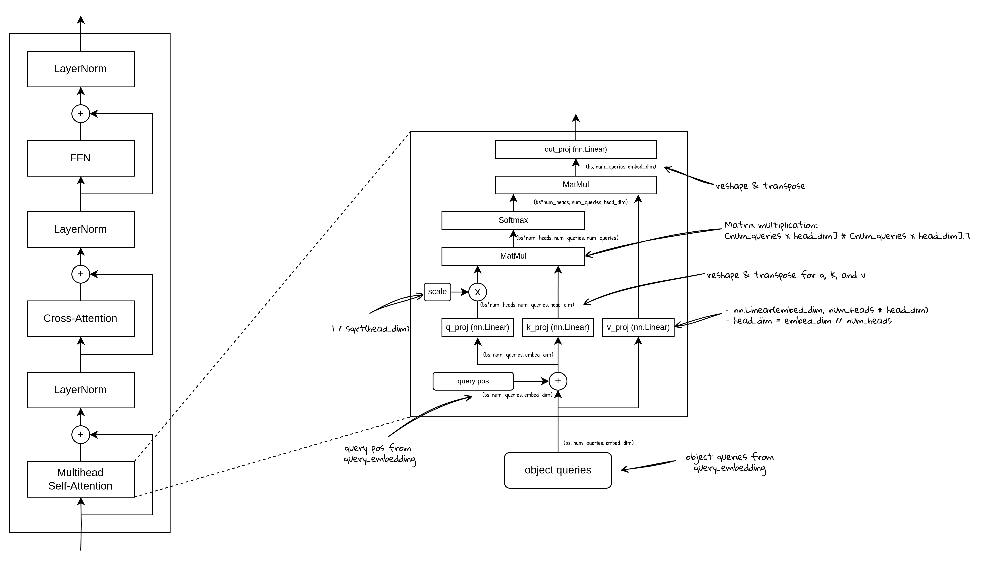

# 从零开始实现BEVFormer (8) - Decoder Self-Attention


## DecodeLayer中的Self-Attention结构：

Self-Attention的主要结构比较清楚：



1. 线性变换q_proj：
    1. 输入：x + pos_embeds
    2. 输出：x_q
2. 线性变换k_proj：
    1. 输入：x + pos_embeds
    2. 输出：x_q
3. 线性变换v_proj：
    1. 输入：x
    2. 输出：x_q
4. Matmul计算注意力：
    1. 输入：x_q，x_k
    2. 输出： attn（注意力矩阵）
5. Matmul计算结果：
    1. 输入：attn，x_v
    2. 输出：out
6. 线性变换out_proj:
    1. 输入：out
    2. 输出：out

需要注意的点：

- 多头注意力，需要把输入的embed_dim维度的特征，按照head的个数划分一下，然后分批去处理
- 在最后的out_proj线性变换之前，再将特征reshap回来，把embed_dim合并起来再计算
- 在BEVFormer里，我们按照官方实现的方式，把残差连接写在Attention实现里，也可以拿出去在外一层实现（这里只是为了方便对齐精度）

### 代码实现：

```python
class MultiheadAttention(nn.Layer):
    """Multi head attention"""
    def __init__(self, embed_dim, num_heads, dropout_rate=0.0):
        super().__init__()
        self.embed_dim = embed_dim
        self.num_heads = num_heads
        self.head_dim = embed_dim // num_heads
        self.scale = self.head_dim ** -0.5

        self.q = nn.Linear(embed_dim, embed_dim)
        self.k = nn.Linear(embed_dim, embed_dim)
        self.v = nn.Linear(embed_dim, embed_dim)

        self.out_proj = nn.Linear(embed_dim, embed_dim)
        self.dropout = nn.Dropout(dropout_rate)
        # 可以不加-1，默认就是沿着最后一维
        self.softmax = nn.Softmax(-1)

    def reshape_to_multi_heads(self, x, seq_l, bs):
        x = x.reshape([bs, seq_l, self.num_heads, self.head_dim])
        x = x.transpose([0, 2, 1, 3])
        x = x.reshape([bs * self.num_heads, seq_l, self.head_dim])
        return x

    def forward(self,
                x,
                attn_mask,
                pos_embeds,
                encoder_x=None,
                encoder_pos_embeds=None):
        h = x
        x_q = x + pos_embeds if pos_embeds is not None else x

        if encoder_x is None:  # self-attn
            x_k = x_q
            x_v = x
        else:  # cross-attn
            x_k = encoder_x + encoder_pos_embeds if encoder_pos_embeds is not None else encoder_x
            x_v = encoder_x

        bs, tgt_l, _ = x_q.shape
        _, src_l, _ = x_v.shape

        q = self.q(x_q) * self.scale
        q = self.reshape_to_multi_heads(q, tgt_l, bs)  # [bs*num_heads, tgt_l, head_dim]
        k = self.k(x_k)
        k = self.reshape_to_multi_heads(k, src_l, bs)  # [bs*num_heads, src_l, head_dim]
        v = self.v(x_v)
        v = self.reshape_to_multi_heads(v, src_l, bs)  # [bs*num_heads, src_l, head_dim]

        attn = paddle.matmul(q, k, transpose_y=True)  # [bs*numheads, tgt_l, src_l]

        # attn mask: padded area is set to small number
        if attn_mask is not None:
            attn = attn.reshape([bs, self.num_heads, tgt_l, src_l])
            attn = attn + attn_mask  # [bs, num_heads, tgt_l, src_l] + [bs, 1, tgt_l, src_l]
            attn = attn.reshape([bs * self.num_heads, tgt_l, src_l])
        attn = self.softmax(attn)
        # return attn_reshaped, reshape back is to ensure attn keeps its gradient
        attn_reshaped = attn.reshape([bs, self.num_heads, tgt_l, src_l])
        attn = attn_reshaped.reshape([bs * self.num_heads, tgt_l, src_l])
        attn = self.dropout(attn)

        out = paddle.matmul(attn, v)
        out = out.reshape([bs, self.num_heads, tgt_l, self.head_dim])
        out = out.transpose([0, 2, 1, 3])
        out = out.reshape([bs, tgt_l, self.num_heads * self.head_dim])
        out = self.out_proj(out)
        out = self.dropout(out)

        out = h + out
        return out, attn_reshaped
```
