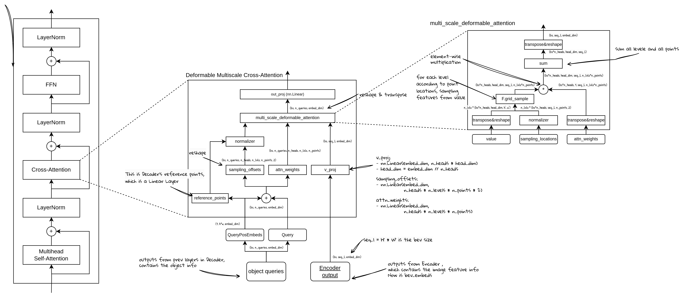

# 从零开始实现BEVFormer (9) - Decoder  Cross-Attention


## DecodeLayer中的Cross-Attention结构：

Cross-Attention是基于Deformable Attention的结构：



我们首先来看CrossAttention本身的整体结构，它包含了：

1. Attn权重计算：
    1. 输入： object query  + query_pos
    2. 输出： attn
    3. 这里的计算就是通过一个可学习的线性变换(self.attn)来计算，个数就是特征的层数*每个特征点的采样点个数
2. 通过参考点和offset计算采样点位置：
    1. 参考点：作为参数传进来的2D参考点（通过线性变换得到的），经过sigmoid归一化之后的值。
    2. offset：通过线性变换得到的对于每个参考点的位置偏移量，这个是绝对值，需要除以特征图的尺寸归一化
    3. 采样点位置：参考点位置 + offsets
3. Deformable Attention计算：
    1. 通过grid_sampling，从BEV特征上，按照采样点位置，采样BEV特征
    2. 采样后的BEV特征与Attn相乘，得到输出

### BEVFormerDeformableAttention类代码实现：

```python
class BEVFormerDeformableAttention(nn.Layer):
    """ This class is used only in cross-attn of Decoder layer """
    def __init__(self,
                 embed_dim,
                 num_heads,
                 num_levels,
                 num_points,
                 dropout_rate=0.1):
        super().__init__()
        self.embed_dim = embed_dim
        self.num_heads = num_heads
        self.head_dim = embed_dim // num_heads
        self.num_points = num_points
        self.num_levels = num_levels

        self.sampling_offsets = nn.Linear(embed_dim, num_heads * num_levels * num_points * 2)
        self.attn = nn.Linear(embed_dim, num_heads * num_levels * num_points)
        self.softmax = nn.Softmax(-1)

        self.value_proj = nn.Linear(embed_dim, embed_dim)
        self.out_proj = nn.Linear(embed_dim, embed_dim)
        self.dropout = nn.Dropout(dropout_rate)

    def forward(self,
                x,
                value,
                attn_mask,
                pos_embeds,
                ref_pts,
                spatial_shapes,
                level_start_index):
        bs, tgt_l, _ = x.shape
        value = x if value is None else value
        _, src_l, _ = value.shape
				# 残差连接
        h = x 
        # value线性变换
        x_v = self.value_proj(value)
        # 输入embeding加位置信息
        x_q = x + pos_embeds if pos_embeds is not None else x

        if attn_mask is not None:  # [bs, seq_l]
            x_v = paddle.masked_fill(x_v, attn_mask[..., None], 0.0)
        x_v = x_v.reshape([bs, src_l, self.num_heads, self.head_dim])

				# 参考点的offset，这里是非归一化的绝对偏移量
        sampling_offsets = self.sampling_offsets(x_q)
        sampling_offsets = sampling_offsets.reshape(
            [bs, tgt_l, self.num_heads, self.num_levels, self.num_points, 2])
				# 计算attn分数
        attn = self.attn(x_q)
        attn = attn.reshape([bs, tgt_l, self.num_heads, self.num_levels * self.num_points])
        attn = self.softmax(attn)
        attn = attn.reshape([bs, tgt_l, self.num_heads, self.num_levels, self.num_points])

        # spatial_shapes: [num_levels, 2]
        # 用于把offset归一化到0，1
        offset_normalizer = paddle.stack([spatial_shapes[..., 1], spatial_shapes[..., 0]], -1)
        # 得到采样点位置
        sampling_locations = (ref_pts[:, :, None, :, None, :] +
                              sampling_offsets / offset_normalizer[None, None, None, :, None, :])

        out = multiscale_deformable_attention(x_v, spatial_shapes, sampling_locations, attn)
        out = self.out_proj(out)
        out = self.dropout(out)
        out = h + out

        return out, attn
```

### multiscale_deformable_attention方法代码实现：

- 需要把采样点位置归一化到(-1,1)，这是因为grid_sample方法要求的输入点的位置范围是（-1，1），该方法中 `x = -1, y = -1` 是`input` 的左上角位置， `x = 1, y = 1` 则是 `input` 的右下角位置。
- v_list是把x_v按每层的大小展开，然后reshape成为每层的[h，w]，再进行grid_sample

```python
def multiscale_deformable_attention(x_v, spatial_shapes, sampling_locations, attn):
    """deformable attention in paddle"""
    # get shapes
    bs, _, num_heads, head_dim = x_v.shape
    _, tgt_l, _, num_levels, num_points, _ = sampling_locations.shape
    # split each level
    spatial_shapes_list = spatial_shapes.numpy().tolist()
    v_list = x_v.split([h * w for h, w in spatial_shapes_list], axis=1)
    # 采样点位置归一化到 （-1， 1）；
    sampling_grids = 2 * sampling_locations - 1  # [bs, tgt_l, num_heads, num_levels, num_points, 2]
    sampling_v_list = []
    # 分层单独处理
    for level_idx, (h, w) in enumerate(spatial_shapes_list):
        # [bs, h*w, num_heads, head_dim] -> [bs, h*w, num_heads*head_dim]
        v_l = v_list[level_idx].flatten(2)
        v_l = v_l.transpose([0, 2, 1])  # -> [bs, num_heads*head_dim, h*w]
        v_l = v_l.reshape([bs * num_heads, head_dim, h, w])

        # [bs, tgt_l, num_heads, num_points, 2]
        sampling_grid_l = sampling_grids[:, :, :, level_idx]
        # [bs, num_heads, tgt_l, num_points, 2]
        sampling_grid_l = sampling_grid_l.transpose([0, 2, 1, 3, 4])
        # [bs*num_heads, tgt_l, num_points, 2]
        sampling_grid_l = sampling_grid_l.flatten(0, 1)

        sampling_v_l = F.grid_sample(v_l,
                                       sampling_grid_l,
                                       mode='bilinear',
                                       padding_mode='zeros',
                                       align_corners=False)
        sampling_v_list.append(sampling_v_l)

    # attn: [bs, tgt_l, num_heads, num_levels, num_points]
    attn = attn.transpose([0, 2, 1, 3, 4])  # [bs, num_heads, tgt_l, num_levels, num_points]
    attn = attn.reshape([bs*num_heads, 1, tgt_l, num_levels*num_points])

    # [bs*num_heads, head_dim, tgt_l, num_points] * num_levels ->
    # [bs*num_heads, head_dim, tgt_l, num_levels, num_points]
    out = paddle.stack(sampling_v_list, axis=-2)
    # [bs*num_heads, head_dim, tgt_l, num_levels * num_points]
    out = out.flatten(-2)
    # attn: [bs*num_heads, 1, tgt_l, num_levels * num_points])
    out = out * attn  # [bs*num_heads, head_dim, tgt_l, num_levels * num_points]
    out = out.sum(-1)  # [bs*num_heads, head_dim, tgt_l]
    out = out.reshape([bs, num_heads * head_dim, tgt_l])
    out = out.transpose([0, 2, 1])  # [bs, tgt_l, embed_dim]
    return out
```
