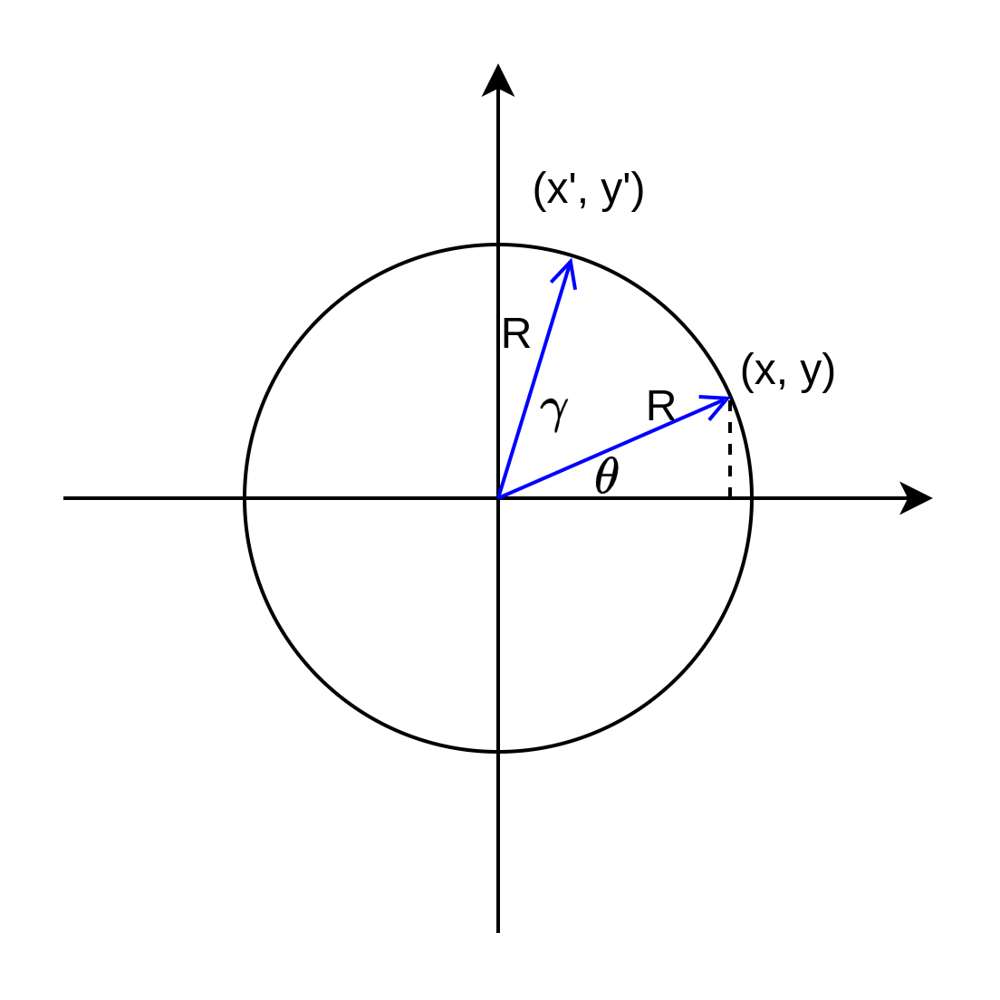

# 从零开始学 - 矩阵旋转平移基础

## **矩阵：**

是计算机视觉和计算机图形学中一个非常重要和基础的数学工具

一个$m\times n$矩阵表示$m$行，$n$列的矩阵，一张2D的数字图像也可以表示成矩阵的形式，矩阵的长宽分别对应图像长宽（像素数），矩阵每个元素的值对应图像中像素点的灰度值。

例如，2x2矩阵：$\begin{bmatrix}a & b \\ c& d\end{bmatrix}$，2x3矩阵：$\begin{bmatrix} 2 & 3 & 4 \\ 5 & 6  & 7 \end{bmatrix}$

## **矩阵乘法：**

简单概括就是：第一行乘以第一列，第二行乘以第二列，得到值依次填到对应的位置上。

例如：

$\begin{bmatrix}a & b \\ c& d\end{bmatrix} \cdot \begin{bmatrix}e & f \\ g& h\end{bmatrix} = \begin{bmatrix}ae+bg & af+bh \\ ce+dg& cf+dh\end{bmatrix}$

## **平移矩阵：**

假设一个点的坐标是$(x,y,z)$，其沿着各个轴分别平移$(\delta_x, \delta_y, \delta_z)$，其平移后的坐标是：

$(x+\delta_x, y+\delta_y, z+\delta_z)$

如果在这里引入**齐次坐标**表示：

- 齐次坐标定义：给定欧氏平面上的一点 (*x*, *y*)，对任意非零实数 Z，三元组 (*xZ*, *yZ*, *Z*) 即称之为该点的齐次坐标

$(x,y,z)^{(h)} =（x,y,z,1）$ ，然后用矩阵形式表示（也叫做列向量）：$\begin{bmatrix} x \\ y \\ z\\1\end{bmatrix}$

齐次坐标的特点是可以将平移操作从加法转换成矩阵乘法。例如我们可以将平移量写成以下的矩阵形式：

$\begin{bmatrix} 1 & 0 & 0 & \delta_x \\  0 & 1 & 0 & \delta_y \\  0 & 0 & 1 & \delta_z \\ 0 & 0 & 0 & 1 \end{bmatrix}$

通过矩阵乘法可以得到：

$\begin{bmatrix} 1 & 0 & 0 & \delta_x \\  0 & 1 & 0 & \delta_y \\  0 & 0 & 1 & \delta_z \\ 0 & 0 & 0 & 1 \end{bmatrix} \cdot \begin{bmatrix} x \\ y \\ z\\1\end{bmatrix} = \begin{bmatrix} x+\delta_x \\ y+\delta_y \\ z+\delta_z\\1\end{bmatrix}$

## **缩放矩阵：**

通过缩放矩阵，可以对齐次坐标点进行缩放

$\begin{bmatrix} s_x & 0 & 0 & 0 \\  0 & s_y & 0 & 0 \\  0 & 0 & s_z & 0 \\ 0 & 0 & 0 & 1 \end{bmatrix} \cdot \begin{bmatrix} x \\ y \\ z\\1\end{bmatrix} = \begin{bmatrix} s_xx \\ s_yy \\ s_zz\\1\end{bmatrix}$

## **旋转矩阵：**

### 欧拉角：

欧拉角通过三个独立的旋转角度$(\psi, \theta, \phi)$描述旋转：

- **Yaw** ：绕 z 轴的旋转（航向角）
- **Pitch**：绕 y 轴的旋转（俯仰角）
- **Roll**：绕 x 轴的旋转（滚动角）

**欧拉角**是一种简单直观的旋转表示方式，适合直接描述人类理解的旋转角度。

### **旋转矩阵：**

假设一个点的坐标是$(x, y, z)$，旋转变换后的坐标是$(x', y', z')$

可以划分为：

- 绕x轴旋转$\alpha$角度：x的坐标不变，y和z的坐标变化
- 绕y轴旋转$\beta$角度：y的坐标不变，x和z的坐标变化
- 绕z轴旋转$\gamma$角度：z的坐标不变，x和y的坐标变化

**旋转角度的关系：**

如下图，假设$(x, y)$是空间中的一个向量，这个向量相对于x轴的角度假设为$\theta$，基于原点旋转（逆时针）后的向量是$(x',y')$，这个向量相对于x轴的角度为$\epsilon$。旋转前后向量的长度不变，假设为$R$。可以得到：

- $\mathrm{sin}(\theta) = \dfrac{y} {R} , \mathrm{cos}(\theta) = \dfrac{x} {R}$
- $\mathrm{sin}(\epsilon) = \dfrac{y'} {R} , \mathrm{cos}(\epsilon) = \dfrac{x'} {R}$

$(x',y')$ 相对于$(x, y)$旋转的角度是 $\gamma = \epsilon - \theta$

也就是说： $\epsilon = \theta + \gamma$

我们已知：$\gamma, x, y$

求：$x', y'$

**推导过程：**

公式1：$sin(a+b) = sin(a)cos(b) + cos(a)sin(b)$

公式2：$cos(a+b) = cos(a)cos(b) - sin(a)sin(b)$

$\epsilon = \theta + \gamma$ 并且 $\mathrm{sine}(\epsilon) = \dfrac{y'} {R}$

$y' = \mathrm{sin}(\theta+\gamma) R$

$y'=\mathrm{sin}(\theta) \mathrm{cos}(\gamma)R + \mathrm{cos}(\theta)\mathrm{sin}(\gamma)R$

因为：

$\mathrm{sin}(\theta) = \dfrac{y} {R} , \mathrm{cos}(\theta) = \dfrac{x} {R}$ 

$R = \dfrac{y}{\mathrm{sin}(\theta)},R = \dfrac{x}{\mathrm{cos}(\theta)}$

所以：

$y'=\mathrm{sin}(\theta) \mathrm{cos}(\gamma)\dfrac{y}{\mathrm{sin}(\theta)} + \mathrm{cos}(\theta)\mathrm{sin}(\gamma)\dfrac{x}{\mathrm{cos}(\theta)}$

$y'= \mathrm{cos}(\gamma)y + \mathrm{sin}(\gamma)x$

$y'= x\mathrm{sin}(\gamma) + y\mathrm{cos}(\gamma)$ 

同理：

$x'= x\mathrm{cos}(\gamma) - y\mathrm{sin}(\gamma)$ 

最终我们分别计算得到：

- （roll）绕x轴旋转$\alpha$角度：$\begin{bmatrix} x' \\ y' \\z' \\1\end{bmatrix} = \begin{bmatrix} x \\ y\mathrm{cos}(\alpha) - z\mathrm{sin}(\alpha)  \\ y\mathrm{sin}(\alpha) + z\mathrm{cos}(\alpha) \\ 1 \end{bmatrix}$
- （pitch）绕y轴旋转$\beta$角度：$\begin{bmatrix} x' \\ y' \\z' \\1\end{bmatrix} = \begin{bmatrix} z\mathrm{sin}(\beta) + x\mathrm{cos}(\beta)  \\ y \\z\mathrm{cos}(\beta) - x\mathrm{sin}(\beta) \\ 1 \end{bmatrix}$
- （yaw）绕z轴旋转$\gamma$角度：$\begin{bmatrix} x' \\ y' \\z' \\1\end{bmatrix} = \begin{bmatrix} x\mathrm{cos}(\gamma) - y\mathrm{sin}(\gamma)  \\ x\mathrm{sin}(\gamma) + y\mathrm{cos}(\gamma) \\ z \\ 1 \end{bmatrix}$

进一步可以得到三个轴分别的旋转矩阵：

Roll：$\mathcal{R}_x(\alpha)=\begin{bmatrix} 1 & 0 & 0 & 0 \\  0 & cos\alpha & -sin\alpha & 0 \\ 0 & sin\alpha & cos\alpha & 0 \\ 0 & 0 & 0 & 1 \end{bmatrix}$

Pitch：$\mathcal{R}_y(\beta)=\begin{bmatrix} cos\beta & 0 & sin\beta & 0 \\  0 & 1 & 0 & 0 \\ -sin\beta & 0 & cos\beta & 0 \\ 0 & 0 & 0 & 1 \end{bmatrix}$

Yaw：$\mathcal{R}_z(\gamma)=\begin{bmatrix} cos\gamma & -sin\gamma & 0 & 0 \\  sin\gamma & cos\gamma & 0 & 0 \\ 0 & 0 & 1 & 0 \\ 1 & 0 & 0 & 1 \end{bmatrix}$

通过矩阵乘法，就可以实现单个轴上的向量旋转计算，例如计算x轴的旋转：

$\mathcal{R}_x(\alpha)\begin{bmatrix} x \\ y \\z \\1\end{bmatrix}=\begin{bmatrix} x' \\ y' \\z' \\1\end{bmatrix}$

再进一步，可以将旋转矩阵合并，得到旋转矩阵：

$\mathcal{M}(\alpha,\beta,\gamma) = \mathcal{R}_z(\gamma)\mathcal{R}_y(\beta)\mathcal{R}_x(\alpha)$

- 参考链接：
    
     https://zh.wikipedia.org/zh-cn/%E6%97%8B%E8%BD%AC%E7%9F%A9%E9%98%B5#%E6%AC%A7%E6%8B%89%E8%A7%92%E8%A1%A8%E7%A4%BA
    

注意旋转矩阵的计算顺序通常是：

$R_{\text{total}} = R_{\text{yaw}} \times R_{\text{pitch}} \times R_{\text{roll}}$

原因如下：

1. **局部坐标系**的旋转：每次旋转都会影响后续旋转的轴的方向，因为旋转总是围绕当前的坐标系进行。
2. **从内到外依次旋转**：最里层的 `Roll` 是局部坐标系的旋转，`Pitch` 和 `Yaw` 影响全局的旋转。换句话说，`Roll` 只影响前向方向，而 `Yaw` 影响整体的旋转方向。
3. 矩阵乘法不具有交换律，所以这个顺序不能随意改变

最终，合并后的旋转矩阵在齐次坐标下是一个4x4的矩阵（如果是在笛卡尔坐标系下，则是一个3x3矩阵）：

$$
\mathcal{R}_z(\gamma)\mathcal{R}_y(\beta)\mathcal{R}_x(\alpha)= \begin{bmatrix}
cos\gamma cos\beta && -sin\gamma && cos\gamma sin\beta && 0 \\
sin\gamma cos\beta && cos\gamma && sin\gamma sin\beta && 0 \\
-sin\beta && 0 && cos\beta && 1\\ cos\beta && 0 && sin\beta && 1
\end{bmatrix} \begin{bmatrix} 1 & 0 & 0 & 0 \\  0 & cos\alpha & -sin\alpha & 0 \\ 0 & sin\alpha & cos\alpha & 0 \\ 0 & 0 & 0 & 1 \end{bmatrix}
$$

结果是：

$$
\begin{bmatrix}
cos\gamma cos\beta && -sin\gamma cos\alpha + cos\gamma sin\beta sin\alpha && sin\gamma sin\alpha + cos\gamma sin\beta cos\alpha && 0 \\
sin\gamma cos\beta && cos\gamma cos\alpha  + sin\gamma sin\beta sin\alpha && -cos\gamma sin\alpha + sin\gamma sin\beta cos\alpha && 0 \\
-sin\beta && cos\beta sin\alpha && cos\beta cos\alpha && 1 \\
cos\beta && sin\beta sin\alpha && sin\beta cos\alpha && 1
\end{bmatrix}
$$

**旋转矩阵**的优点是：可直接表示线性变换，适合矩阵运算。

## 四元数

四元数也可以用来表示三维空间中的旋转。

四元数是一个四维数，通常表示为：

$$
q=[w, x, y, z]
$$

其中，$w$是一个实数，$[x, y, z]$是一个三维向量。

四元数可以和旋转矩阵互相转换：

四元数 $q = [w, x, y, z]$对应的旋转矩阵为：

$R =
\begin{bmatrix}
1 - 2(y^2 + z^2) & 2(xy - wz) & 2(xz + wy) \\
2(xy + wz) & 1 - 2(x^2 + z^2) & 2(yz - wx) \\
2(xz - wy) & 2(yz + wx) & 1 - 2(x^2 + y^2)
\end{bmatrix}$

反过来，也可以从旋转矩阵 R 转换回四元数。

四元数和欧拉角的关系也可以通过计算得到：

四元数 $q = [w, x, y, z]$，可以计算对应的欧拉角 $(\psi, \theta, \phi)$：

1. **计算 Pitch (θ)**：
    
    $\theta = \arcsin(2(wy - xz))$
    
2. **计算 Yaw (ψ)**：
    
    $\psi = \arctan2(2(wz + xy), 1 - 2(y^2 + x^2))$
    
3. **计算 Roll (φ)**：
    
    $\phi = \arctan2(2(wx + yz), 1 - 2(z^2 + y^2))$
    

四元数表示旋转，最主要的好处是避免万向节锁问题（欧拉角在某个特定角度下发生重叠，导致原本独立的三个旋转轴变成了两个轴，失去了一个自由度），适合插值计算和复杂旋转场景。