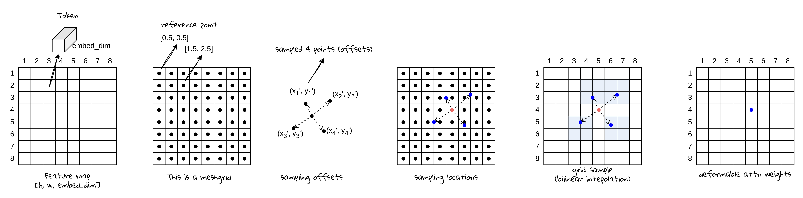

# 从零开始学 Deformable DETR (3) - 多尺度特征融合：Deformable Attention



# 标准Self-Attention的原理：

给定一个特征图，假设其维度是 [1, embed_dim, h, w]，标准的Self-Attention，会将h*w个token（每个token维度是embed_dim）两两计算注意力权重（通过点积的方式），其所有的token都会参与计算：


如上图所示，Self Attention在计算时，query 和 key 来自相同的feature map（经过不同的线性变换得到）。对于图像来说，2D的Feature map会先被展开成`[bs, seq_l, embed_dim]`，其中`seq_l = h * w`，这一步之后，每个元素就是原2D feature map上的一个特征向量，也可以被称为token，原本的2D feature map就变成了token序列。在得到Attention分数（经过softmax）后，再和Value（同样是来自相同的feature map，经过不同的线性变换得到）相乘，得到输出。


# Deformable Attention的原理：


Deformable Attention为了节省计算，去掉了点积计算注意力权重，而在每一个token的附近进行位置采样，作为注意力需要关注的位置，然后仅对这些位置做注意力计算，从而达到节省计算的目的。具体的计算过程如下：

首先，对于图像任务来说，每一个token尽管在输入注意力计算的时候已经被展开（flatten）成一个token的序列，但其在2D空间中都有是有具体位置（（也就是坐标，对于数组来说也可以是下标）。如下图所示，2D的feature map上的每个token（左图），都可以对应一个具体的坐标位置（右图）。


对于每一个token，我们可以以该token的位置为中心，向上下左右各个方向采样N个位置。在这些位置上的token，会被用来参与计算Attention，feature map上的其他点，对于这个token来说不参与计算。如下图所示，对于每个位置（左图），先按照偏移量进行采样，然后可以计算得到实际的采样点位置（右图），这些采样点位置对应的特征（token）将会被用来计算attention。


可以看到，采样位置不一定正好落在某个Token的坐标位置上，如果特征采样的时候出现非整数（比如在某两个token之间的位置），那就使用双线性差值，得到该点的特征。


- 双线性差值：原理是根据在采样点上下左右四个像素点，通过距离加权平均，得到目标点的像素值。
    
    具体的计算过程可以参考下面的代码（来自Paddle官方文档：https://www.paddlepaddle.org.cn/documentation/docs/zh/2.6/api/paddle/nn/functional/grid_sample_cn.html#grid-sam[ple](https://www.paddlepaddle.org.cn/documentation/docs/zh/2.6/api/paddle/nn/functional/grid_sample_cn.html#grid-sample)）
    
    主要过程是：
    
    1. 找到相邻的四个像素点位置
        1. 使用+1取右边的点，因为坐标会取整，相当于取ceil；（可以理解为 int(x-1) == ceil(x-1)）
        2. 使用floor取左边的点
    2. 计算距离
    3. 根据距离比例进行加权求和
    
    ```python
      wn ------- y_n ------- en
      |           |           |
      |          d_n          |
      |           |           |
     x_w --d_w-- grid--d_e-- x_e
      |           |           |
      |          d_s          |
      |           |           |
      ws ------- y_s ------- es
    
    x_w = floor(x)              // west side x coord
    x_e = x_w + 1               // east side x coord
    y_n = floor(y)              // north side y coord
    y_s = y_s + 1               // south side y coord
    d_w = grid_x - x_w          // distance to west side
    d_e = x_e - grid_x          // distance to east side
    d_n = grid_y - y_n          // distance to north side
    d_s = y_s - grid_y          // distance to south side
    wn = X[:, :, y_n, x_w]      // north-west point value
    en = X[:, :, y_n, x_e]      // north-east point value
    ws = X[:, :, y_s, x_w]      // south-east point value
    es = X[:, :, y_s, x_w]      // north-east point value
    
    output = wn * d_e * d_s + en * d_w * d_s
           + ws * d_e * d_n + es * d_w * d_n
    ```
    

从上面的过程可以看出，如何选择这N个点，是影响模型能力的一个比较重要的部分，Deformable DETR将选择交给网络本身，通过可学习的线性层生成这些采样点，让这些点随着网络的更新逐步优化，使得网络自己找到更重要的采样点位置。

总的来说，Deformable Attention相当于是把每个token的注意力权重，由原来的seq_l个，限制为N个（例如N=4），大大减少了计算。这里注意到，上面的操作完成了从Token中采样N个特征参与注意力计算，注意力本身的计算，类似于得到了Value值，表示每个对token可以提供的信息是来自于4个采样点的特征，每个采样点需要拿多少信息，则是通过attn weights来决定，Deformable DETR采用了一个可学习的参数让attn通过网络学习得到。所以在这一步中，类比标准self-attn，是没有Query和Key的。

## Deformable Self-Attention

Deformable DETR在Encoder中使用了基于Deformable Attention的self-attention，当在计算Self-Attention的时候：

- value是来自输入图像特征，经过线性变换得到
- 采样需要的位置，还有特征，都是来自图像特征，并且各自经过线性变换得到
- attn_weight是来自图像特征，经过线性变换得到

另外对于采样点的位置，是通过 参考点 +偏移量得到的。在Encoder里输入是图像特征，参考点就是图像特征大小的网格，每个参考点的坐标就是图像特征长宽等距离划分的点。可学习的部分是偏移量offset。

## Deformable Cross-Attention

Deformable DETR在Decoder中同时使用了self-attention和cross-attention：其中的self-attention是标准的self-attention；cross-attention是基于deformable attention进行计算。

Cross-Attention计算时：

- value是来自encoder输出，包含了图像信息，经过线性变换得到
- 采样需要的位置，还有特征，都是来自object query，并且各自经过线性变换得到
- attn_weight是来自object query，经过线性变换得到

采样点的位置，在Decoder中是通过 参考点 + 偏移量计算得到的。参考点本身的位置是和object query一一对应，代表潜在的目标中心位置，在decoder中是使用pos_embeds经过可学习的线性层生成的，同时偏移量本身也是经过一个线性层，输入参考点位置生成的。也就是说，decoder的采样点，参考点和偏移量都是通过学习得到的。

## Multiscale Deformable Attention：

Deformable DETR有使用多层特征，这里的多层指的是输入的图像特征是多层的，这些图像特征通过image backbone以及一个多层特征提取FPN层得到。这些图像特征大小不同，通常每两层之间都是2x下采样的关系。在计算attention的时候，需要进行分层处理，最后通过求和将这些结果融合到一起。具体的融合方式，我们会在代码实现的章节进行详细讲解。
