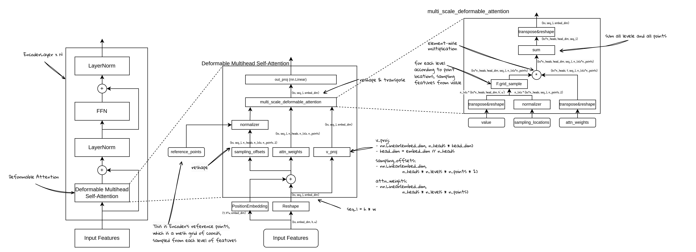

# 从零开始学 Deformable DETR (4) - 从 Query 到关键点：偏移机制的原理

从 **Query 到关键点** 的过程，以及偏移机制的设计，是 Deformable DETR 的核心创新点之一。Deformable DETR中使用到Deformable Attention的有两个地方：

1. Encoder中，计算图像特征自注意力
2. Decoder中，计算Object Query和Encoder输出（多尺度图像特征）的交叉注意力

我们会分别从这两种方式详细分析其原理和机制

# 图像特征的自注意力：

图像特征在进入Encoder模块后，以一个Token序列的形式进入到自注意力计算模块，在DeformableDETR中使用的是Deformable Attention。具体来说：

1. **计算参考点**
2. **计算参考点偏移**
3. **计算Attention权重**
4. **计算value的线性变换**

上面的计算完成之后：

1. **通过参考点和参考点偏移，计算得到采样点位置**
2. **通过采样点位置、Attention权重、value线性变换后的结果，进行deformable attn的计算**

计算完成后：

1. **对输出再进行线性变换，返回结果**

**比较直观的描述这些步骤：**

1. 给当前Token序列中的每个Token都生成一个参考点位置
2. 给每个参考点位置，生成若干个偏移量。对于每个参考点位置，可以得到若干个采样点位置
3. 通过可学习的注意力权重，计算得到注意力打分
4. 通过采样点位置，在value上进行特征采样
5. 融合各个点的特征，乘以注意力打分，作为输出特征

这里比较重要和不太容易理解计算过程是：**参考点生成、偏移量生成，采**样特征

1. 参考点生成：
    1. 对于Encoder中的图像特征自注意力，输入的Token序列，本质上是图像特征，序列中每个元素对应着图像2D空间某个位置的图像特征。
    2. 标准的自注意力机制，对于每个图像特征，会与其他所有的图像特征进行注意力计算，而在Deformable注意力这里，我们希望仅使用一部分特征参与，这样可以节省掉很多计算量。至于怎么选择哪些特征，我们通过可学习的映射，将特征的位置编码作为输入，输出我们要的点的位置。这些位置，就称为采样点。
    3. 为了更有效的生成这些采样点，我们把采样点位置分成两部分：
        1. 参考点：每个query设置一个参考点位置，对于图像特征，就是其在2D图像特征网格上的位置。
        2. 偏移量：每个参考点可以生成多个偏移量，从而得到多个采样点。
2. **偏移量生成**：
    1. 这一步是通过一个Linear层，经过线性变换，以图像特征作为输入，得到对应的偏移量
    2. 偏移量是一个绝对值，需要根据特征的大小变成0,1的归一化值
3. 采样特征：
    1. 有了上面的采样点，我们要在特征图上按照这些位置进行采样。特征图是只经过线性变换之后的特征，来源是图像特征，这里不加位置编码
    2. 采样的过程，是按照采样点的数量，从特征图中按位置拿到这些特征并返回。对于非整数的采样点，会使用双线性插值的方式从这个采样点周围的整数位置的特征进行插值，得到该采样点的特征。
    3. 这样有了采样特征之后，我们原来的整张特征图，就变成了一组包含有采样点个数的特征。这些特征，被认为是需要参与到注意力计算的部分。将他们乘以可学习的注意力权重，得到的就是我们要的注意力计算后的输出特征。

## Object Query和图像特征的交叉注意力：

在Decoder中，计算图像特征（实际上是encoder部分的输出）和object query之间的交叉注意力，也使用了Deformable attention计算，具体的计算方式和Decoder的self-attention有几个区别：

1. 注意力计算的参考点和偏移量，来自object query（具体是object query的位置编码部分），而不是来自图像特征的参考点。因为这里是对于每个object query，需要有一个“中心点”，这个点的生成是通过一个线性变换动态生成的，偏移量也是一样通过动态的方式生成。
2. 有了采样点之后，采样的value是图像特征（encoder的输出），而不是object query本身，这一步就是为了让object query获得图像特征的信息。这也是“交叉”的含义所在。

Deformable DETR的原理部分并不复杂，相对比较难的部分是具体的实现，我们将在代码实现的章节详细讲解。
