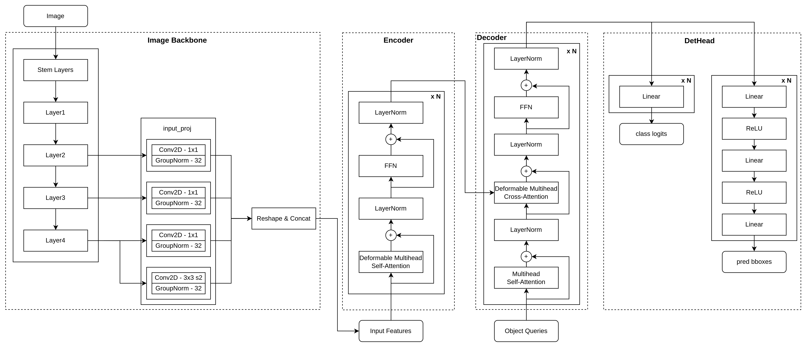
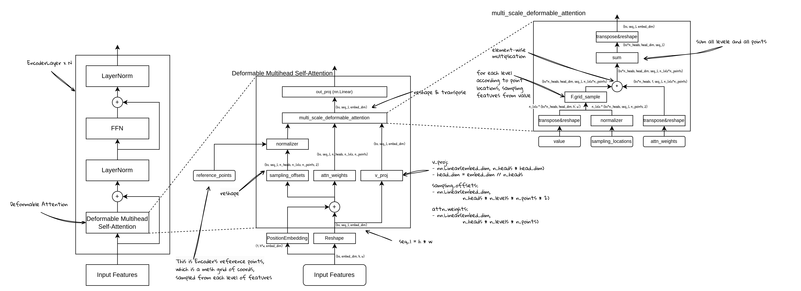

# 从零开始实现 Deformable DETR (3) - Encoder和Deformable Attention 计算

我们再来看一下DeformableDETR的整体结构：



在上一节中，我们实现了Encoder的基本框架和参考点的计算，本节我们来看EncoderLayer的具体实现。

### EncoderLayer结构：


从上图中可以看到，EncoderLayer的结构，是在标准的Transformer Encoder结构基础上，修改了MultiHeadAttentioni模块，将其替换成了Deformable MultiHead Self-Attention，其他部分基本上保持不变。

EncoderLayer类的主要成员为:

```python
        # Self-Attn
        self.self_attn = MultiscaleDeformableAttention(embed_dim, num_heads, num_points, num_levels)
        # self-attn norm
        self.self_attn_norm = nn.LayerNorm(embed_dim)
        # FFN
        self.dropout = nn.Dropout(dropout_rate)
        self.fc1 = nn.Linear(embed_dim, ffn_dim)
        self.act = nn.ReLU()
        self.act_dropout = nn.Dropout(dropout_rate)
        self.fc2 = nn.Linear(ffn_dim, embed_dim)
        # FFN norm
        self.norm = nn.LayerNorm(embed_dim)
```

### EncoderLayer完整代码：

```python
class DeformableDetrEncoderLayer(nn.Layer):
    """"Encoder Layer for Deformable Detr"""
    def __init__(self,
                 embed_dim,
                 ffn_dim,
                 num_heads,
                 num_points,
                 num_levels,
                 dropout_rate=0.0):
        super().__init__()
        # Self-Attn
        self.self_attn = MultiscaleDeformableAttention(embed_dim, num_heads, num_points, num_levels)
        self.self_attn_norm = nn.LayerNorm(embed_dim)
        # FFN
        self.dropout = nn.Dropout(dropout_rate)
        self.fc1 = nn.Linear(embed_dim, ffn_dim)
        self.act = nn.ReLU()
        self.act_dropout = nn.Dropout(dropout_rate)
        self.fc2 = nn.Linear(ffn_dim, embed_dim)
        self.norm = nn.LayerNorm(embed_dim)

    def forward(self,
                x,
                attn_mask,
                pos_embeds,
                ref_pts,
                spatial_shapes,
                level_start_index):
        # Self-Attn
        h = x
        x, attn_w = self.self_attn(x=x,
                                   value=None,
                                   attn_mask=attn_mask,
                                   pos_embeds=pos_embeds,
                                   ref_pts=ref_pts,
                                   spatial_shapes=spatial_shapes,
                                   level_start_index=level_start_index)
        x = self.dropout(x)
        x = h + x
        x = self.self_attn_norm(x)
        # FFN
        h = x
        x = self.fc1(x)
        x = self.act(x)
        x = self.act_dropout(x)
        x = self.fc2(x)
        x = self.dropout(x)
        x = h + x
        x = self.norm(x)

        outputs = (x, attn_w)
        return outputs

```

### Deformable Attention的结构：



我们首先来看Deformable Attention的实现：

```python
class MultiscaleDeformableAttention(nn.Layer):
    """Multi scale deformable attention for DeformableDetr"""
    def __init__(self, embed_dim, num_heads, num_points, num_levels):
        super().__init__()
        self. embed_dim = embed_dim
        self.num_heads = num_heads
        self.head_dim = embed_dim // num_heads
        self.num_points = num_points
        self.num_levels = num_levels

        self.sampling_offsets = nn.Linear(embed_dim, num_heads * num_levels * num_points * 2)
        self.attn = nn.Linear(embed_dim, num_heads * num_levels * num_points)
        self.softmax = nn.Softmax(-1)

        self.v = nn.Linear(embed_dim, embed_dim)
        self.out_proj = nn.Linear(embed_dim, embed_dim)

    def forward(self, x, value, attn_mask, pos_embeds, ref_pts, spatial_shapes, level_start_index):
        bs, tgt_l, _ = x.shape
        value = x if value is None else value
        _, src_l, _ = value.shape

        x_v = self.v(value)
        x_q = x + pos_embeds if pos_embeds is not None else x
        if attn_mask is not None:
            x_v = x_v.masked_fill(attn_mask[..., None], 0.0)
        x_v = x_v.reshape([bs, src_l, self.num_heads, self.head_dim])

        sampling_offsets = self.sampling_offsets(x_q)
        sampling_offsets = sampling_offsets.reshape(
            [bs, tgt_l, self.num_heads, self.num_levels, self.num_points, 2])

        attn = self.attn(x_q)
        attn = attn.reshape([bs, tgt_l, self.num_heads, self.num_levels * self.num_points])
        attn = self.softmax(attn)
        attn = attn.reshape([bs, tgt_l, self.num_heads, self.num_levels, self.num_points])

        # spatial shapes: [num_levels, 2]
        offset_normalizer = paddle.stack([spatial_shapes[..., 1], spatial_shapes[..., 0]], -1)

        # ref_pts: [bs, tgt_l, num_levels, 2]
        # sampling_offsets: [bs, tgt_l, num_heads, num_levels, num_points, 2]
        # offset_normalizer: [num_levels, 2]
        # sampling_locations: [bs, tgt_l, num_heads, num_levels, num_points, 2]
        sampling_locations = (ref_pts[:, :, None, :, None, :] +
                              sampling_offsets / offset_normalizer[None, None, None, :, None, :])

        out = multiscale_deformable_attention(x_v, spatial_shapes, sampling_locations, attn)
        out = self.out_proj(out)
        return out, attn
```

Forward部分可以分为以下几个步骤：

1. 计算x_v：这里是不需要加上位置编码的输入特征序列，经过线性层投影的结果
2. 计算sampling locations：
    1. 首先将输入（加了位置编码后）通过一个线性层得到offsets，这个是基于参考点（ref_pts）的偏移量。
    2. sampling locations 是参考点加上offsets，要注意这里计算的时候，需要归一化offsets。
3. 计算attn权重：这里也是通过一个线性层计算得到权重，在下一步里进行注意力的计算。
    
    
    
4. 特征采样和注意力计算：
    1. 这一步是可变形注意力的核心部分，原理是通过特征采样，按我们预设的数量在参考位置（reference locations）附近进行特征采样，然后使用这些特征作为参与注意力计算的特征，最终与attn权重相乘得到输出。
    2. 需要注意的是multi scale的计算，是说，我们的每个特征点，在采样的时候，会在其各个level（就是多scale）上都去采样n个点，最后会在level和point的维度上都进行求和相加。
5. 输出投影


### 特征采样和注意力计算：


- `F.grid_sample`: 要求输入的网格点在(-1,1)范围内，所以 当 x=-1, y=-1时，指的是特征图的左上角，当x=1,y=1的时候，指的是特征图的右下角。如果超出这个范围，会将特征填0（当设置**padding_mode="zeros"时**）
- 循环是分层计算特征采样
    - `sampling_grid_l` 是找到所有特征点（每层的每个特征点）在当前层的参考点位置。
        - `sampling_locations` 的shape是： `[bs, tgt_l, num_heads, num_levels, num_points, 2]`
        - `tgt_l = h1*w1 + … h4*w4` 所以是**多层**特征点的参考点位置
        - 循环中`sampling_grid_l = sampling_grids[:, :, :, level_idx]` 表示只拿当**前层的参考点**
    - `v_l` 是特征
        - `x_v`的shape是：`[bs, tgt_l, num_heads, head_dim]` ，表示所有特征点的特征（多层已经flatten后成为tgt_l长度的特征）
        - `v_list` 是在`tgt_l` 这个维度上，将特征按层分开：
            - `[bs, h1*w1, num_heads, head_dim]`
            - `[bs, h2*w2, num_heads, head_dim]`
            - `[bs, h3*w3, num_heads, head_dim]`
            - `[bs, h4*w4, num_heads, head_dim]`
        - 在循环中， `v_l = v_list[level_idx].flatten(2)`  实际上只取了当前层的特征点，看上去好像是应该取所有层的特征，其实这里是对的，因为我们要做的是：
            - 按照采样点位置进行特征采样，采样点有一维是按照level存放的
            - 所以可以分level对于每层特征分别采样，最后再拼起来
            - 按level采样时，在当前层我们只需要用到当前层的特征，因为采样点位置也是只取的当前层的位置
            - 循环外采样点的shape是`[bs, tgt_l, num_heads, num_levels, num_points, 2]` 可以理解为：
                - bs: 对于batch中的每一个样本
                - tgt_l: 对于4层图像特征中的每一个特征点
                - num_heads: 对于每一个head
                - num_level: 在每一个level上（level=4）
                - num_points: 采样了了num_points个点
                - 2: 存了每个采样点x,y的位置

```python
def multiscale_deformable_attention(x_v, spatial_shapes, sampling_locations, attn):
    """deformable attention in paddle"""
    # get shapes
    bs, _, num_heads, head_dim = x_v.shape
    _, tgt_l, _, num_levels, num_points, _ = sampling_locations.shape
    # split each level
    spatial_shapes_list = spatial_shapes.numpy().tolist()
    v_list = x_v.split([h * w for h, w in spatial_shapes_list], axis=1)
    sampling_grids = 2 * sampling_locations - 1  # [bs, tgt_l, num_heads, num_levels, num_points, 2]
    sampling_v_list = []

    for level_idx, (h, w) in enumerate(spatial_shapes_list):
        # [bs, h*w, num_heads, head_dim] -> [bs, h*w, num_heads*head_dim]
        v_l = v_list[level_idx].flatten(2)
        v_l = v_l.transpose([0, 2, 1])  # -> [bs, num_heads*head_dim, h*w]
        v_l = v_l.reshape([bs * num_heads, head_dim, h, w])

        # [bs, tgt_l, num_heads, num_points, 2]
        sampling_grid_l = sampling_grids[:, :, :, level_idx]
        # [bs, num_heads, tgt_l, num_points, 2]
        sampling_grid_l = sampling_grid_l.transpose([0, 2, 1, 3, 4])
        # [bs*num_heads, tgt_l, num_points, 2]
        sampling_grid_l = sampling_grid_l.flatten(0, 1)

        sampling_v_l = F.grid_sample(v_l,
                                       sampling_grid_l,
                                       mode='bilinear',
                                       padding_mode='zeros',
                                       align_corners=False)
        sampling_v_list.append(sampling_v_l)

    # attn: [bs, tgt_l, num_heads, num_levels, num_points]
    attn = attn.transpose([0, 2, 1, 3, 4])  # [bs, num_heads, tgt_l, num_levels, num_points]
    attn = attn.reshape([bs*num_heads, 1, tgt_l, num_levels*num_points])

    # [bs*num_heads, head_dim, tgt_l, num_points] * num_levels ->
    # [bs*num_heads, head_dim, tgt_l, num_levels, num_points]
    out = paddle.stack(sampling_v_list, axis=-2)
    # [bs*num_heads, head_dim, tgt_l, num_levels * num_points]
    out = out.flatten(-2)
    out = out * attn
    # [bs*num_heads, head_dim, tgt_l]
    out = out.sum(-1)
    out = out.reshape([bs, num_heads * head_dim, tgt_l])
    out = out.transpose([0, 2, 1])  # [bs, tgt_l, embed_dim]
    return out
```

### FFN结构：


```python
        # Class定义：
        # FFN
        self.dropout = nn.Dropout(dropout_rate)
        self.fc1 = nn.Linear(embed_dim, ffn_dim)
        self.act = nn.ReLU()
        self.act_dropout = nn.Dropout(dropout_rate)
        self.fc2 = nn.Linear(ffn_dim, embed_dim)
        # FFN norm
        self.norm = nn.LayerNorm(embed_dim)
        
        ...
        
        # Forward方法：
        # FFN
        h = x
        x = self.fc1(x)
        x = self.act(x)
        x = self.act_dropout(x)
        x = self.fc2(x)
        x = self.dropout(x)
        x = h + x
        x = self.norm(x)
```
