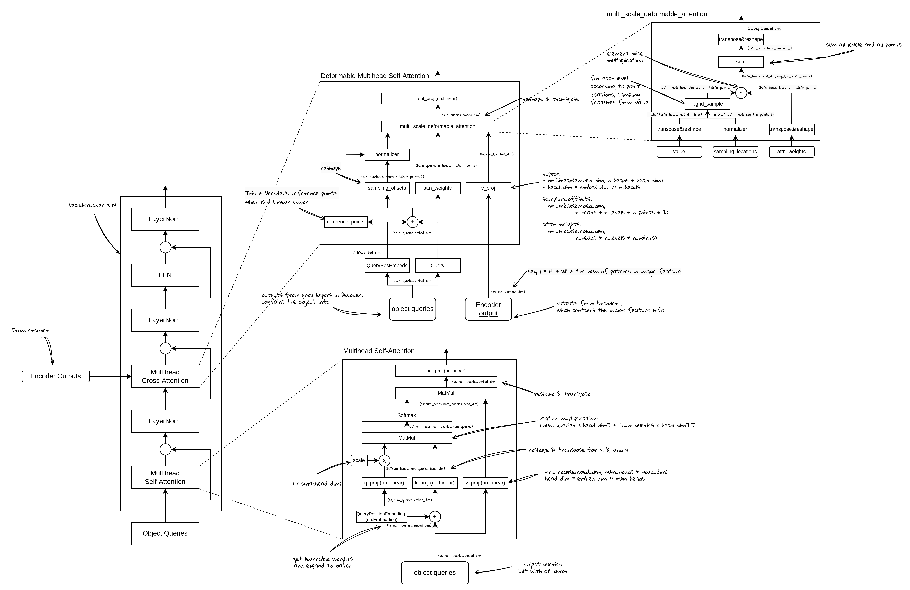

# 从零开始实现 Deformable DETR (5) - DecoderLayer的实现

**完整的结构图：**



# DecoderLayer的基本结构：


如上图所示，DecoderLayer的基本结构是包含有：

- MultiHead Self-Attention
- Cross Attention
- FFN
- LayerNorm和残差连接

在实现的时候，也按照各个模块和计算顺序进行搭建，self-attention和cross-attention也是单独的类来实现，所以在这一步只需要实现Layer部分的逻辑：

```python
class DeformableDetrDecoderLayer(nn.Layer):
    """"Decoder Layer for Deformable Detr"""
    def __init__(self,
                 embed_dim,
                 ffn_dim,
                 num_heads,
                 num_points,
                 num_levels,
                 dropout_rate=0.0):
        super().__init__()
        # Self-Attn
        self.self_attn = MultiheadAttention(embed_dim, num_heads, dropout_rate)
        self.self_attn_norm = nn.LayerNorm(embed_dim)
        # Cross-Attn
        self.cross_attn = MultiscaleDeformableAttention(embed_dim, num_heads, num_points, num_levels)
        self.cross_attn_norm = nn.LayerNorm(embed_dim)
        # FFN
        self.dropout = nn.Dropout(dropout_rate)
        self.fc1 = nn.Linear(embed_dim, ffn_dim)
        self.act = nn.ReLU()
        self.act_dropout = nn.Dropout(dropout_rate)
        self.fc2 = nn.Linear(ffn_dim, embed_dim)
        self.norm = nn.LayerNorm(embed_dim)

    def forward(self,
                x,
                attn_mask,
                encoder_x,
                encoder_attn_mask,
                pos_embeds,
                ref_pts,
                spatial_shapes,
                level_start_index):
        # Self-Attn
        h = x
        x, self_attn_w = self.self_attn(x=x,
                                        attn_mask=attn_mask,
                                        pos_embeds=pos_embeds)
        x = self.dropout(x)
        x = h + x
        x = self.self_attn_norm(x)
        # Cross-Attn
        h = x
        x, cross_attn_w = self.cross_attn(x=x,
                                          value=encoder_x,
                                          attn_mask=encoder_attn_mask,
                                          pos_embeds=pos_embeds,
                                          ref_pts=ref_pts,
                                          spatial_shapes=spatial_shapes,
                                          level_start_index=level_start_index)
        x = self.dropout(x)
        x = h + x
        x = self.cross_attn_norm(x)
        # FFN
        h = x
        x = self.fc1(x)
        x = self.act(x)
        x = self.act_dropout(x)
        x = self.fc2(x)
        x = self.dropout(x)
        x = h + x
        x = self.norm(x)

        outputs = (x, self_attn_w, cross_attn_w)
        return outputs
```

要注意的是：

- Self-Attention：就是标准的自注意力，输入是object queries，attn_mask是None，表示对于object query没有需要mask的部分
- Cross-Attention：这个是通过可变形注意力进行计算的交叉注意力
    - value是encoder的输出
    - encoder_attn_mask这里是从输入传过来用于mask掉padding部分
    - ref_pts是参考点位置，这个参考点是通过object query的pos embed部分经过linear层计算得到的参考点，可以理解为是decoder中，对于每个object query，在图像特征（encoder_x）上的参考点位置。
    - spatial_shapes保存了各个level的feature map的大小
    - level_start_index这里没有使用（当用cuda算子的时候需要）
    

# Self-Attention：


Decoder中的Self-Attention使用的是标准多头自注意力计算，具体实现如下：

```python
class MultiheadAttention(nn.Layer):
    """Multi head attention for DeformableDetr"""
    def __init__(self, embed_dim, num_heads, dropout_rate=0.0):
        super().__init__()
        self.embed_dim = embed_dim
        self.num_heads = num_heads
        self.head_dim = embed_dim // num_heads
        self.scale = self.head_dim ** -0.5

        self.q = nn.Linear(embed_dim, embed_dim)
        self.k = nn.Linear(embed_dim, embed_dim)
        self.v = nn.Linear(embed_dim, embed_dim)

        self.out_proj = nn.Linear(embed_dim, embed_dim)
        self.dropout = nn.Dropout(dropout_rate)
        self.softmax = nn.Softmax(-1)

    def reshape_to_multi_heads(self, x, seq_l, bs):
        x = x.reshape([bs, seq_l, self.num_heads, self.head_dim])
        x = x.transpose([0, 2, 1, 3])
        x = x.reshape([bs * self.num_heads, seq_l, self.head_dim])
        return x

    def forward(self,
                x,
                attn_mask,
                pos_embeds,
                encoder_x=None,
                encoder_pos_embeds=None):
        x_q = x + pos_embeds if pos_embeds is not None else x

        if encoder_x is None:  # self-attn
            x_k = x_q
            x_v = x
        else:  # cross-attn
            x_k = encoder_x + encoder_pos_embeds if encoder_pos_embeds is not None else encoder_x
            x_v = encoder_x

        bs, tgt_l, _ = x_q.shape
        _, src_l, _ = x_v.shape

        q = self.q(x_q) * self.scale
        q = self.reshape_to_multi_heads(q, tgt_l, bs)  # [bs*num_heads, tgt_l, head_dim]
        k = self.k(x_k)
        k = self.reshape_to_multi_heads(k, src_l, bs)  # [bs*num_heads, src_l, head_dim]
        v = self.v(x_v)
        v = self.reshape_to_multi_heads(v, src_l, bs)  # [bs*num_heads, src_l, head_dim]

        attn = paddle.matmul(q, k, transpose_y=True)  # [bs*numheads, tgt_l, src_l]
        
        # attn mask: padded area is set to small number
        if attn_mask is not None:
            # set padded area with small value
            attn_mask = paddle.masked_fill(
                paddle.zeros(attn_mask.shape), attn_mask, paddle.finfo(paddle.float32).min)
            attn = attn.reshape([bs, self.num_heads, tgt_l, src_l])
            attn = attn + attn_mask  # [bs, num_heads, tgt_l, src_l] + [bs, 1, tgt_l, src_l]
            attn = attn.reshape([bs * self.num_heads, tgt_l, src_l])
        attn = self.softmax(attn)
        # return attn_reshaped, reshape back is to ensure attn keeps its gradient
        attn_reshaped = attn.reshape([bs, self.num_heads, tgt_l, src_l])
        attn = attn_reshaped.reshape([bs * self.num_heads, tgt_l, src_l])
        attn = self.dropout(attn)

        out = paddle.matmul(attn, v)
        out = out.reshape([bs, self.num_heads, tgt_l, self.head_dim])
        out = out.transpose([0, 2, 1, 3])
        out = out.reshape([bs, tgt_l, self.num_heads * self.head_dim])
        out = self.out_proj(out)

        return out, attn_reshaped

```

其中：

- x：输入的**查询**，表示”query”
- v：被查询的**值**，表示“value”
- k：被查询的**键**，表示”key”
- attn_mask在这里使用+的操作，是因为mask的部分会先填为-inf，这样在经过softmax之后，这一部分就会无限接近0，表示不参与计算。

# Cross-Attention：


Cross Attention的部分是使用DeformableAttention，这里将采样点位置生成，attention权重生成等操作，与特征采样等操作分离开来，前一部分通过nn.Layer的类来定义，后一部分使用一个函数来处理：

```python
class MultiscaleDeformableAttention(nn.Layer):
    """Multi scale deformable attention for DeformableDetr"""
    def __init__(self, embed_dim, num_heads, num_points, num_levels):
        super().__init__()
        self. embed_dim = embed_dim
        self.num_heads = num_heads
        self.head_dim = embed_dim // num_heads
        self.num_points = num_points
        self.num_levels = num_levels

        self.sampling_offsets = nn.Linear(embed_dim, num_heads * num_levels * num_points * 2)
        self.attn = nn.Linear(embed_dim, num_heads * num_levels * num_points)
        self.softmax = nn.Softmax(-1)

        self.v = nn.Linear(embed_dim, embed_dim)
        self.out_proj = nn.Linear(embed_dim, embed_dim)

    def forward(self, x, value, attn_mask, pos_embeds, ref_pts, spatial_shapes, level_start_index):
        bs, tgt_l, _ = x.shape
        value = x if value is None else value
        _, src_l, _ = value.shape

        x_v = self.v(value)
        x_q = x + pos_embeds if pos_embeds is not None else x
        if attn_mask is not None:
            x_v = x_v.masked_fill(attn_mask[..., None], 0.0)
        x_v = x_v.reshape([bs, src_l, self.num_heads, self.head_dim])

        sampling_offsets = self.sampling_offsets(x_q)
        sampling_offsets = sampling_offsets.reshape(
            [bs, tgt_l, self.num_heads, self.num_levels, self.num_points, 2])

        attn = self.attn(x_q)
        attn = attn.reshape([bs, tgt_l, self.num_heads, self.num_levels * self.num_points])
        attn = self.softmax(attn)
        attn = attn.reshape([bs, tgt_l, self.num_heads, self.num_levels, self.num_points])

        # spatial shapes: [num_levels, 2]
        offset_normalizer = paddle.stack([spatial_shapes[..., 1], spatial_shapes[..., 0]], -1)

        # ref_pts: [bs, tgt_l, num_levels, 2]
        # sampling_offsets: [bs, tgt_l, num_heads, num_levels, num_points, 2]
        # offset_normalizer: [num_levels, 2]
        # sampling_locations: [bs, tgt_l, num_heads, num_levels, num_points, 2]
        sampling_locations = (ref_pts[:, :, None, :, None, :] +
                              sampling_offsets / offset_normalizer[None, None, None, :, None, :])

        out = multiscale_deformable_attention(x_v, spatial_shapes, sampling_locations, attn)
        out = self.out_proj(out)
        return out, attn
```

- offset：经过线性层之后，会reshape成： `[bs, tgt_l, self.num_heads, self.num_levels, self.num_points, 2]` ，可以理解为：
    - bs:：对batch中的每一个样本
    - tgt_l：对每一个object query
    - self.num_heads: 对每一个head
    - self.num_levels: 在图像特征的每一层上
    - self.num_points: 采样num_points个点
    - 2：每个点的维度是2，用于表示其坐标位置
    - 此时，offset的偏移量并没有经过任何归一化处理
- normalizer：
    - 主要是对于num_levels这一维度，保存了各个level的图像特征大小
- sampling locations:
    - 原理上是： ref_pts + offset
    - 实现的时候：
        - ref_pts需要reshape增加维度到目标shape：原本是 `[bs, tgt_l, num_levels, 2]`
        - 目标的shape（与offset一样）： `[bs, tgt_l, self.num_heads, self.num_levels, self.num_points, 2]`
        - 同时offset需要normalize：除以各个level的shape，归一化到0-1，因为reference points在生成的时候去了sigmoid已经归一化到0到1了
        - normalizer也需要reshape到目标shape

## 特征采样和注意力计算：


```python
def multiscale_deformable_attention(x_v, spatial_shapes, sampling_locations, attn):
    """deformable attention in paddle"""
    # get shapes
    bs, _, num_heads, head_dim = x_v.shape
    _, tgt_l, _, num_levels, num_points, _ = sampling_locations.shape
    # split each level
    spatial_shapes_list = spatial_shapes.numpy().tolist()
    v_list = x_v.split([h * w for h, w in spatial_shapes_list], axis=1)
    sampling_grids = 2 * sampling_locations - 1  # [bs, tgt_l, num_heads, num_levels, num_points, 2]
    sampling_v_list = []

    for level_idx, (h, w) in enumerate(spatial_shapes_list):
        # [bs, h*w, num_heads, head_dim] -> [bs, h*w, num_heads*head_dim]
        v_l = v_list[level_idx].flatten(2)
        v_l = v_l.transpose([0, 2, 1])  # -> [bs, num_heads*head_dim, h*w]
        v_l = v_l.reshape([bs * num_heads, head_dim, h, w])

        # [bs, tgt_l, num_heads, num_points, 2]
        sampling_grid_l = sampling_grids[:, :, :, level_idx]
        # [bs, num_heads, tgt_l, num_points, 2]
        sampling_grid_l = sampling_grid_l.transpose([0, 2, 1, 3, 4])
        # [bs*num_heads, tgt_l, num_points, 2]
        sampling_grid_l = sampling_grid_l.flatten(0, 1)

        sampling_v_l = F.grid_sample(v_l,
                                       sampling_grid_l,
                                       mode='bilinear',
                                       padding_mode='zeros',
                                       align_corners=False)
        sampling_v_list.append(sampling_v_l)

    # attn: [bs, tgt_l, num_heads, num_levels, head_dim]
    attn = attn.transpose([0, 2, 1, 3, 4])  # [bs, num_heads, tgt_l, num_levels, head_dim]
    attn = attn.reshape([bs*num_heads, 1, tgt_l, num_levels*num_points])

    # [bs*num_heads, head_dim, tgt_l, num_points] * num_levels ->
    # [bs*num_heads, head_dim, tgt_l, num_levels, num_points]
    out = paddle.stack(sampling_v_list, axis=-2)
    # [bs*num_heads, head_dim, tgt_l, num_levels * num_points]
    out = out.flatten(-2)
    out = out * attn
    # [bs*num_heads, head_dim, tgt_l]
    out = out.sum(-1)
    out = out.reshape([bs, num_heads * head_dim, tgt_l])
    out = out.transpose([0, 2, 1])  # [bs, tgt_l, embed_dim]
    return out

```

其中：

- `sampling_grids = 2 * sampling_locations - 1`  :这一行的目的是将采样点的范围转换为（-1， 1），这么做是因为grid_sample方法要求输入网格的范围就是（-1，1）
- 对每一层进行特征采样之后，首先将这些采样后的特征（`shape = [bs*num_heads, head_dim, tgt_l, num_points]`）都stack起来，成为`[bs*num_heads, head_dim, tgt_l, num_levels, num_points]`
- 然后num_levels, num_points这两维需要进行融合，用来表示当前object query的特征，所以可以使用：flatten，先将shape变为`[bs*num_heads, head_dim, tgt_l, num_levels * num_points]`，然后乘以attn之后，再进行sum，得到的就是输出：`[bs*num_heads, head_dim, tgt_l]` ，最后再reshape和transpose回输出的token序列的维度：`[bs, tgt_l, embed_dim]`
