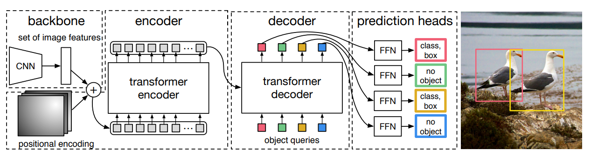

# 从零开始学DETR (1) - DETR的整体结构

# 论文地址：

- **End-to-End Object Detection with Transformers -** https://arxiv.org/pdf/2005.12872

# DETR的整体流程：

从上图中可以看到DETR的模型主要分为以下4个部分：

- **backbone**：用于提取图像特征，其结构是一个CNN网络
- **encoder**：也叫做编码器，是一个Transformer网络
    - 输入：图像特征和位置编码
    - 输出：经过学习和更新的图像tokens，这里tokens可以暂时理解为“图像块特征”
- **decoder**：也叫做解码器，同样是一个Transformer结构（具体实现与encoder略有不同）
    - 输入：encoder的输出，和object queries（可以理解为预设的一些候选查询变量）
    - 输出：包含有语义信息的object queries，或者也可以叫object embeddings
- **prediction heads**：预测头，是一个双分支的MLP结构
    - 一个分支用于预测类别，一个分支用于预测框位置
    - 输入：decoder的输出，也就是object queries
    - 输出：和object queries数量一致的，障碍物的框和类别信息

# DETR的Transformer结构：

图中展示了 Transformer Encoder 和 Decoder 的结构及其计算过程。之后的章节我们会详细介绍并实现这些计算，其中对于初学者来说，不太容易理解的部分是 **object queries**，这里我们首先介绍一下object query的概念。

## **Object Queries**

**Object queries**（目标查询向量）可以理解为 Transformer 在目标检测任务中的“查询”向量，它们的作用类似于“**检测框的模板**”或者“**查询候选目标的特征表示**”。在 DETR 中，每个 object query 代表一个潜在的检测目标，经过 Transformer Decoder 的计算，这些 object queries 会融合图像特征，从而学习到关于潜在目标的信息，最终输入检测头用于预测目标类别和位置。

换句话说，在 Transformer 计算过程中，object queries 就是模型优化的目标。经过多层 Transformer Decoder 的迭代计算后，它们会逐步聚合和调整自身的信息，使得最终的 object queries 可以有效捕捉图像中的具体目标。

回顾一下Transformer的基本结构，Transformer的输入通常Query，Key和Value，其核心是通过Query和Key计算注意力权重，然后乘以Value得到输出。在自注意力计算式，Query，Key和Value的初始值是一样的特征。Object Query是在Transformer的Decoder计算时，作为交叉注意力的输入，计算和图像特征的交叉注意力。因此，Object Query就是该计算过程中的Query，而Key和Value都是图像特征。

Object Query，在初始化的时候，可以使用一个Embedding层来生成，（也可以直接使用Parameter来生成）。Query的个数是预设的一个大于实际障碍物数量的值，维度就是标准的Transformer的embed_dim。

### **Object Queries 的组成**

Object queries 通常由两部分组成：

1. **位置嵌入（Position Embedding）**：
    - 这部分是 **可学习的 embedding**，作用是将 1 到 N 个 query 的索引（编号）编码成与 query 具有相同维度的特征向量。
    - 由于 Transformer 本身是无序的，为了让模型能够区分不同的 queries，并在学习过程中保留 queries 之间的相对顺序信息，引入了位置嵌入。
    - 这种位置编码方式与传统 CNN 直接基于空间位置提取特征的方式不同，而是通过 query 编号的 embedding 显式地传递位置信息。
2. **Query 本体部分（Query Content）**：
    - 这部分通常被初始化为 0（或者小的随机噪声），在训练过程中通过 Transformer 逐步学习到有意义的特征。
    - 经过 Decoder 计算后，query 本体部分会携带关于检测目标的语义信息，例如目标类别、大小、形状等。

在实际使用时，**位置嵌入和 query 本体部分会进行相加**，使得 query 既包含内容信息，又隐式地编码了其序列中的位置信息。

### **这样设计的好处**

1. **显式编码位置信息**：
    
    由于 DETR 是基于 Transformer 的目标检测方法，而 Transformer 不具有 CNN 那样的先天位置信息感知能力，因此额外引入位置嵌入能够帮助 Transformer 识别和区分不同的查询向量，使其能够有效聚焦到不同的目标上。
    
2. **动态目标查询**：
    
    传统的 anchor-based 方法（如 Faster R-CNN）需要在图像上生成大量的候选框，而 DETR 通过 object queries 进行目标查询，**不依赖手工设计的 anchor**，直接让 Transformer 学习目标的位置和类别信息，使其具有更强的泛化能力。
    
3. **更强的特征表达能力**：
    
    由于 object queries 经过多层 Transformer Decoder 的计算，它们会从图像特征中逐步提取语义信息，并且可以对输入图像的全局信息进行建模，从而形成更强的特征表示能力，使最终的检测更为准确。
    

下一节开始我们详细讲解DETR的各个模块。