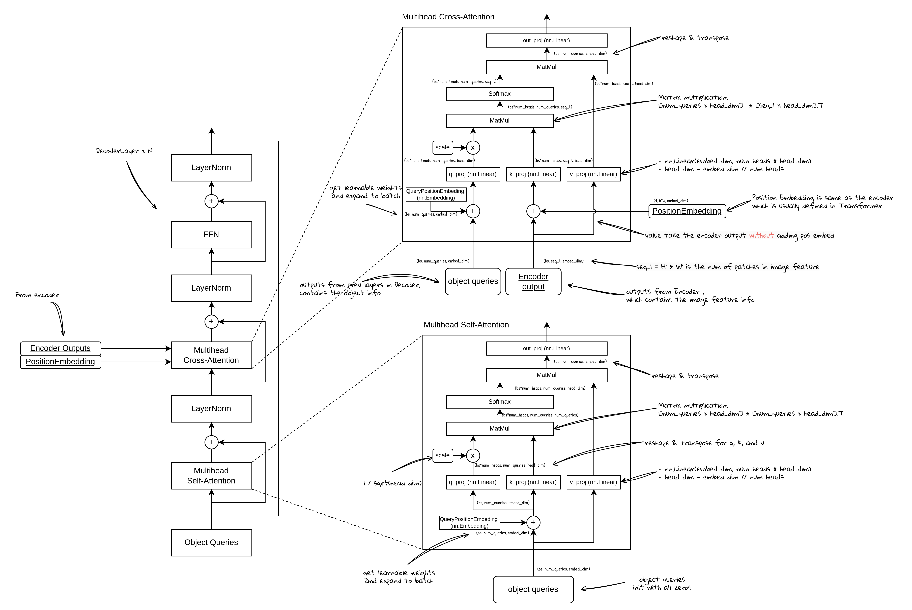

# 从零开始学DETR (4) - 从查询到检测：Transformer Decoder

![DETR Transformer的整体结构]detr4/image.png)

DETR Transformer的整体结构

DETR 通过使用 Transformer 结构进行目标检测。输入图像首先经过 Image Backbone 提取初步的视觉特征，随后进入 Transformer 的 Encoder，通过自注意力机制对全局特征进行进一步的建模和优化。接着，编码后的特征进入 Decoder，通过多头自注意力机制（MSA）处理目标查询的自相关性，增强目标查询的表示能力。然后，通过 Cross Attention 将目标查询与 Encoder 输出的图像特征进行交互，进一步捕捉图像中的上下文信息并优化目标表示。最终，Decoder 输出的目标特征通过分类和边界框回归头生成最终的检测结果，实现精准的目标检测。

# Transformer Decoder

## 目标查询 （Object Query）

在 DETR Decoder 中，Object Query（目标查询）是一个关键的概念，它用于表示待检测的目标。具体来说，目标查询是可学习的向量。在训练过程中，它们通过与图像特征的交互逐渐学习到每个目标的相关特征。

- **目标查询的定义**
    - 目标查询是一组固定数量的可学习向量，每个向量对应一个潜在的目标对象。这些查询向量并不代表图像中的任何特定部分，而是作为 Decoder 的输入，经过训练后逐渐学习到如何代表图像中的不同目标。在 DETR 中，通常会设定固定数量的目标查询（例如 100 个）。
- **目标查询的作用**
    - 目标查询在 Self-Attention 部分，会计算相互作用，从而更新查询之间的关系。在Cross Attention部分，通过与图像特征的交互，学习如何表示图像中的不同目标，使得每个查询向量能够捕捉到目标在图像中的具体信息，如位置、类别等。
- **目标查询与检测的关系**
    - 每个目标查询学习到的表示与图像中的一个潜在目标相关。通过训练，目标查询向量的表示逐渐优化，最终使得每个查询向量能够有效地表示不同的目标。在Decoder最终的输出层，每个目标查询的表示会被用于预测该目标的类别和位置，生成最终的检测结果。
- **目标查询的初始化**
    - 目标查询向量一开始是随机初始化，随着训练的进行，这些查询向量会逐渐被优化，以便更好地适应检测任务。
- **目标查询在Attention中的位置**
    - 目标查询在Self-Attention中，因为是计算查询之间相互关系，所以Attention中的Q，K，V都来自目标查询（也就是Q，K，V线性变换的输入是一样的，注意V的输入没有加position embedding）。
    - 在Cross-Attention中，计算的是目标查询和图像特征之间的关系，所以Attention中的Q来自目标查询，但是K和V来自Encoder的输出（包含了图像信息的特征）。

## Object Query，Query Pos Embed和Target

在 DETR Decoder中，**Query Pos Embed** 是一个嵌入向量，提供初始的位置信息，并与 **Target** 相加生成 **Object Query**，在训练过程中不断更新以学习目标的特征。

### **Query Pos Embed**

**Query Pos Embed** 是一个额外的嵌入向量，类似于 Encoder 中的 Position Encoding。在 DETR 的 Decoder 中，Query Pos Embed 通过与 Object Query (Target) 相加，给每个目标查询向量引入位置信息。这一嵌入向量可以看作是 Position Encoding，其作用是将目标查询引入模型的空间，以便模型理解目标查询在整个目标检测过程中的位置。虽然 Position Encoding 通常用于传递位置信息，但在 Decoder 中的 Query Pos Embed 并不仅仅是位置信息，还包含了其他信息，如目标的潜在表示。

### Target

在 DETR 中，**Target** 可以理解为 Object Query，它表示待检测的目标，也是我们希望持续学习和优化的“目标”特征。每个 Object Query 是一个可学习的向量，用于在 Decoder 中进行目标检测任务。实际上，Target 就是 Object Query 的初始化状态，通常在训练开始时被初始化为零向量。

- **Target** 是可学习的，但它的实现方式可能与通常意义上的可学习参数有所不同。在 **DETR** 中，**Target** 实际上是 **Object Query** 的初始化状态，通常在训练过程中作为一个固定的 **Tensor** 被处理。它并不是像模型中的权重那样直接作为 **nn.Parameter** 来声明和管理，但它确实是通过训练过程进行更新和优化的。在 **DETR** 中，**Target**（即 **Object Query**）被初始化为一个固定的 **Tensor**，它的值通常是零向量。这个 **Tensor** 实际上是作为输入传递到 **Decoder** 的，在训练过程中随着目标检测任务的进行，这些 **Object Query**（即 **Target**）会与图像特征进行交互。在训练过程中，**Target** 作为 **Decoder** 的输入，与经过 **Encoder** 处理的图像特征通过自注意力机制和 **Cross Attention** 相互作用，并逐渐学习到与目标相关的特征。尽管 **Target** 是一个 **Tensor**，它仍然是可学习的。因为在 **DETR** 的训练过程中，**Object Query**（即 **Target**）会被反向传播优化，这意味着它的值会随着梯度更新而调整。

### Query Pos Embedding 与 Target 的关系

**Object Query** 是通过将 **Target**（初始化为零向量）与 **Query Pos Embed** 相加得到的。**Query Pos Embed** 可以看作是一个起始的查询嵌入，为每个目标查询提供初始信息。随着训练的进行，**Target**（即 **Object Query**）通过与图像特征的交互不断更新，最终学习到与目标相关的特征

## 自注意力Self Attention

Decoder 自注意力（Self-Attention）部分是根据目标查询嵌入（object query）进行计算, 并不直接使用 Encoder 的输出。Decoder 的Q，K，V都是来自于目标查询嵌入(object queries)。其中，Q表示目标查询，是可学习的向量，用于表示潜在的检测目标。每个查询向量在训练过程中逐渐学习到与具体目标相关的特征。键 (K) 和值 (V)同样来自同一组目标查询，因为这里是自注意力计算，是每个object query和其他object query进行计算。Decoder计算这些目标查询之间的相关性来更新每个目标查询的表示。

因此，自注意力机制不依赖于 Encoder 的输出。目标查询向量之间的关系被通过自注意力计算加权和更新，逐步增强目标查询的表示能力。

## 交叉注意力Cross Attention

Decoder 中的 **Cross Attention** 模块与自注意力机制不同，它通过目标查询与 Encoder 输出之间的交互来计算注意力分数。Cross Attention 模块的 **查询 (Q)** 来自于 Decoder 中的目标查询嵌入，这些目标查询是可学习的向量，用于表示待检测的目标；而 **键 (K)** 和 **值 (V)** 来自于 Encoder 的输出特征，这些特征主要是包含了图像信息。

在 Cross Attention 中，Decoder 通过计算目标查询与 Encoder 输出的相关性，生成注意力权重。这些权重决定了每个目标查询应从 Encoder的图像特征中获取多少信息。最终，Decoder 结合这些权重和 Encoder 输出的特征，更新目标查询的表示，使得目标查询能够更好地融合图像中的上下文信息。

因此，Cross Attention 机制允许 Decoder 利用 Encoder 提供的全局视觉信息，通过与目标查询之间的交互，进一步优化目标查询的表示，以提高目标检测的精度。

## **前馈神经网络FFN （同Encoder）**

![image.png]detr4/image%203.png)

FFN 是 Transformer 中的重要组成部分，主要由线性层、激活层和残差连接构成。它对每个输入 Token 独立地进行非线性变换，进一步提升特征表达能力。

具体结构如下：

1. **线性层1 (Linear)**：
    - 首先通过一个线性变换将输入特征维度从embed_dim映射到更高的维度ffn_dim，通常ffn_dim >embed_dim。
- 首先通过一个线性变换将输入特征维度从embed_dim映射到更高的维度ffn_dim，通常ffn_dim >embed_dim。
1. **激活函数 (Activation)**：
    - 使用非线性激活函数（通常是 ReLU 或 GELU），引入非线性能力。
- 使用非线性激活函数（通常是 ReLU 或 GELU），引入非线性能力。
1. **线性层2(Linear)**：
    - 再次通过线性变换将特征维度从ffn_dim 投影回embed_dim。
- 再次通过线性变换将特征维度从ffn_dim 投影回embed_dim。
1. **残差连接 (Residual Connection)**：
    - 输入直接跳跃连接到输出，缓解梯度消失问题，并加速模型训练。
- 输入直接跳跃连接到输出，缓解梯度消失问题，并加速模型训练。
1. **归一化层 (Layer Normalization)**：
    - 对最终输出进行层归一化，稳定训练。
- 对最终输出进行层归一化，稳定训练。

公式表示为：

$\text{FFN}(x) = \text{LayerNorm}(x + W_2 \cdot \sigma(W_1 \cdot x + b_1) + b_2)$

其中，$W_1$，$W_2$， $b_1$，$b_2$ 为可学习参数，$\sigma$ 为激活函数。

FFN 逐 Token 独立处理，没有引入序列间的交互，专注于每个 Token 的局部特征优化。配合自注意力机制，提升全局特征表达的非线性建模能力。

## **残差连接和归一化（同Encoder）**

**1. 残差连接 (Residual Connection)**

- 类似于ResNet的方式，用于缓解深层网络中的梯度消失问题，同时加快收敛速度。
- **计算**：$y = x + f(x)$

**2. 归一化 (Layer Normalization)**

- 对每个输入的特征维度进行归一化，减去均值并除以标准差，使得每个 Token 的分布更加平稳。
- 给定输入 ，归一化公式为：
    
    $\text{LayerNorm}(y) = \dfrac{y - \mu}{\sigma + \epsilon} \cdot \gamma + \beta$
    
    - $\mu$：特征均值；
    - $\sigma$：特征标准差；
    - $\epsilon$：防止除零的小常数；
    - $\gamma, \beta$：可学习参数，用于调整归一化后的特征

$\text{LayerNorm}(y) = \dfrac{y - \mu}{\sigma + \epsilon} \cdot \gamma + \beta$

- $\mu$：特征均值；
- $\sigma$：特征标准差；
- $\epsilon$：防止除零的小常数；
- $\gamma, \beta$：可学习参数，用于调整归一化后的特征

在 FFN 和自注意力机制中，残差连接将原始输入加入到变换后的输出，随后通过归一化层平滑特征分布，最终得到优化的输出。

## 对Cross Attention的进一步理解

Cross Attention是目标序列（target）从原序列（source）中获取信息的过程，首先，我们会构建q,k,v，也就是:

1. 查询（query）：从target中生成，表示“我要获取什么信息”
2. 键（key）：从source中生成，表示“我能提供什么信息”
3. 值（value）：从source中生成，表示“实际提供的信息”

有了这些值之后，我们会进一步计算注意力权重：

1. 通过query和key的点积计算相似性，主要是为了确定target中的每个元素与source中的每个元素的相关性是多少

最后，使用注意力权重，对value进行加权求和，将信息从source中提取到target。

这里target和source的含义：

target表示目标序列：

- 表示需要生成的，或者需要更新表示的输入（更新表示可以理解为更新特征）。
- 可以理解为是提问者，提出自己的问题，例如“每个元素包含一个目标障碍物的特征表达”。
- 在计算cross attention的时候，target是query的来源，target是“目标”，是希望从其他地方（source）获取信息来更新自己
- 通常是网络层的输入

source表示源序列：

- 表示提供上下文的输入，或者提供外部信息的输入
- 可以理解为知识库，提供相关信息的上下文，例如，“每个元素表示图像中一块区域的特征，包含了图像信息”
- 在计算cross attention的时候，source是key和value的来源，提供需要被关注的信息和内容
- 通常是encoder传递过来的信息