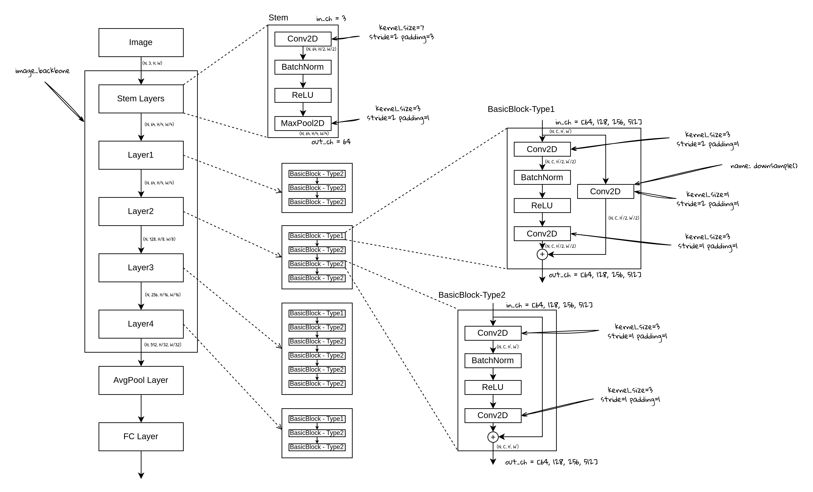

# 从零开始实现DETR (1) - Backbone和特征提取



ResNet50的整体结构图

本节开始，我们使用PaddlePaddle从零开始实现DETR，首先我们来实现Image Backbone。

- 如果你不是PaddlePaddle的用户：
    
    PaddlePaddle和Pytorch有非常相似的API和类似的使用方式，你完全可以按照本系列的实现在Pytorch上完成相关实现，通常你需要的做的只是修改import，有时候需要根据API映射对相应的API进行修改，具体可参考官方文档：https://www.paddlepaddle.org.cn/documentation/docs/zh/2.6/guides/model_convert/convert_from_pytorch/pytorch_api_mapping_cn.html#api
    

# 1. ResNet50的整体结构：ResNet类

```python
class ResNet50(nn.Layer):
    def __init__(self):
        super().__init__()
        # stem
        self.conv1 = nn.Conv2D(3, 64, kernel_size=7, stride=2, padding=3)
        self.bn1 = nn.BatchNorm2D(64)
        self.relu = nn.ReLU()
        self.maxpool = nn.MaxPool2D(kernel_size=3, stride=2, padding=1)
        
        self.layer1 = _make_layer(out_ch=64, blocks=3, stride=1)
        self.layer2 = _make_layer(out_ch=128, blocks=4, stride=2)
        self.layer3 = _make_layer(out_ch=256, blocks=6, stride=2)
        self.layer4 = _make_layer(out_ch=512, blocks=3, stride=2)
        
    def forward(self):
        # stem
        x = self.conv1(x)
        x = self.bn1(x)
        x = self.relu(x)
        x = self.maxpool(x)
        # res layers
        x = self.layer1(x)
        x = self.layer2(x)
        x = self.layer3(x)
        x = self.layer4(x)
        
        return x
```

- Stem层由conv-bn-relu-maxpool组成
    - 可以看到第一个卷积是7x7，并且stride=2，padding=3，这是一个2x下采样的卷积
    - 回忆卷积的输出大小计算公式：
        - $o = \lfloor \dfrac{n+2p-f}{s}\rfloor+1$
        - 其中，n表示特征图大小，p表示padding，f表示卷积核大小，s表示stride
        - $\lfloor \space \rfloor$表示向下取整
- Residual Blocks包含在4个不同的block layers里，每个layer包含若干个block，这些block通过一个_make_layer方法来实现，在_make_layer方法中，会根据设置创建多个BasicBlock对象。
- Forward方法就是顺序执行这些layer，然后返回最后一层的feature map。

# 2. ResNet50的Residual结构：BasicBlock类

```python
class BasicBlock(nn.Layer):
    def __init__(self, in_ch, out_ch, stride=1, downsample=None):
        super().__init__()
        self.conv1 = nn.Conv2D(in_ch,
							                 out_ch,
							                 kernel_size=3,
							                 stride=stride,
							                 padding=1)
			  self.bn1 = nn.BatchNorm2D(out_ch)
			  self.relu = nn.ReLU()
        self.conv2 = nn.Conv2D(out_ch,
                               out_ch,
                               kernel_size=3,
                               stride=1,
                               padding=1)
        self.bn2 = nn.BatchNorm2D(out_ch)
        self.downsample = downsample
        self.stride = stride
    
    def forward(self, x):
        h = x
        x = self.conv1(x)
        x = self.bn1(x)
        x = self.relu(x)
        x = self.conv2(x)
        x = self.bn2(x)
        h = self.downsample(h) if self.downsample is not None else h
        x = x + h
        x = self.relu(x)
        return x
```

- BasicBlock主要实现的是Residual Block，主要的成员包括：
    - conv1：一个3x3卷积，stride可以是1或者2（根据网络设置取不同的值），stride=2时，feature map的大小会下采样2倍；out_ch控制feature map的channel数。
    - conv2：一个3x3卷积，stride=1，feature map大小不变，channels数也不变
    - downsample：一个1x1卷积，主要是在Residual bypass保持tensor维度一致（最后才能相加），stride和channel数都和conv1一致。这里为了方便支持多种ResNet结构，downsample放在了BasicBlock之外定义，然后以参数的形式传进下来。
    - Forward方法：分主线和bypass分别计算，bypass需要判断，如果没有downsample，那直接与主线结果相加并返回，如果有downsample，需要先计算downsample然后才能相加。

# 3. 创建ResBlock：_make_layer方法

```python
def _make_layer(self, out_ch, blocks, stride):
    downsample = None
    if stride != 1:
        downsample = nn.Sequential(
            nn.Conv2D(self.in_ch, out_ch, kernel_size=1, stride=stride),
            nn.BatchNorm2D(out_ch))
    layer_list = []
    layer_lsit.append(BasicBlock(self.in_ch, out_ch, stride, downsample))
    self.in_ch = out_ch
    for _ in range(1, blocks):
        layer_list.append(BasicBlock(self.in_ch, out_ch))
    layer = nn.Sequential(*layer_list)
    return layer
```

- 根据stride创建downsample，主要用于Residual bypass，作为参数传入BasicBlock。
- 第一个block单独处理，因为：
    - 第一个block可能会遇到以下的情况：
        - 输入的feature map的channel数与当前不一致，那么就需要downsample的Conv2D设置对应的channel数，这样在Residual相加的时候才能保证两个tensor维度一致。
        - stride == 2，block的第一个conv2D需要设置stride=2，同时需要downsample的conv2D也设置stride=2，这样才能保证feature map下采样2倍，Residual的feature map也下采样2倍
- 第二个block开始，循环加入到list中
- 所有的block由nn.Sequential串起来

# 4. 多尺度图像特征提取：ResNet50Feature类

```python
class Resnet50Feature(nn.LayerDict)：
    def __init__(self, resnet, return_layers):
        orig_return_layers = return_layers
        return_layers = dict(return_layers.items())
        layers = OrderedDict()
        for name, module in resnet.named_children():
            layers[name] = module
            if name in return_layers:
                del return_layers[name]
            if not return_layers:
                break
        super().__init__(layers)
        self.return_layers = orig_return_layers
    
    def forward(self, x, mask):
        features = OrderedDict()
        for name, module in self.named_children():
            x = module(x)
            if name in self.return_layers:
                out_name = self.return_layers[name]
                features[out_name] = x
        out = []
        for feat_name, feat_map in features.items():
            mask = nn.functional.interpolate(mask[None].astype('float32'),
                                             size=feat_map.shape[-2:])[0]
            out.append((feat_name, feat_map, mask))
        return out
```

这个Resnet50Feature类的主要作用是从ResNet中，按照输入的layer names提取一层或多层feature maps，结果存到list中并返回。

- 主要实现通过nn.LayerDict来实现，LayerDict可以通过OrderedDict来创建，并且会按顺序注册每个子层
- 通常需要输出的feature map来自：
    - layer1 - layer4的输出
- 因此我们需要从ResNet中拿到的层有（例如return_layers = [”layer2”, “layer3”, “layer4”]）：
    - Stem层，保存到OrderedDict中，key是layer name
    - layer1 到 layerN （N是我们需要的最后的Layer名字，这里是4），保存到OrderedDict中，key是layer name
    - layerN 之后的所有层不需要，可以丢掉（这里是avepool层，fc层等）
    - 同时需要记录输出层的名字（ [”layer2”, “layer3”, “layer4”] 保存为成员变量）
- Forward方法：
    - 对于每一个named_children()，进行推理（调用forward方法）
    - 如果是要返回的层，那么记录结果
    - 返回结果
    - named_children() 和 named_sublayers()的区别：
        
        named_children: 返回下一层的子层
        
        named_sublayers: 递归返回所有子层，包含每一层子层的子层