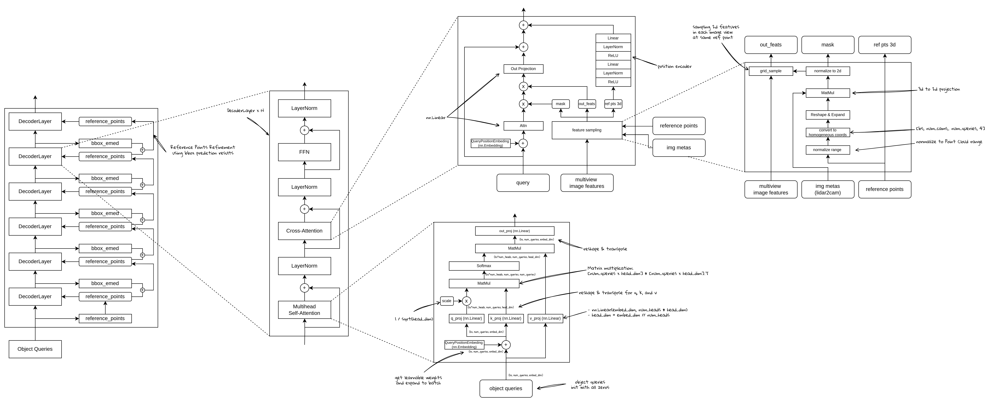

# 从零开始实现 DETR3D (3) - 3D 查询点到多视角图像的投影和Cross-Attention实现

上一节我们实现了DETR3D的Transformer整体结构（如下图），本节我们来重点实现其中的Attn部分，Self-Attention和Cross-Attention。


将上面的DecoderLayer各个部分进一步展开，可以得到如下的结构图：



## Self-Attention

Self-Attention部分采用的是标准的Attention结构，与DETR基本类似，主要是通过计算object query之间的注意力关系，对object query进行更好的建模。可以理解为，这一步是让原本各自关注自己特定区域的目标查询（潜在的目标特征表示是包含位置等信息的）之间能够互相看到和融合。具体实现如下：

- 输入：query，pos_embeds，这两个特征是从embedding拆分出来的，shape相同，一个是主要的query表达，另一个主要包含每个query对应的位置信息。
- 输出：enc_out，和query的shape一致。
- 计算过程：
    - query + pos_embed 经过线性层得到 q
    - query + pos_embed 经过线性层得到 k
    - query 经过线性层得到 v
    - 将qkv转换成multi-head形式：
        - `[bs * num_heads, num_queries, head_dim]`
        - 其中: num_heads * head_dim = embed_dim
    - 计算attn score：  `attn = softmax(q * k’ * (head_dim ** -0.5))`
    - 计算输出： out = attn * v
    - 合并多头：
        - 首先将shape还原成： `[bs, num_queries, embed_dim]`
        - 线性投影：`out = out_proj(out)`

结构图：


代码实现：

```python
class MultiheadAttention(nn.Layer):
    """ Multi head self attention"""
    def __init__(self, embed_dim, num_heads, dropout_rate, bias=True):
        super().__init__()
        self.embed_dim = embed_dim
        self.num_heads = num_heads
        self.head_dim = self.embed_dim // self.num_heads
        self.scale = self.head_dim ** -0.5

        self.q = nn.Linear(embed_dim, embed_dim, bias_attr=bias)
        self.k = nn.Linear(embed_dim, embed_dim, bias_attr=bias)
        self.v = nn.Linear(embed_dim, embed_dim, bias_attr=bias)
        self.out_proj = nn.Linear(embed_dim, embed_dim, bias_attr=bias)

        self.dropout = nn.Dropout(dropout_rate)
        self.softmax = nn.Softmax(axis=-1)

    def reshape_to_multi_heads(self, x, seq_l, batch_size):
        """
        convert [batch_size, seq_l, embed_dim] -> [batch_size * num_heads, seq_len, head_dim]
        """
        x = x.reshape([batch_size, seq_l, self.num_heads, self.head_dim])
        x = x.transpose([0, 2, 1, 3])
        x = x.reshape([batch_size * self.num_heads, seq_l, self.head_dim])
        return x

    def forward(self, x, attn_mask=None, pos_embed=None):
        h = x
        bs, seq_l, _ = x.shape

        x_q = x + pos_embed if pos_embed is not None else x
        x_k = x_q
        x_v = x

        q = self.q(x_q) * self.scale
        q = self.reshape_to_multi_heads(q, seq_l, bs)  # [bs*num_heads, seq_l, head_dim]
        k = self.k(x_k)
        k = self.reshape_to_multi_heads(k, seq_l, bs)  # [bs*num_heads, seq_l, head_dim]
        v = self.v(x_v)
        v = self.reshape_to_multi_heads(v, seq_l, bs)  # [bs*num_heads, seq_l, head_dim]

        attn = paddle.matmul(q, k, transpose_y=True)  #[bs*num_heads, seq_l, seq_l]

        # mask
        if attn_mask is not None:
            attn_mask = paddle.masked_fill(paddle.zeros(attn_mask.shape) ,
                                          attn_mask,
                                          float('-inf'))

        attn = attn.reshape([bs, self.num_heads, seq_l, seq_l])
        attn = attn + attn_mask if attn_mask is not None else attn

        attn = attn.reshape([bs * self.num_heads, seq_l, seq_l])
        attn = self.softmax(attn)

        attn_reshaped = attn.reshape([bs, self.num_heads, seq_l, seq_l])
        attn = attn_reshaped.reshape([bs * self.num_heads, seq_l, seq_l])

        attn = self.dropout(attn)
        out = paddle.matmul(attn, v)

        # output
        out = out.reshape([bs, self.num_heads, seq_l, self.head_dim])
        out = out.transpose([0, 2, 1, 3])
        out = out.reshape([bs, seq_l, self.num_heads * self.head_dim])
        out = self.out_proj(out)
        out = self.dropout(out)
        out = h + out

        return out, attn_reshaped
```

## Cross-Attention

Cross-Attention的计算方式，是利用Deformable Attention，对特征进行采样，然后通过两个线性层，一个用来生成注意力权重（注意这个是可学习的），另一个用来对采样的特征进一步提取特征，最后再使用矩阵乘法按照注意力权重从特征中获得最终的输出特征，大致的流程如下图所示：


详细结构：


**代码实现：**

```python
class Detr3DCrossAttention(nn.Layer):
    def __init__(self,
                 embed_dim,
                 num_heads,
                 n_levels,
                 num_points,
                 num_cams,
                 pc_range,
                 dropout_rate):
        super().__init__()
        self.embed_dim = embed_dim
        self.num_heads = num_heads
        self.head_dim = embed_dim // num_heads
        self.num_points = num_points
        self.n_levels = n_levels
        self.num_cams = num_cams
        self.pc_range = pc_range
        self.dropout_rate = dropout_rate

        self.attn = nn.Linear(embed_dim, num_cams * n_levels * num_points)

        self.position_encoder = nn.Sequential(
            nn.Linear(3, embed_dim),
            nn.LayerNorm(embed_dim),
            nn.ReLU(),
            nn.Linear(embed_dim, embed_dim),
            nn.LayerNorm(embed_dim),
            nn.ReLU())

        self.softmax = nn.Softmax(axis=-1)
        self.dropout = nn.Dropout(self.dropout_rate)
        self.out_proj = nn.Linear(embed_dim, embed_dim)

    def forward(self,
                query,
                key,
                value,
                attn_mask,
                pos_embed,
                ref_pts,
                img_metas):
        key = query if key is None else key
        value = key if value is None else value

        bs, seq_l, _ = key.shape

        h = query
        query = query + pos_embed if pos_embed is not None else query
        bs, n_queries, _ = query.shape

        attn = self.attn(query)  # [bs, num_queries, num_cams*num_points*n_levels]
        attn = attn.reshape([bs, 1, n_queries, self.num_cams, self.num_points, self.n_levels])

        reference_points_3d, output, mask = feature_sampling(value, ref_pts, self.pc_range, img_metas)

        # output: [bs, embed_dim, num_queries, num_cams, 1, n_levels]
        output = paddle.nan_to_num(output)
        # mask: [bs, 1, num_queries, num_cams, 1, 1]
        mask = paddle.nan_to_num(mask)

        attn = attn.sigmoid() * mask  # [bs, 1, num_queries, num_cams, num_points, n_levels]

        output = output * attn  # [bs, embed_dim, num_queries, num_cams, num_points, n_levels]
        output = output.sum(-1).sum(-1).sum(-1)  # [bs, embed_dim, num_queries]
        output = output.transpose([0, 2, 1])  # [bs, num_queries, embed_dim]

        output = self.out_proj(output)  # [num_queries, bs, embed_dim]
        pos_feat = self.position_encoder(inverse_sigmoid(reference_points_3d))

        output = self.dropout(output)
        output = h + output
        output = output + pos_feat

        return output, attn
```

对于DETR3D来说，这里最核心的是两个部分（都是在`feature_sampling`方法中实现）：

1. 输入的处理：主要是3D查询点的生成和多视角图像的投影。
2. Feature Sampling的计算：主要是特征维度的变换和采样方式的实现细节。

下面我们分别来看这两部分。

### 3D 查询点到多视角图像的投影


### DETR3D Reference Points

参考点，可以理解为是预先假设的物体中心，有多少个潜在目标就对应多少个中心位置。潜在目标在DETR3D是通过object query的形式来表示的，每个query代表一个潜在的目标，通过将这个目标的位置信息（pos_embed）输入到一个可学习的线性层，我们可以得到3D参考点的坐标（x, y, z），这些位置在刚开始训练的时候常常是非常随机的位置（如上图空间中的点）。

- 进阶版本：
    
    参考点位置可以进行更新，因为本质上参考点表示了当前query所代表的目标物体的潜在位置，所以我们可以动态的显示的更新这些位置，让模型可以更快的学习到物体的位置。具体来说，在每层decoder计算完整之后，将decoder的输出经过框回归的检测头部分得到预测框的结果，这个结果本质上还是基于参考点的偏移量。有了这些偏移量之后，将他们加回到参考点作为新的参考点位置。
    

### **多视角图像投影：**

有了3D参考点，要和图像进行交互，我们需要从环视的图像中提取对应位置的特征进行注意力计算，所以需要，把3D参考点投影到2D，可以得到3D参考点在每个view上的位置，也就是2D参考点，有了2D参考点，就可以按照Deformable Attention的方式，从而得到对应View的图像特征。

（回忆一下，在DeformableDETR中，我们是做2D的目标检测，采样点的计算是通过在参考点周围采样多个偏移量，与参考点相加就可以得到采样点的位置。这里的偏移量的数量是预设的，例如4个点）
DETR3D中，情况稍微不太一样：
首先，我们的参考点是3D点（虽然是通过可学习层计算得到的，但表示的是3D空间中的位置），如果我们进一步将其限制在pc_range之内，那么这每个参考点就表示在我们检测的范围内的有具体位置的点。
其次，我们的输入是多视角下的2D图像特征，而这些3D参考点，需要找到其在各个视角下的2D图像中的位置，才能进一步与图像特征进行交互，计算注意力等。**所以，我们需要计算这些3D参考点，在不同的2D视角（图像）上的位置。**（如上图所示，需要找到各个视角下对应的2D点位置）
再次，计算得到这些2D位置之后，对于一个3D参考点，我们就有了6个2D采样点，有了这些2D点，我们可以在其对应的特征图上进行特征采样。
最后，对于每个3D参考点，使用其各个视角下的图像特征作为value，与可学习的attn权重相乘进行注意力计算，得到的结果再经过线性映射，残差连接等操作，得到本层的计算结果。

参考点需要从 3D 相机坐标系投影到 2D 图像坐标系上，通过 相机内参 和 外参 将 3D 坐标映射到每个摄像机对应的特征图上:

- 每个object query对应一个3D参考点
- 每个3D参考点在对应的图像视图上，采样num_points个点（DETR3D中是1个，DeformableDETR是4个），也就是说，每个3D参考点，会在每一个View上采样1个点，当然这个点可能不是整数，所以需要通过双线性插值得到对应位置的特征，这多个View上得到的特征，一起和query进行注意力计算。
- **DETR3D** 中没有像 **Deformable DETR** 那样引入额外的 **offset（偏移量）** 计算机制。这是因为 DETR3D 的设计与 Deformable DETR 的机制存在本质上的区别，其特征聚合过程依赖于 **3D参考点的精确投影** 和 **多视图特征融合**，而非局部特征点的偏移采样
    - 在 DETR3D 中，3D 参考点由查询向量（query）直接与 Transformer 生成，是三维空间中的一个明确位置（x,y,z）。
    - 这些 3D 参考点通过相机的 **内参和外参矩阵** 投影到 2D 特征图的具体位置 (u,v)，并直接采样该位置的特征。
    - 这种投影依赖于几何和相机参数计算，因此是一个 **几何精确的位置映射**，不需要通过偏移来弥补不确定性，主要也是为了简洁和效率。
    - DETR3D 的核心优势在于多视图信息的融合：每个 3D 参考点会被投影到多个摄像机视图的特征图上。即使单个视图的特征可能存在模糊或不完整（例如视角遮挡、特征丢失），其他视图的特征可以补充这些信息
- Deformable DETR是在2D图像上进行计算：
    - Offset 是在参考点的基础上，增加一组学习到的偏移量，用来采样参考点附近的局部区域特征。
    - 这种设计适合处理特征稀疏、目标形变或特征位置不确定的情况

**论文中定义的世界坐标系是激光雷达坐标系，需要将其转换到相机坐标系下的，再将其转换到像素坐标系上：**

- **3D参考点 (lidar坐标系)→ 图像坐标系 →归一化平面坐标系→像素坐标系**

**投影过程：**

1. 读取lidar2img的转换矩阵：
    
    ```python
      for img_meta in img_metas:
    			  #lidar2img是一个4x4的矩阵，类型是List
            lidar2img.append(img_meta['lidar2img'])
        # 转换为Tensor类型：[6, 4, 4]
        lidar2img = paddle.to_tensor(np.asarray(lidar2img), dtype='float32')
        # 转换为[bs, 6, 4, 4]
        lidar2img = lidar2img.reshape([1, num_cams, 4, 4])
        lidar2img = lidar2img.expand([bs, num_cams, 4, 4])
    ```
    
    - 每个视角（环视图的每张图）都有自己的转换矩阵，所以lidar2img的第二维是对应各个不同的camera视角
    - 对于一个batch中的不同的样本（每个样本都是6个camera的图像特征），6个camera的位置是不变的，也就是说6个camera的转换矩阵是一样的（因为这些样本都是从一辆车同一套标定参数得到的）。所以lidar2img的第一维度是直接expand（也就是复制）得到的。
2. 3D参考点转换：
    
    ```python
        # refence points
        reference_points = reference_points.clone()
        reference_points_3d = reference_points.clone()
        reference_points[..., 0:1] = reference_points[..., 0:1] * (pc_range[3] - pc_range[0]) + pc_range[0] 
        reference_points[..., 1:2] = reference_points[..., 1:2] * (pc_range[4] - pc_range[1]) + pc_range[1] 
        reference_points[..., 2:3] = reference_points[..., 2:3] * (pc_range[5] - pc_range[2]) + pc_range[2] 
        # [bs, num_queries, 3] -> [bs, num_queries, 4]
        reference_points = paddle.concat([reference_points,
                                          paddle.ones_like(reference_points[..., :1])], axis=-1)
        num_queries = reference_points.shape[1]
    
        reference_points = reference_points.reshape([bs, 1, num_queries, 4])
        reference_points = reference_points.expand([bs, num_cams, num_queries, 4])
        reference_points = reference_points.unsqueeze(-1)  # [bs, num_cams, num_queries, 4, 1]
        
        
        # 待转换的3D参考点
        reference_points = reference_points.clone()
        # 保存原始的3D参考点
        reference_points_3d = reference_points.clone()
        # 参考点从归一化（0，1）范围，变换为lidar坐标系实际坐标
        # 0：1， 1：2，和2：3 其实就是取[..., 0], [..., 1] [..., 2],冒号是为了保持dimension
        # pc_range：[后， 左， 下， 前， 右，上]
        # [bs, num_queries, 3] -> [bs, num_queries, 4]
        reference_points[..., 0:1] = reference_points[..., 0:1] * (pc_range[3] - pc_range[0]) + pc_range[0] 
        reference_points[..., 1:2] = reference_points[..., 1:2] * (pc_range[4] - pc_range[1]) + pc_range[1] 
        reference_points[..., 2:3] = reference_points[..., 2:3] * (pc_range[5] - pc_range[2]) + pc_range[2] 
        # [bs, num_queries, 3] -> [bs, num_queries, 4]
        # 这一步是将世界坐标系（在这里就是lidar坐标系）转换为齐次坐标表示
        reference_points = paddle.concat([reference_points,
                                          paddle.ones_like(reference_points[..., :1])], axis=-1)
    ```
    
    - 参考点是经过线性变换然后取sigmoid得到的0-1的相对坐标（x, y, z）形式，需要乘以实际的范围（单位是m）pc_range，得到绝对坐标表示实际空间中的位置。
    - 参考点从笛卡尔坐标转换为齐次坐标： `[x, y, z] →[x, y, z, 1]`
    - 参考点在生成的时候是通过pos_embed进过线性层计算得到的，所以对于batch中不同的样本，这些参考点是不同的，所以此时的参考点shape是`[bs, num_queries, 4]` 。
    - 我们希望求的是参考点（3D）在各个camera上的2D投影位置，对于同一个样本的同一个query来说，他的各个camera的2D投影点，都是基于同一个3D参考点位置来计算的，所以我们可以把3D参考点复制一份，然后expand一下，作为2D投影位置：`[bs, num_cams, num_queries, 4]` 。注意，此时只是完成了坐标的转换，和维度对齐，还没有开始计算2D投影。
    - 上面的代码还有一步unsqueeze, 在下面会进行介绍。
3. 投影计算：
    
    ```python
        # 获得query的个数，一般是900个，每个表示一个潜在的障碍物
        num_queries = reference_points.shape[1]
        lidar2img = lidar2img.unsqueeze(2)  # [bs, num_cams, 1, 4, 4]
        lidar2img = lidar2img.expand([bs, num_cams, num_queries, 4, 4])
    
        # [bs, n_cam, 1, 4, 4] * [bs, n_cam, n_query, 4, 1]
        reference_points_cam = paddle.matmul(lidar2img, reference_points)
        # [bs, n_cam, n_query, 4, 1] -> [bs, n_cam, n_query, 4]
        reference_points_cam = reference_points_cam.squeeze(-1)
        
        lidar2img = lidar2img.unsqueeze(2)  # [bs, n_cam, 1, 4, 4]
        lidar2img = lidar2img.expand([bs, num_cams, num_queries, 4, 4])
    
        # 投影：[bs, n_cam, n_query, 4, 4] * [bs, n_cam, n_query, 4， 1]
        reference_points_cam = paddle.matmul(lidar2img, reference_points)
        reference_points_cam = reference_points_cam.squeeze(-1)
    ```
    
    - 目标是： $P_{ref2d} = (K[R|T])*P_{ref3d}$
    - 此时lidar2img的shape是：`[bs, num_cams, 4, 4]`
    - ref_points的shape是：`[bs, num_cams, num_queries, 4]`
    - lidar2img需要进一步扩展：`[bs, num_cams, num_queries, 4, 4]`
    - ref_points也需要进一步扩展：`[bs, num_cams, num_queries, 4, 1]` （这就是上面unsqueeze的代码的作用）
    - 有了上面这两部分的shape对齐，矩阵计算才可以变成：
        - 对于[bs, num_cams, num_queries]的每一个[4, 4]都去乘以[4, 1]，得到`[bs, num_cams, num_queries, 4, 1]`
        - 最后再去掉-1维度，得到我们要的[x, y, z, 1](归一化前的坐标)；`[bs, n_cam, n_query, 4, 1] -> [bs, n_cam, n_query, 4]`


**具体实现的时候：**

1. 生成参考点位置：
    - 输入： object query的pos embedding部分, shape是[bs, num_queries, embed_dim]
    - 计算： nn.Linear(embed_dim, 3)， 再经过sigmoid变成0，1范围
    - 输出: ref_pts, shape是[bs, num_queries, 3]
2. 将参考点normalize到检测范围内：
    - 输入： ref_pts
    - 计算： 根据pc_range进行标准化操作
    - 输出： ref_pts（在pc_range范围内）
3. 进行3D到2D的投影：
    - 输入： ref_pts
    - 计算：
        1. 笛卡尔坐标变换为齐次坐标： 3D点（x, y, z），变为(x, y, z, 1)
        2. ref_pts复制num_cams份： [bs, num_queries, 4] -> [bs, num_cams, num_queries, 4, 1]
        3. lidar2img参数reshape： [bs, num_cams, 4, 4] -> [bs, num_cams, num_queries, 4, 4]
        4. 投影计算： lidar2img * ref_pts，得到的2D参考点：[bs, num_cams, num_queries, 4]
    - 输出： 2D参考点：[bs, num_cams, num_queries, 2]
        - 输出维度为2是经过了表达转换得到的：
            - 从齐次坐标转为笛卡尔坐标 [x, y, z, 1] → [x, y, z]
            - 再从对坐标进行深度归一化[x, y, z ]→[x/z, y/z]得到像素坐标
4. 计算mask：
    - 计算mask是因为有些3D点，经过投影之后，可能落在的图像的外面，不在图像范围内的这些点需要被剔除掉，这里使用mask。
    - 输入： 2D参考点，图像大小
    - 计算：
        1. 保留坐标z>0的点，这些点是投影到平面上的点。
        2. 图像坐标转换为像素坐标，(x, y, z) -> (x/z, y/z)
        3. 像素坐标归一化到（-1， 1）
        4. 只保留在(-1, 1)范围内的点
    - 输出： ref_pts, mask(shape是[bs, 1, num_queries, num_cams, 1, 1])
    倒数第二维的1表示采样点个数，这里是1

### 特征采样：

这里有几点需要注意：

- normalize到-1到1：是因为grid_sample方法要求输入的网格坐标范围是-1，1
- 对每层特征进行特征采样的时候，是对该层特征的每个View（cams）都要进行采样
- `reference_points_cam_level = reference_points_cam.reshape([b*n, num_queries, 1, 2])，`其中的倒数第一维是2，表示x,y坐标；倒数第二维是1，表示只采样1一个点。

1. 特征采样：
    - 输入： ref_pts, feats
    - 输出： sampled_feats, shape是[bs, embed_dim, num_queries, num_cams, 1, n_levels]
2. 注意力计算：
    - attn 首先乘以 mask， mask掉不需要参与的采样点位置
    - sampled_feats * attn 完成注意力计算，输出的shape: [bs, embed_dim, num_queries, num_cams, 1, n_levels]
    - 在倒数第一维和倒数第二维上求和，分别表示多个level融合，和多个采样点融合（这里采样点数量是1）
    - 输出的线性投影，position encoder加权, 残差连接等

**代码实现：**

```python
def feature_sampling(multi_level_feats, reference_points, pc_range, img_metas):
    # get lidar2img projection matrix for each view
    bs = reference_points.shape[0]
    num_cams = len(img_metas[0]['lidar2img'])
    lidar2img = []
    for img_meta in img_metas:
        lidar2img.append(img_meta['lidar2img'])
    lidar2img = paddle.to_tensor(np.asarray(lidar2img), dtype='float32')
    lidar2img = lidar2img.reshape([1, num_cams, 4, 4])
    lidar2img = lidar2img.expand([bs, num_cams, 4, 4])

    # refence points
    reference_points = reference_points.clone()
    reference_points_3d = reference_points.clone()
    reference_points[..., 0:1] = reference_points[..., 0:1] * (pc_range[3] - pc_range[0]) + pc_range[0] 
    reference_points[..., 1:2] = reference_points[..., 1:2] * (pc_range[4] - pc_range[1]) + pc_range[1] 
    reference_points[..., 2:3] = reference_points[..., 2:3] * (pc_range[5] - pc_range[2]) + pc_range[2] 
    # [bs, num_queries, 3] -> [bs, num_queries, 4]
    reference_points = paddle.concat([reference_points,
                                      paddle.ones_like(reference_points[..., :1])], axis=-1)
    num_queries = reference_points.shape[1]

    reference_points = reference_points.reshape([bs, 1, num_queries, 4])
    reference_points = reference_points.expand([bs, num_cams, num_queries, 4])
    reference_points = reference_points.unsqueeze(-1)  # [bs, num_cams, num_queries, 4, 1]

    lidar2img = lidar2img.unsqueeze(2)  # [bs, num_cams, 1, 4, 4]
    lidar2img = lidar2img.expand([bs, num_cams, num_queries, 4, 4])

    # [bs, n_cam, 1, 4, 4] * [bs, n_cam, n_query, 4, 1]
    reference_points_cam = paddle.matmul(lidar2img, reference_points)
    # [bs, n_cam, n_query, 4, 1] -> [bs, n_cam, n_query, 4]
    reference_points_cam = reference_points_cam.squeeze(-1)

    eps = 1e-5
    mask = (reference_points_cam[..., 2:3] > eps)

    # [x, y, z, 1] -> [x/z, y/z]
    reference_points_cam = reference_points_cam[..., 0:2] / paddle.maximum(
        reference_points_cam[..., 2:3], paddle.ones_like(reference_points_cam[..., 2:3]) * eps)
    # normalize to (0, 1)
    reference_points_cam[..., 0] /= img_metas[0]['img_shape'][0][1]
    reference_points_cam[..., 1] /= img_metas[0]['img_shape'][0][0]
    # normalize to (-1, 1)
    reference_points_cam = (reference_points_cam - 0.5) * 2

    mask = mask & (reference_points_cam[..., 0:1] > -1.0)
    mask = mask & (reference_points_cam[..., 0:1] < 1.0)
    mask = mask & (reference_points_cam[..., 1:2] > -1.0)
    mask = mask & (reference_points_cam[..., 1:2] < 1.0)

    mask = mask.reshape([bs, num_cams, 1, num_queries, 1, 1])
    mask = mask.transpose([0, 2, 3, 1, 4, 5])  # [bs, 1, num_queries, num_cams, 1, 1]
    mask = mask * 1.0  # from boolean to float
    mask = paddle.nan_to_num(mask)

    sampled_feats = []
    for level, feat in enumerate(multi_level_feats):
        b, n, c, h, w = feat.shape  # N == num_cams
        feat = feat.reshape([b*n, c, h, w])
        reference_points_cam_level = reference_points_cam.reshape([b*n, num_queries, 1, 2])
        sampled_feat = F.grid_sample(feat, reference_points_cam_level, align_corners=False)
        sampled_feat = sampled_feat.reshape([b, n, c, num_queries, 1])
        sampled_feat = sampled_feat.transpose([0, 2, 3, 1, 4])  # [B, C, num_queries, N, 1]
        sampled_feats.append(sampled_feat)

    sampled_feats = paddle.stack(sampled_feats, -1)  # [B, C, num_queries, N, n_levels]
    sampled_feats = sampled_feats.reshape([b, c, num_queries, num_cams, 1, len(multi_level_feats)])

    return reference_points_3d, sampled_feats, mask
```
