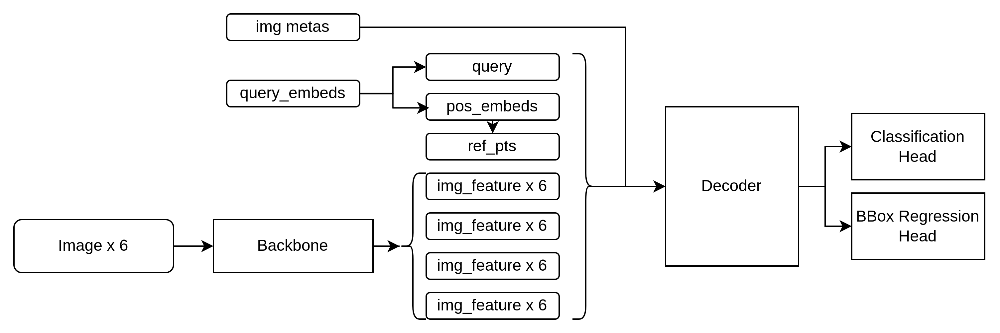

# 从零开始实现 DETR3D (4) - 预测头: DetHead



**Decoder在经过多层计算后，主要的输出为：**

- all_hidden_states: 包含每一层（DecoderLayer）的object query经过注意力计算后的最终输出，每层输出的shape是[bs, num_queries, embed_dim]，都放在all_hidden_states这个list中。
- init_reference: 初始的参考点，shape是[bs, num_queries, 3]
- inter_reference: 因为每次decoder计算完成后，会用box_embed更新一下参考点位置，所以这里返回的是每个decoderlayer更新后的参考点位置，shape是[bs, num_levels, num_queries, 3]，第二维表示decoderLayer数
- 为什么要保存参考点位置？
    - 因为网络学习的bbox中心点，是基于参考点位置的偏移量，这个偏移量是绝对坐标

**预测头分为两部分：**

1. class_embed: 用于分类
    1. 结构： Linear→LayerNorm→ReLU→Linear→LayerNorm→ReLU→Linear
2. bbox_embed: 用于回归基于各个level参考点（就是潜在目标的中心点位置）的偏移量，这个偏移量加上对应的参考点就是预测的bbox中心点位置
    1. 结构是：Linear→ReLU→Linear→ReLU→Linear
3. 预测头会在每一层decoder layer上都进行预测，但在预测的时候只使用最后一层的输出进行解码bbox（就是把输出进一步变成bbox的绝对坐标形式）

代码实现：

```python
        # classification head for category
        class_embed_list = []
        for idx in range(num_layers):
            class_embed_list.append(paddle.nn.Sequential(
                paddle.nn.Linear(embed_dim, embed_dim),
                paddle.nn.LayerNorm(embed_dim),
                paddle.nn.ReLU(),
                paddle.nn.Linear(embed_dim, embed_dim),
                paddle.nn.LayerNorm(embed_dim),
                paddle.nn.ReLU(),
                paddle.nn.Linear(embed_dim, num_classes)))
        self.class_embed = paddle.nn.LayerList(class_embed_list)
        # regression head for bbox
        bbox_embed_list = []
        for idx in range(num_layers):
            bbox_embed_list.append(paddle.nn.Sequential(
                paddle.nn.Linear(embed_dim, embed_dim),
                paddle.nn.ReLU(),
                paddle.nn.Linear(embed_dim, embed_dim),
                paddle.nn.ReLU(),
                paddle.nn.Linear(embed_dim, self.code_size)))
        self.bbox_embed = paddle.nn.LayerList(bbox_embed_list)
```

**计算bbox的过程：**

- decoder特征经过self.bbox_embed得到bbox预测tmp
- tmp的shape是[bs, num_queries, 4], 最后一维分别表示 xc_offset, yc_offset, h, w, zc_offset
- tmp前两维xc_offset, yc_offset, zc_offset加上参考点位置得到xc yc 和 zc，
    - 由于参考点此时是sigmoid之后的相对坐标，范围是(0,1)，所以需要取反sigmoid，相加之后再sigmoid进行归一化
- 最后再乘以pc_range范围得到绝对坐标

**代码实现：**

```python
        for level_idx in range(len(all_hidden_states)-1): 
            if level_idx == 0:
                reference = init_reference  # 1st is the original ref_pts
            else:
                # 1st item in inter_reference is the output from 1st layer
                reference = inter_reference[level_idx - 1]
            reference = inverse_sigmoid(reference)
            # 1st element in all_hidden_states is the input (not needed here)
            output_class = self.class_embed[level_idx](all_hidden_states[level_idx + 1])
            # refine bbox
            tmp = self.bbox_embed[level_idx](all_hidden_states[level_idx + 1])
            tmp[..., 0:2] += reference[..., 0:2]
            tmp[..., 0:2] = tmp[..., 0:2].sigmoid()
            tmp[..., 4:5] += reference[..., 2:3]
            tmp[..., 4:5] = tmp[..., 4:5].sigmoid()
            tmp[..., 0:1] = tmp[..., 0:1] * (self.pc_range[3] - self.pc_range[0]) + self.pc_range[0]
            tmp[..., 1:2] = tmp[..., 1:2] * (self.pc_range[4] - self.pc_range[1]) + self.pc_range[1]
            tmp[..., 4:5] = tmp[..., 4:5] * (self.pc_range[5] - self.pc_range[2]) + self.pc_range[2]
            output_coord = tmp

            output_classes.append(output_class)
            output_coords.append(output_coord)
```
