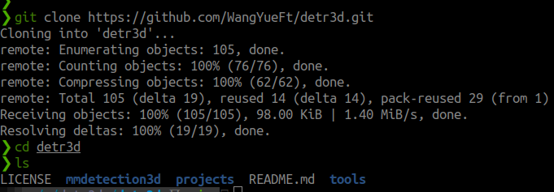
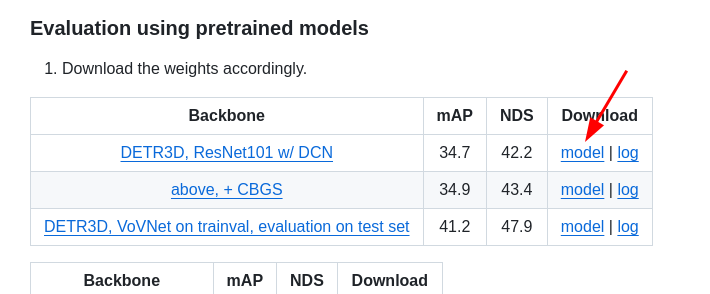

# 附录 - 如何跑通DETR3D Pytorch源码

DETR3D源码是以mmdetction3d库为基础进行开发和运行的。其形式可以理解为是开发了一些新的模块，以plugin的形式在mmdetection3的相关代码和流程上运行，而mmdetection3d又依赖于mmdet和mmcv等库，从环境配置到跑通和修改都有一定的学习曲线，尤其是对于mm系列库不熟悉的同学可能会常常找不到要找的类和方法，我们从本章开始，先带大家跑通DETR3D的代码，然后再一步一步进行拆解，最终从0实现我们自己的DETR3D模型。

具体的内容，按顺序分为以下7个章节，大家可以一步一步按照本章的内容进行实验验证。

## 0. 硬件环境

硬件环境建议选择**配有NVIDIA GPU**的台式机、笔记本电脑、服务器等，作者曾经尝试使用MacOS进行配置，在安装mm系列库的时候经常会报错，修改很多也还没有完全解决，最终还是选择Linux + NVIDIA GPU环境。

作者实际使用的环境：

- GPU：NVIDIA RTX-4080 移动版，显存12G
- CUDA Driver：550.120
- 操作系统：Ubuntu22.04
- 内存： 32G

实际使用其实也是可以使用CPU来跑简单的测试和调试代码，批量的测试或者训练，建议使用集群多卡环境。

## 1. 下载源码

直接从官方github下载源码：

链接：

[https://github.com/WangYueFt/detr3d](https://github.com/WangYueFt/detr3d)

下载命令：

```bash
git clone https://github.com/WangYueFt/detr3d.git
```



## 2. 下载权重

从官方Github的文档中可以查找到模型权重的下载地址（googledrive）：



下载地址： https://drive.google.com/file/d/1YWX-jIS6fxG5_JKUBNVcZtsPtShdjE4O/view?usp=sharing

下载完成后，将权重文件放在项目文件目录下，例如，`detr3d/ckpt/detr3d_resnet01.pth`


## 3. 下载数据

DETR3D使用Nuscenes数据集，可以从数据集官方网站下载数据（需要注册一下），下载地址是：

https://www.nuscenes.org/download

代码学习和开发阶段，我们可以只下载mini版本：


下载完成后，同样将数据解压放在项目文件夹下，例如： `detr3d/data/` ，文件结构应该是类似下面截屏的内容：


## 4. 准备环境

官方提供的模型权重Log中，提供了非常详细的运行环境，我们可以打开进行查阅和参考。实际开发过程中，由于源码的开发时间相对比较早，一些环境和版本对于新一些的硬件以及大家常用的版本已经有些出入，经过作者验证，有一些库是可以使用更新的版本，但由于大家的软硬件环境各不相同，这里不推荐具体的软件版本，大家可以参考下面的配置流程。


几个主要的版本（比较熟悉的可以直接对照和安装相关包）：

| Package Name | Official DETR3D Version | My Version |
| --- | --- | --- |
| GPU | RTX 3090 x8 | RTX 4080 x1 |
| Linux | N/A | Ubuntu 22.04 |
| Python | 3.8.5 | 3.8.20 |
| NVCC(CUDA) | 11.2 | 11.1 |
| GCC | 7.5.0 | 7.5.0 |
| PyTorch | 1.9.1+cu111 | 1.9.1+cu111 |
| CuDNN | 8.0.5 | 8.0.5 |
| MMCV | 1.3.14 | 1.4.0 |
| MMDetection | 2.16.0 | 2.16.0 |
| MMSegmentation | 0.17.0 | 0.17.0 |
| MMDetection3D | 0.17.0+2fab808 | 0.17.1 |
| numpy |  | 1.19.5 |
| numba |  | 0.48.0 |
| seaborn |  | 0.11.0 |
- 如何使用多个版本的CUDA：
    - 22.04中，我安装了: cuda11.1, cuda11.6, cuda11.7,
    - 主要通过以下几个环境变量来控制：
        - `$PATH`
        - `$LD_LIBRARY_PATH`
        - `$CUDA_HOME`
    - 需要添加：
        
        ```bash
        export CUDA_HOME=/usr/local/cuda-11.1
        export PATH=/usr/local/cuda-11.1/bin:$PATH
        export LD_LIBRARY_PATH=/usr/local/cuda-11.1/lib64:$LD_LIBRARY_PATH 
        ```
        
    - 还可以通过设置conda激活时候的脚本来按照不同的conda环境使用不同版本的cuda：
        - 创建并在 ~/anaconda3/envs/YOUR_ENV/etc/conda/activate.d/activate.sh中添加：
            
            ```bash
            ORIGINAL_CUDA_HOME=$CUDA_HOME
            ORIGINAL_LD_LIBRARY_PATH=$LD_LIBRARY_PATH
            ORIGINAL_PATH=$PATH
            export CUDA_HOME=/usr/local/cuda-11.1
            export PATH=/usr/local/cuda-11.1/bin:$PATH
            export LD_LIBRARY_PATH=$CUDA_HOME/lib64:$LD_LIBRARY_PATH
            
            ```
            
        - 创建并在 ~/anaconda3/envs/YOUR_ENV/etc/conda/deactivate.d/deactivate.sh中添加：
            
            ```bash
            export CUDA_HOME=$ORIGINAL_CUDA_HOME
            export LD_LIBRARY_PATH=$ORIGINAL_LD_LIBRARY_PATH
            export PATH=$ORIGINAL_PATH
            unset ORIGINAL_CUDA_HOME
            unset ORIGINAL_PATH
            unset ORIGINAL_LD_LIBRARY_PATH
            
            ```
            

### 1.安装conda环境

安装并使用conda的主要好处是：

（1）conda可以使用虚拟环境（也就是我们常用的conda env），对不同的python开发环境进行隔离

（2）conda里同样能够使用Pip安装(pip install)，pip安装不了的情况也可使用conda进行安装(conda install)

安装方法比较简单：

1. 参考官方安装教程：https://docs.anaconda.com/miniconda/install/#quick-command-line-install

```bash
mkdir -p ~/miniconda3
wget https://repo.anaconda.com/miniconda/Miniconda3-latest-Linux-x86_64.sh -O ~/miniconda3/miniconda.sh
bash ~/miniconda3/miniconda.sh -b -u -p ~/miniconda3
rm ~/miniconda3/miniconda.sh
```

1. 安装完成后：

```bash
source ~/miniconda3/bin/activate
conda init --all
```

- anaconda 和 miniconda的区别？
    - TL;DR: 我们使用miniconda就行；anaconda有图形界面包含了很多库，miniconda是轻量化版本，需要自己安装库；
    - 具体可以参考官方说明：https://docs.anaconda.com/distro-or-miniconda/

### 2. 安装pytorch

首先创建conda虚拟环境：

```bash
conda create --name detr3d python=3.8
conda activate detr3d
```

安装pytorch：

官方安装连接：https://pytorch.org/get-started/previous-versions/#linux-and-windows-41

```bash
pip install torch==1.9.1+cu111 torchvision==0.10.1+cu111 -f https://download.pytorch.org/whl/torch_stable.html
```

验证版本和正确性：


### 3. 安装mmcv，mmdet，mmdet3d库

安装MMCV：

```bash
pip install mmcv-full==1.4.0 -f https://download.openmmlab.com/mmcv/dist/cu111/torch1.9.1/index.html
```

- 参考官方教程：https://mmcv.readthedocs.io/en/v1.4.1/get_started/installation.html
- 安装过程中有时候会报numpy版本的错误，我安装成功的numpy版本是：1.19.5， opencv版本是4.10；安装过程中有时候会出现安装错误显示某些包未安装成功，可以手动pip install对应的包再重试安装mmcv

安装mmdet和mmsegmentation：

```bash
pip install mmdet==2.16.0
pip install mmsegmentation==0.17.0
```

- 参考官方教程：https://mmdetection.readthedocs.io/en/v2.16.0/get_started.html#install-mmdetection
- 安装直接使用pip手动安装即可，不需要安装openmim

安装mmdet3d，在DETR3D项目路径下：

```bash
git clone https://github.com/open-mmlab/mmdetection3d.git
cd mmdetection3d
git checkout v0.17.1
python setup.py install
```

- 参考官方教程：https://mmdetection3d.readthedocs.io/en/v0.17.1/getting_started.html#installation
- 可能会出现报错，如果是gcc版本的问题：
    - 可以在conda环境中安装gcc7.5，这样不会影响系统的gcc版本（而且ubuntu22.04安装gcc7.5不是特别方便）
    
    ```python
    conda install -c conda-forge gxx_linux-64=7.5.0
    ```
    

## 5. 运行源码

**处理数据：**

我们需要对下载好的Nuscenes数据进行处理，转换为pkl文件（python pickle），DETR3D源代码中提供了相关的脚本，我们需要进行简单的修改。

```bash
python ./tools/create_data.py nuscenes --version v1.0-mini --root-path ./data/nuscenes --out-dir ./data/nuscenes --extra-tag nuscenes
```

运行，会报错，显示找不到module，这是因为pythonpath没有设置，而代码中直接import了tools这个module，所以需要把这个包加到pythonpath里：

```bash
Traceback (most recent call last):
  File "./tools/create_data.py", line 5, in <module>
    from tools.data_converter import indoor_converter as indoor
ModuleNotFoundError: No module named 'tools.data_converter'
```

解决办法：

STEP1：在命令行输入 `export PYTHONPATH=$PYTHONPATH:$PWD`  注意当前路径是DETR3D的项目目录，不是detr3d/tools的目录

STEP2：在命令行输入 `touch ./tools/__init__.py` ，创建一个空的init文件

再次运行，如果成功会出现数据集转换的进度条：


数据转换完成后，在`data/nuscenes`路径下会生成几个新的pkl文件，就是我们在代码中加载的数据文件：


**运行源码：**

项目源码中的脚本是在集群上运行的，我们在单机环境下，可以使用下面的脚本：   

```bash
tools/dist_test.sh projects/configs/detr3d/detr3d_res101_gridmask.py ./ckpts/detr3d_resnet101.pth 1 --eval=bbox
```

当命令正确运行，我们可以看到如下的进度条显示：


此时的GPU被拉满，显存占用可以看到大约需要4.3G左右：


## 6. 查看结果

上面的命令运行完成（RTX4080移动版大约1min不到）后会有evaluation的结果显示：


看到这些就表示运行成功了
