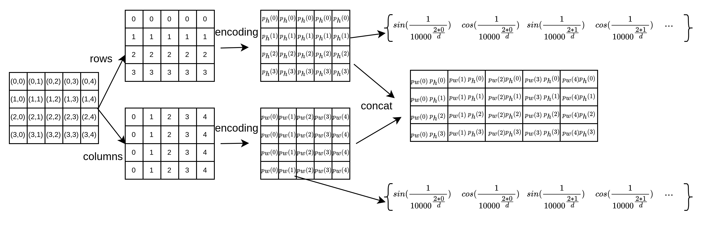

# 从零开始学 - 智驾基础：Transformer中的位置编码

## 从NLP中的概念来引入为什么需要位置编码？

在使用Transformer模型处理文本数据的时候，区别于RNN的输出方式，所有的token在Transformer中是一起输入到模型进行计算，所以对于模型来说，在输入的时候，并没有包含句子中词语之间的顺序。但是，对于一句话来说，词语之间的顺序是包含了很多信息的，所以在论文中就提出了一种方法，叫做position encoding，目的就是在模型输入的时候，给每个token额外增加一个编码，包含了这个token的位置，以便模型能够更好的学习不同位置的信息。

## 位置编码

如何来做这种位置编码，通常是两种方式：

- 将位置信息加入到输入序列中，也就是把位置索引引入到输入序列中。例如，我们知道每个token的顺序，比如1,2,3,4…n，然后有一个映射函数能够将这些位置信息变成特征，再与输入相加，得到带有位置信息的输入，再送进Transformer中进行计算。如何获得这种映射函数，常见的两种方式是：
    - **基于数学运算的位置编码**：这种通常是使用比如sine cosine等方式生成一个位置编码序列
    - **基于学习的位置编码**：使用可学习的参数，让模型在训练过程中自动学习这个编码
- 将位置信息通过微调注意力运算过程，使其能够分辨不同token之间的相对位置。例如，在T5模型中，就是在计算Attention的时候，额外有一个embedding用来学习和计算当前每两个token在位置上的偏移

第一种方式叫做：绝对位置编码，可以简单理解为，在输入时加入position embedding再计算attention

第二种方式叫做：相对位置编码，可以简单理解为，在计算attention时，加入position embedding

我们在这里主要讨论第一种编码方式的两中实现：

1. 基于三角函数的位置编码
2. 基于学习的位置编码

### 三角函数位置编码

公式如下：

$$
PE(pos, 2i)=sin(\dfrac{pos}{10000^{2i/d_{model}}})
$$

$$
PE(pos, 2i+1)=cos(\dfrac{pos}{10000^{2i/d_{model}}})
$$

其中，$pos$是token在输入序列中的位置，$d_{model}$是特征维度，$i$表示编码中的位置，其中偶数位置使用正弦函数sin，奇数位置使用余弦函数cos。

- 更直观的理解：
    
    假设我们的token序列长度是400，也就是一共有400个token，他们按顺序排列，编号就是[0, 399]。
    
    我们的目标是：把[0…399] 这些数字，也就是顺序的索引，编码成一定维度的特征，比如这个维度是128，那我们希望：
    
    - 编号0：从数字0，变成 [a1, a2, … a128]，一个128维的向量
    - 编号1：从数字1，变成 [b1, b2, …b128]，一个128维的向量
    - …
    
    所以上面的公式中：
    
    - $pos$就是编号0到编号399中的每个编号的数字
    - $i$就是编码后的128维向量中的第几个位置
    - $d_{model}$是编码长度，在这个例子里就是128
    

例如，pos = 3， d_model = 128，就是说，在每个token都是128维的token序列中，第3个位置的token对应的位置编码（128个float）是：

[$sin(3/1000^{(0/128)})$，$cos(3/1000^{(3/128)})$，$sin(3/1000^{(4/128)})$…]

为什么这么设置网上有很多介绍，这里就略过了。

由于我们这里常常处理的是2D的图像特征，这里的特征不是1维顺序排列的token序列，而是一个二维的特征图，所以在二维的情况下，基于sine的编码形式为：分别对高度和宽度方向进行编码，然后将两个维度的编码合并起来： $p = [p_h,p_w]$：

$$
p_{h, 2i}=sin(\dfrac{h}{10000^{2i/d_{model}}}), p_{h, 2i+1}=cos(\dfrac{h}{10000^{2i/d_{model}}})
$$

$$
p_{w, 2i}=sin(\dfrac{w}{10000^{2i/d_{model}}}), p_{w, 2i+1}=cos(\dfrac{w}{10000^{2i/d_{model}}})
$$

这里需要注意的一点是，在代码实现的时候，$d_{model}$在应用上面的公式的时候，通常需要先除以2，这样两个方向的编码合并之后的维度才等于最终需要输出的维度。

可视化：



### DETR中的2维position encoding代码实现：

```python

def forward(self, tensor_list):
    # 没用到
    x = tensor_list.tensors
    # mask：如果图像经过了zero pad，那么mask就用来记录pad的部分，如果没有经过zero pad那这个mask就是一个全0的数组
    mask = tensor_list.mask
    # 【关键步骤】 not_mask: 取有用的区域，这里是和输入一样大的全1（如果有padding，padding的位置是0）
    not_mask = (mask < 0.5).astype('float32')
    # 【关键步骤】 cumsum计算累积和，第一个参数是计算哪一维度，因为这里是全1的not_mask，所以就是分别计算行和列的每一个位置的坐标
    y_embed = not_mask.cumsum(1, dtype='float32')
    x_embed = not_mask.cumsum(2, dtype='float32')
    # 归一化
    if self.norm:
        eps = 1e-6
        y_embed = y_embed / (y_embed[:, -1:, :] + eps) * self.scale
        x_embed = x_embed / (x_embed[:, :, -1:] + eps) * self.scale
    # 【关键步骤】生成公式中的i （如果dim是128，那就是[0，1， 2， ... 127]）
    dim_t = paddle.arange(self.num_position_features, dtype='int32')
    # 【关键步骤】10000^(2i/d_model)
    dim_t = self.temp ** (2 * (dim_t // 2) / self.num_position_features)
		# 【关键步骤】计算公式中的 h/10000^(2i/d_model);  
		# 尺寸变化： [b, h, w, 1] -> [b, h, w, d_model]
    pos_y = y_embed.unsqueeze(-1) / dim_t
    pos_x = x_embed.unsqueeze(-1) / dim_t
		#【关键步骤】按奇偶位置分别计算sin和cos
		# 尺寸变化：[b, h, w, d_model/2, 2] -> [b, h, w, d_model]
    pos_y = paddle.stack((pos_y[:, :, :, 0::2].sin(),
                          pos_y[:, :, :, 1::2].cos()), axis=4).flatten(3)
    pos_x = paddle.stack((pos_x[:, :, :, 0::2].sin(),
                          pos_x[:, :, :, 1::2].cos()), axis=4).flatten(3)
    #【关键步骤】合并，输出
    # [b, h, w, d_model] -> [b, h, w, d_model*2] ->  [b, d_model*2, h, w]
     pos = paddle.concat((pos_y, pos_x), axis=3).transpose([0, 3, 1, 2])

    return pos
```

可视化一下过程:

### 可学习位置编码

对于二维的情况，其实只需要有：

- x方向的embedding层：nn.Embedding(n, dim)，其中n是要编码多少个位置，这个数量一般大于特征图的大小就行(n > max(height, width), dim是输出维度
- y方向的embedding层：nn.Embedding(n, dim)，其中n是要编码多少个位置，这个数量一般大于特征图的大小就行(n > max(height, width), dim是输出维度
- 然后foward的时候，需要对于输入的特征图，生成其坐标位置：
    - `i = paddle.arange(w)`
    - `j = paddle.arange(h)`
- 再经过embedding：
    - `x_embed = self.col_embed(i)`
    - `y_embed = self.row_embed(j)`
- 最后再组合起来:
    
    `pos = paddle.concat([
        x_embed.unsqueeze(0).expand((h, x_embed.shape[0], x_embed.shape[1])),    y_embed.unsqueeze(1).expand((y_embed.shape[0], w, y_embed.shape[1])),
                ], axis=-1)`